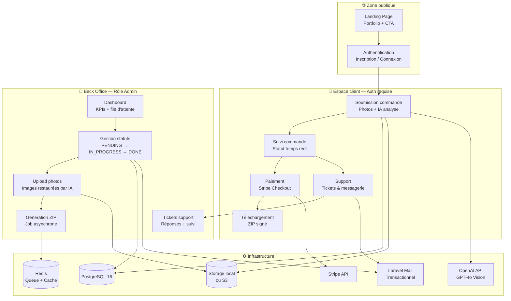
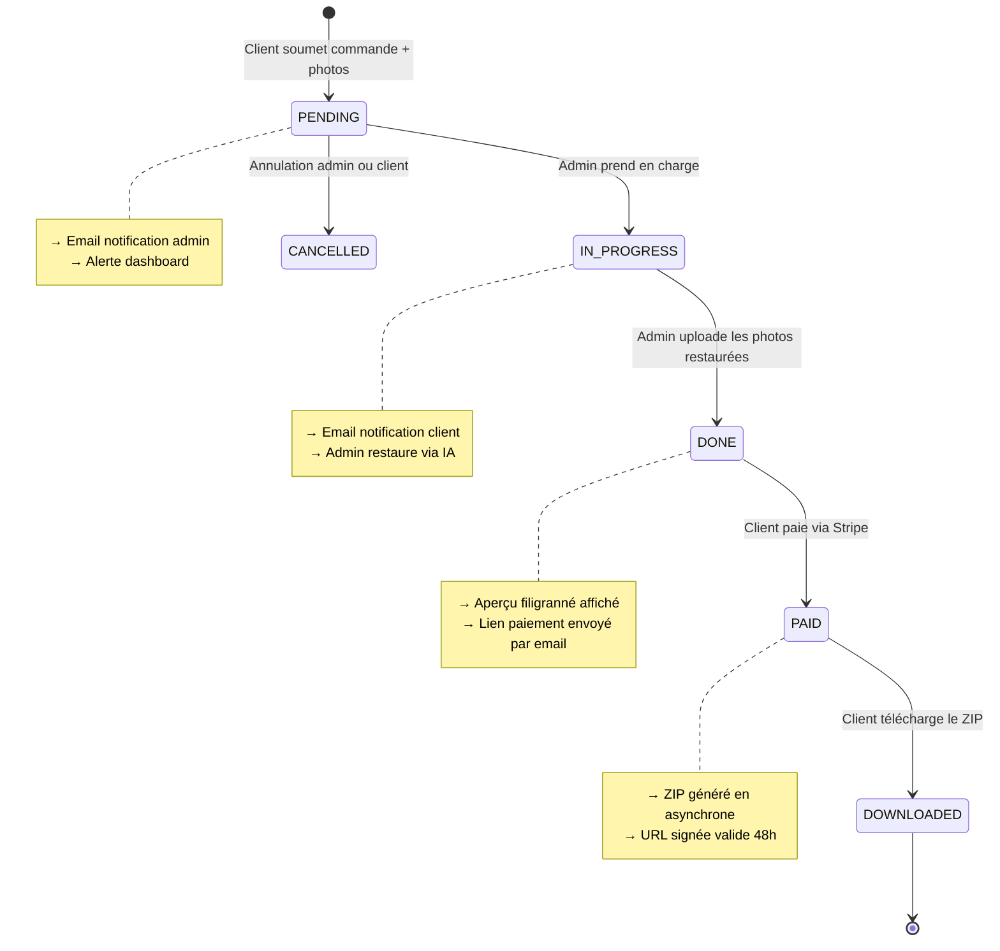

<div align="center">

# 🖼️ OmnyRestore

**Plateforme SaaS de restauration de photographies vintage par IA**

[](https://laravel.com)
[](https://livewire.laravel.com)
[](https://alpinejs.dev)
[](https://tailwindcss.com)
[](https://www.postgresql.org)
[](https://stripe.com)

[](LICENSE)
[](https://php.net)
[](CHANGELOG.md)

</div>

---

## 📖 Table des matières

- [🎯 À propos](#-à-propos)
- [🏗️ Architecture](#️-architecture)
- [🔄 Cycle de vie d'une commande](#-cycle-de-vie-dune-commande)
- [🛠️ Stack technique](#️-stack-technique)
- [🚀 Installation](#-installation)
- [👥 Comptes de test](#-comptes-de-test)
- [📁 Structure du projet](#-structure-du-projet)
- [🎫 Module Support (Tickets)](#-module-support-tickets)
- [⚙️ Configuration upload](#️-configuration-upload)
- [🔐 Sécurité & RGPD](#-sécurité--rgpd)
- [🌿 Git Workflow](#-git-workflow)
- [🗺️ Roadmap](#️-roadmap)
- [👤 Auteur](#-auteur)

---

## 🎯 À propos

**OmnyRestore** est une plateforme SaaS professionnelle permettant à des clients de soumettre leurs photographies anciennes ou endommagées pour une restauration par IA. Le workflow est :

1. **Client** dépose 1 à 10 photos — l'IA analyse automatiquement l'état de dégradation et calcule le prix
2. **Admin** prend en charge la commande, restaure les photos (ChatGPT / OpenAI) et les uploade
3. **Client** visualise un aperçu filigranné de ses photos restaurées
4. **Client** paie via Stripe et télécharge le ZIP haute résolution

> **Modèle économique** : aperçu d'abord, paiement ensuite. Le filigrane crée un déclencheur émotionnel fort avant la conversion.

---

## 🏗️ Architecture



---

## 🔄 Cycle de vie d'une commande



---

## 🛠️ Stack technique

| Couche | Technologie | Version | Raison |
|---|---|---|---|
| Framework backend | Laravel | 12.x | Ecosystem mature, Cashier, support Livewire natif |
| Réactivité UI | Livewire + Volt | 3.x | Composants dynamiques sans JS complexe |
| JS léger | Alpine.js | 3.x | Modals, dropdowns, état local |
| CSS utilitaire | Tailwind CSS | 4.x | Productivité, cohérence, auto-purge |
| Base de données | PostgreSQL | 16 | Robustesse, contraintes FK, JSON natif |
| Stockage fichiers | Spatie MediaLibrary + Local/S3 | 11.x | Upload, conversions, UUID, policies |
| Paiement | Stripe via Laravel Cashier | — | Standard marché, PCI-DSS conforme |
| Compression ZIP | PHP ZipArchive | natif | Sans dépendance critique tierce |
| Authentification | Laravel Breeze (TALL) | — | Scaffolding rapide, 2FA ready |
| Queue / Jobs | Laravel Horizon (Redis) | — | Génération ZIP, emails, tâches async |
| Email | Laravel Mail | — | Transactionnel, logs, haute délivrabilité |
| IA Restauration | OpenAI API (GPT-4o Vision) | — | Restauration & colorisation photo |
| Tests | Pest PHP | 3.x | Syntaxe concise, couverture complète |

---

## 🚀 Installation

### Prérequis

- PHP 8.2+
- Composer 2.x
- Node.js 20+ / npm 10+
- PostgreSQL 16
- Redis 7+
- Un compte Stripe (clés test)
- Une clé API OpenAI (pour l'analyse IA)

### Installation

```bash
# 1. Cloner le dépôt
git clone git@github.com:zyrass/OmnyRestore.git
cd OmnyRestore

# 2. Installer les dépendances PHP
composer install

# 3. Installer les dépendances Node
npm install

# 4. Copier et configurer l'environnement
cp .env.example .env
php artisan key:generate

# 5. Configurer le .env
# Minimum requis pour le développement local :
# APP_URL=http://127.0.0.1:8001
# DB_*, STRIPE_*, OPENAI_*, MEDIA_DISK=public

# 6. Créer le lien symbolique pour le stockage public
php artisan storage:link

# 7. Exécuter les migrations avec les seeders
php artisan migrate --seed

# 8. Démarrer les serveurs de développement
composer run dev
# Lance : php artisan serve --port=8001 + npm run dev + php artisan queue:listen
```

### Variables d'environnement clés

```env
APP_URL=http://127.0.0.1:8001    # IMPORTANT : doit correspondre au port réel du serveur

MEDIA_DISK=public                 # 'public' en local, 's3' en production

# PostgreSQL
DB_CONNECTION=pgsql
DB_HOST=127.0.0.1
DB_PORT=5432
DB_DATABASE=omnyrestore

# OpenAI (analyse IA photos)
OPENAI_API_KEY=sk-...

# Stripe
STRIPE_KEY=pk_test_...
STRIPE_SECRET=sk_test_...
```

---

## 👥 Comptes de test

Après `php artisan migrate --seed` :

| Rôle | Email | Mot de passe | Accès |
|------|-------|--------------|-------|
| **Admin** | `admin@omnyrestore.test` | `password` | `/admin/dashboard` |
| Client | `client@omnyrestore.test` | `password` | `/client/orders` |
| Client | `jean@omnyrestore.test` | `password` | `/client/orders` |
| Client | `sophie@omnyrestore.test` | `password` | `/client/orders` |

> **Note** : Pour tester admin et client simultanément, utilisez Chrome + une fenêtre **Incognito** (deux sessions distinctes).

**Distinction visuelle admin dans la nav :**
- Badge `[Admin]` en or à côté du nom
- Avatar avec bordure 2px pleine or vs 1px client
- Navigation différente : Dashboard / Commandes / Tickets

---

## 📁 Structure du projet

```
omnyrestore/
├── app/
│   ├── Console/Commands/
│   │   ├── DebugMedia.php           # php artisan debug:media
│   │   └── ListUsers.php            # php artisan debug:users
│   ├── Http/
│   │   ├── Controllers/
│   │   │   ├── Admin/
│   │   │   │   └── OrderController.php
│   │   │   └── Webhook/
│   │   │       └── StripeWebhookController.php
│   │   └── Middleware/
│   │       └── EnsureIsAdmin.php    # Contrôle d'accès par rôle
│   ├── Models/
│   │   ├── User.php                 # Billable, RGPD, soft delete
│   │   ├── Order.php                # State machine, relations, media collections
│   │   ├── OrderDelivery.php        # Gestion URL signée ZIP
│   │   ├── SupportTicket.php        # Tickets support client
│   │   ├── SupportTicketMessage.php # Messages du fil de conversation
│   │   └── AuditLog.php             # Audit trail immuable
│   ├── Jobs/
│   │   └── GenerateOrderZipJob.php
│   ├── Policies/
│   │   └── OrderPolicy.php          # Prévention IDOR — vérification propriété
│   ├── Services/
│   │   ├── PhotoDamageAnalyzer.php  # Analyse IA niveau dégradation
│   │   ├── AuditService.php         # Écriture logs audit centralisée
│   │   └── ZipGeneratorService.php
│   └── Mail/
│       └── OrderPaidConfirmation.php
├── resources/views/livewire/pages/
│   ├── client/
│   │   ├── orders/
│   │   │   ├── create.blade.php     # Wizard upload + analyse IA
│   │   │   ├── index.blade.php      # Historique commandes
│   │   │   └── show.blade.php       # Détail + aperçu filigranné + paiement
│   │   ├── tickets/
│   │   │   ├── create.blade.php     # Création ticket support
│   │   │   ├── index.blade.php      # Liste tickets client
│   │   │   └── show.blade.php       # Fil de conversation
│   │   └── profile.blade.php
│   └── admin/
│       ├── dashboard.blade.php      # KPIs + file d'attente
│       ├── orders/
│       │   ├── index.blade.php      # Liste commandes filtrables
│       │   └── show.blade.php       # Gestion commande + upload photos
│       └── tickets/
│           ├── index.blade.php      # Liste tous les tickets (badge non-lus)
│           └── show.blade.php       # Fil conversation + réponse admin
├── routes/
│   ├── web.php
│   ├── client.php                   # Routes espace client (auth + verified)
│   ├── admin.php                    # Routes admin (middleware: admin)
│   └── webhook.php                  # Stripe webhook (sans CSRF)
├── config/
│   ├── livewire.php                 # Upload max 100Mo, disk local, tiff support
│   └── media-library.php            # Disk dynamique via MEDIA_DISK env
└── storage/
    ├── app/public/                  # Fichiers media accessibles (symlink → public/storage)
    └── app/tmp-uploads/             # Buffer temporaire pour uploads admin/client
```

---

## 🎫 Module Support (Tickets)

### Flux client

1. Client crée un ticket depuis `/client/tickets/create`
   - Sélection optionnelle d'une commande liée (pré-remplie via `?order_id=xxx`)
   - Priorité : Faible / Normale / Élevée / Urgent
2. Client suit le fil de conversation sur `/client/tickets/{ticket}`
3. Client peut clore son ticket (avec modal de confirmation)

### Flux admin

1. Admin voit tous les tickets sur `/admin/tickets` avec :
   - Filtres par statut (Ouvert / En attente / Fermé)
   - Badge or indiquant le nombre de tickets avec messages non lus
2. Admin répond sur `/admin/tickets/{ticket}` :
   - Passage automatique en `pending` à l'ouverture (pris connaissance)
   - Passage en `open` quand le client répond (notifie l'admin)
   - Actions : Répondre / Fermer / Rouvrir
3. Sidebar : infos client + lien vers la commande liée

### Statuts tickets

| Statut | Déclencheur | Signification |
|--------|-------------|---------------|
| `open` | Création ou réponse client | En attente de réponse admin |
| `pending` | Admin ouvre / répond | En attente de réponse client |
| `closed` | Admin ou client clôture | Résolu |

---

## ⚙️ Configuration upload

### Limites configurées

| Niveau | Paramètre | Valeur |
|--------|-----------|--------|
| PHP `php.ini` | `upload_max_filesize` | **100 Mo** |
| PHP `php.ini` | `post_max_size` | **120 Mo** |
| Livewire | `temporary_file_upload.rules` | **`max:102400`** (100 Mo) |
| Validation Laravel | `photos.*` / `restoredPhotos.*` | `max:51200` (50 Mo) |

### Disks configurés

| Usage | Disk | Chemin |
|-------|------|--------|
| Photos originales (client) | `public` | `storage/app/public/{id}/` |
| Photos restaurées (admin) | `public` | `storage/app/public/{id}/` |
| Temporaire upload Livewire | `local` | `storage/app/livewire-tmp/` |
| Buffer stable pre-Spatie | `local` | `storage/app/tmp-uploads/` |

> **En production** : changer `MEDIA_DISK=s3` dans `.env` et configurer `AWS_*` / Scaleway Object Storage.

### Fix race condition Livewire + Spatie

Les fichiers temporaires Livewire sont supprimés après chaque cycle de rendu. Pour éviter ce problème :

```php
// ❌ FAIL — le fichier est supprimé avant que Spatie le lise
$order->addMedia($photo->getRealPath())->toMediaCollection('originals');

// ✅ FIX — copie stable avant d'appeler Spatie
$destPath = storage_path('app/tmp-uploads/') . uniqid() . '.jpg';
copy($photo->getRealPath(), $destPath);
$order->addMedia($destPath)->preservingOriginal()->toMediaCollection('originals');
@unlink($destPath);
```

---

## 🔐 Sécurité & RGPD

### Couverture OWASP Top 10

| Vecteur | Contre-mesure Laravel |
|---|---|
| Injection SQL | Eloquent ORM + Query Builder — pas de SQL brut |
| XSS | Blade `{{ }}` auto-échappe toutes les sorties |
| CSRF | Token CSRF sur tous les formulaires POST |
| Upload malveillant | Validation MIME + extension + taille, stockage non-exécutable |
| IDOR | `OrderPolicy` — vérification propriété systématique |
| Secrets exposés | `.env` dans `.gitignore`, rotation régulière |
| Rate Limiting | `throttle:60,1` sur routes auth, `throttle:10,1` sur uploads |

### Conformité RGPD

| Obligation | Implémentation technique |
|---|---|
| Consentement explicite | Checkbox obligatoire à l'inscription → `users.rgpd_consent_at` |
| Droit d'accès | Export JSON de toutes les données via profil |
| Droit à l'effacement | Soft delete + anonymisation + suppression fichiers via job planifié |
| Portabilité | Export ZIP : données + métadonnées JSON |
| Durée de conservation | Commandes : 5 ans (comptabilité). Photos : auto-supprimées 6 mois après livraison |
| Sécurité | HTTPS, AES-256 au repos, IAM moindre privilège |

---

## 🌿 Git Workflow

```
main              ← Production-ready (merges via PR depuis test uniquement)
test              ← Branche par défaut / intégration (GitHub default)
  └── feature/*  ← Développement de fonctionnalités
  └── fix/*      ← Corrections de bugs
  └── docs/*     ← Documentation
  └── chore/*    ← Outils, config, dépendances
```

### Convention de commits (Conventional Commits)

```bash
git commit -m "feat(tickets): interface admin tickets support" \
           -m "- Liste paginée avec filtres statut et badge non-lus" \
           -m "- Fil de conversation avec réponse, fermeture, réouverture" \
           -m "- Passage automatique pending/open selon l'auteur du dernier message"
```

**Types** : `feat` | `fix` | `docs` | `chore` | `test` | `refactor` | `ci` | `style` | `perf`

### Tags de version

| Tag | Description |
|-----|-------------|
| `v0.1.0` | Scaffold Laravel + Auth (Breeze TALL) |
| `v0.2.0` | Migrations PostgreSQL + Models + Policies |
| `v0.3.0` | Module client (commandes, suivi, téléchargement) |
| `v0.4.0` | Back office admin (gestion commandes, upload photos) |
| `v0.4.1` | **Module tickets support + fixes upload + nav contextuelle** |
| `v0.5.0` | Stripe Cashier + livraison ZIP async |
| `v1.0.0` | **MVP — Prêt pour production** |
| `v1.1.0` | Système d'aperçu filigranné automatique (Intervention Image) |
| `v1.2.0` | Intégration API OpenAI (restauration auto) |
| `v2.0.0` | Multi-prestataires + messagerie avancée |

---

## 🗺️ Roadmap

- [x] `v0.0.1` — Documentation architecturale
- [x] `v0.1.0` — Scaffold Laravel + Breeze TALL auth
- [x] `v0.2.0` — Migrations PostgreSQL + Models Eloquent
- [x] `v0.3.0` — Module client (soumission, suivi, aperçu)
- [x] `v0.4.0` — Back office admin (gestion commandes, upload)
- [x] `v0.4.1` — **Module tickets support + fixes critiques**
  - [x] Interface admin tickets (liste + conversation + réponse)
  - [x] Interface client tickets (création + fil + clôture)
  - [x] Fix race condition Livewire + Spatie MediaLibrary (uploads)
  - [x] Fix APP_URL port + symlink storage Windows Junction
  - [x] Limites upload PHP/Livewire portées à 100 Mo
  - [x] Modal de confirmation custom Alpine.js (remplace `wire:confirm`)
  - [x] Navigation contextuelle admin/client avec badge rôle
  - [x] Aperçu photos restaurées côté client (collection retouched + watermark CSS)
- [ ] `v0.5.0` — Stripe Cashier + livraison ZIP async
- [ ] `v1.0.0` — **MVP — Prêt pour production**
- [ ] `v1.1.0` — Aperçu filigranné automatique (Intervention Image / GD)
- [ ] `v1.2.0` — Intégration API OpenAI (restauration automatique)
- [ ] `v2.0.0` — Multi-prestataires + messagerie avancée

---

## 👤 Auteur

**Alain Guillon** — OmnyVia
📧 [contact@omnyvia.fr](mailto:contact@omnyvia.fr)
🐙 [@zyrass](https://github.com/zyrass)

---

<div align="center">

*Construit avec ❤️ par OmnyVia — Restaurer les souvenirs, un pixel à la fois.*

</div>
