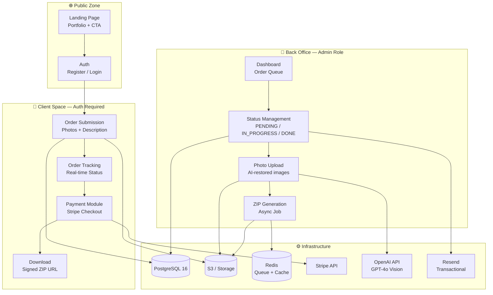
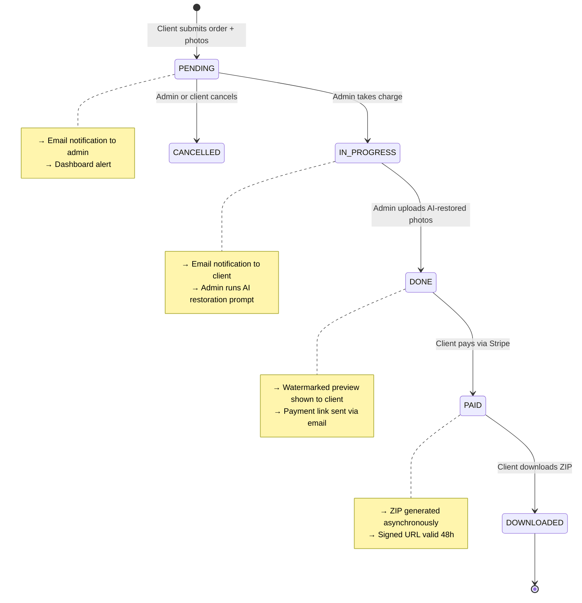

<div align="center">

# 🖼️ OmnyRestore

**AI-powered vintage photograph restoration platform**

[](https://laravel.com)
[](https://livewire.laravel.com)
[](https://alpinejs.dev)
[](https://tailwindcss.com)
[](https://www.postgresql.org)
[](https://stripe.com)

[](LICENSE)
[](https://php.net)
[](CHANGELOG.md)

</div>

---

## 📖 Table of Contents

- [🎯 About the Project](#-about-the-project)
- [🏗️ Architecture](#️-architecture)
- [🔄 Order Lifecycle](#-order-lifecycle)
- [🛠️ Tech Stack](#️-tech-stack)
- [🚀 Getting Started](#-getting-started)
- [🌿 Git Workflow](#-git-workflow)
- [📁 Project Structure](#-project-structure)
- [🔐 Security & GDPR](#-security--gdpr)
- [🗺️ Roadmap](#️-roadmap)
- [👤 Author](#-author)

---

## 🎯 About the Project

**OmnyRestore** is a professional SaaS platform that allows clients to submit old or damaged photographs for AI-powered restoration. The workflow is:

1. **Client** uploads one or more degraded photos via the web interface
2. **Admin** uses a structured AI prompt (ChatGPT / OpenAI API) to restore the images to 8K quality
3. **Client** sees a watermarked preview of their restored photos
4. **Client** pays via Stripe and downloads the high-resolution ZIP archive

The platform is built on the **TALL stack** (Tailwind 4, Alpine.js 3, Laravel 12, Livewire 3) for maximum developer productivity with a single codebase.

> **Business model**: The AI restoration takes only minutes, so the "pay-before-delivery" risk is eliminated. The watermarked preview creates a high emotional conversion trigger before payment.

---

## 🏗️ Architecture



---

## 🔄 Order Lifecycle



---

## 🛠️ Tech Stack

| Layer | Technology | Version | Why |
|---|---|---|---|
| Backend Framework | Laravel | 12.x | Mature ecosystem, Cashier, native Livewire support |
| UI Reactivity | Livewire | 3.x | Dynamic components without complex JS |
| Lightweight JS | Alpine.js | 3.x | Modals, dropdowns, local state |
| CSS Utility | Tailwind CSS | 4.x | Productivity, coherence, auto-purge |
| Database | PostgreSQL | 16 | Robustness, FK constraints, native JSON |
| File Storage | Laravel Storage + S3 | — | Storage / application separation |
| Payment | Stripe via Laravel Cashier | — | Market standard, PCI-DSS compliant |
| ZIP Compression | PHP ZipArchive | native | No critical third-party dependency |
| Media Management | Spatie Media Library | 11.x | Upload, conversions, UUID, policies |
| Authentication | Laravel Breeze (TALL) | — | Fast scaffolding, 2FA ready |
| Queue / Jobs | Laravel Horizon (Redis) | — | ZIP generation, email, async tasks |
| Email | Laravel Mail + Resend | — | Transactional, logs, high deliverability |
| AI Restoration | OpenAI API (GPT-4o) | — | Photo restoration & colorization |
| Testing | Pest PHP | 3.x | Concise syntax, full coverage |

---

## 🚀 Getting Started

### Prerequisites

- PHP 8.3+
- Composer 2.x
- Node.js 20+ / npm 10+
- PostgreSQL 16
- Redis 7+
- A Stripe account (test keys)
- An OpenAI API key (for AI restoration)

### Installation

```bash
# 1. Clone the repository
git clone git@github.com:zyrass/OmnyRestore.git
cd OmnyRestore

# 2. Install PHP dependencies
composer install

# 3. Install Node dependencies
npm install

# 4. Copy and configure environment
cp .env.example .env
php artisan key:generate

# 5. Configure your .env (see .env.example for all variables)
# DB_CONNECTION, STRIPE_*, OPENAI_*, AWS_*, RESEND_*

# 6. Run database migrations with seeders
php artisan migrate --seed

# 7. Start the development servers
composer run dev
# This runs: php artisan serve + npm run dev + php artisan queue:listen
```

### Default Admin Account (after seeding)

```
Email:    admin@omnyrestore.test
Password: password
```

---

## 🌿 Git Workflow

This project follows a strict Git branching strategy:

```
main              ← Production-ready (merges only via PR from test)
test              ← Default/integration branch (GitHub default)
  └── feature/*  ← Feature development branches
  └── fix/*      ← Bug fix branches
  └── docs/*     ← Documentation branches
  └── chore/*    ← Tooling, config, dependencies
```

### Commit Convention (Conventional Commits)

```bash
git commit -m "feat(orders): add status machine with state transitions" \
           -m "- Implement OrderStatus enum with PENDING/IN_PROGRESS/DONE/CANCELLED" \
           -m "- Add state transition validation in Order model" \
           -m "- Dispatch OrderStatusChanged event on each transition"
```

**Types**: `feat` | `fix` | `docs` | `chore` | `test` | `refactor` | `ci` | `style` | `perf`

### Version Tags

| Tag | Description |
|-----|-------------|
| `v0.1.0` | Laravel scaffold + Auth (Breeze TALL) |
| `v0.2.0` | Database migrations + Models + Policies |
| `v0.3.0` | Client module (Livewire components) |
| `v0.4.0` | Admin back office (Livewire components) |
| `v0.5.0` | Stripe payment + ZIP delivery job |
| `v1.0.0` | **MVP — PR test → main** |

---

## 📁 Project Structure

```
omnyrestore/
├── app/
│   ├── Http/
│   │   ├── Controllers/
│   │   │   ├── Client/              # Client-facing controllers
│   │   │   │   ├── OrderController.php
│   │   │   │   └── OrderDownloadController.php
│   │   │   ├── Admin/               # Admin back-office controllers
│   │   │   │   ├── OrderController.php
│   │   │   │   └── DashboardController.php
│   │   │   └── Webhook/             # External webhook handlers
│   │   │       └── StripeWebhookController.php
│   │   └── Middleware/
│   │       └── EnsureIsAdmin.php    # Role-based access control
│   ├── Livewire/
│   │   ├── Client/                  # Client-facing Livewire components
│   │   │   ├── OrderCreateForm.php  # Multi-file upload wizard
│   │   │   ├── OrderList.php        # Order history with real-time status
│   │   │   ├── OrderDetail.php      # Order detail + watermarked preview
│   │   │   └── ProfileSettings.php  # GDPR: data export + account deletion
│   │   └── Admin/                   # Admin back-office Livewire components
│   │       ├── AdminDashboard.php   # KPIs + pending order queue
│   │       ├── AdminOrderList.php   # Order list with filters + CSV export
│   │       ├── AdminOrderManage.php # Order management + status change
│   │       └── AdminPhotoUpload.php # Bulk upload of AI-restored photos
│   ├── Models/
│   │   ├── User.php                 # Billable trait, GDPR fields, soft delete
│   │   ├── Order.php                # State machine, relations, scopes
│   │   ├── OrderDelivery.php        # ZIP signed URL management
│   │   └── AuditLog.php             # Immutable audit trail
│   ├── Jobs/
│   │   ├── GenerateOrderZipJob.php       # Async ZIP creation from S3 media
│   │   ├── GenerateSignedDownloadUrlJob.php # Pre-signed S3 URL (TTL 48h)
│   │   └── CleanupExpiredMediaJob.php    # GDPR: auto-delete after 6 months
│   ├── Policies/
│   │   ├── OrderPolicy.php          # IDOR prevention — ownership check
│   │   └── FilePolicy.php           # ZIP access — payment verified
│   ├── Services/
│   │   ├── ZipGeneratorService.php  # ZipArchive wrapper
│   │   ├── SignedUrlService.php     # S3 presigned URL factory
│   │   └── AuditService.php         # Centralized audit log writer
│   └── Notifications/
│       ├── OrderCreatedAdmin.php
│       ├── OrderStatusChanged.php
│       └── OrderReadyForPayment.php
├── database/migrations/
├── docs/
│   ├── architecture.mdx             # Full technical documentation with diagrams
│   └── api-flows.mdx                # Sequence diagrams for all business flows
├── .github/
│   ├── PULL_REQUEST_TEMPLATE.md
│   └── ISSUE_TEMPLATE/
│       ├── bug_report.md
│       └── feature_request.md
└── routes/
    ├── web.php
    ├── client.php                   # Client-space routes (auth + verified)
    ├── admin.php                    # Admin routes (role:admin middleware)
    └── webhook.php                  # Stripe webhook (no CSRF)
```

---

## 🔐 Security & GDPR

### OWASP Top 10 Coverage

| Vector | Laravel Countermeasure |
|---|---|
| SQL Injection | Eloquent ORM + Query Builder — no raw SQL |
| XSS | Blade `{{ }}` auto-escapes all output |
| CSRF | CSRF token on all POST forms |
| Malicious Upload | MIME type + extension + size validation, S3 non-executable storage |
| IDOR | `OrderPolicy` — systematic ownership check on every request |
| Exposed Secrets | `.env` in `.gitignore`, regular key rotation |
| Rate Limiting | `throttle:60,1` on auth routes, `throttle:10,1` on uploads |

### GDPR Compliance

| Obligation | Technical Implementation |
|---|---|
| Explicit consent | Mandatory checkbox on registration → `users.rgpd_consent_at` |
| Right to access | JSON export of all user data via `ProfileSettings` |
| Right to erasure | Soft delete + field anonymization + S3 deletion via scheduled job |
| Data portability | ZIP export: data + JSON metadata |
| Retention period | Orders: 5 years (accounting). Photos: auto-deleted 6 months after delivery |
| Security | HTTPS, S3 AES-256 at-rest, IAM least-privilege |

---

## 🗺️ Roadmap

- [x] `v0.0.1` — Architectural documentation
- [ ] `v0.1.0` — Laravel scaffold + Breeze TALL auth
- [ ] `v0.2.0` — PostgreSQL migrations + Eloquent models
- [ ] `v0.3.0` — Client module (order submission, tracking, download)
- [ ] `v0.4.0` — Admin back office (order management, photo upload)
- [ ] `v0.5.0` — Stripe Cashier + async ZIP delivery
- [ ] `v1.0.0` — **MVP — Production ready**
- [ ] `v1.1.0` — Watermarked preview system
- [ ] `v1.2.0` — OpenAI API integration (auto-restoration)
- [ ] `v2.0.0` — Multi-provider support + messaging

---

## 👤 Author

**Alain Guillon** — OmnyVia  
📧 [contact@omnyvia.fr](mailto:contact@omnyvia.fr)  
🐙 [@zyrass](https://github.com/zyrass)

---

<div align="center">

*Built with ❤️ by OmnyVia — Restoring memories, one pixel at a time.*

</div>
