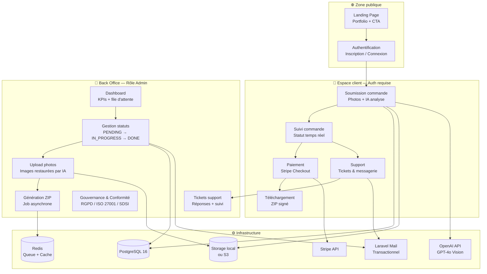
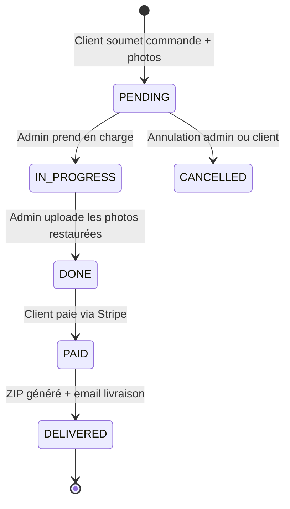

<div align="center">

# 🖼️ OmnyRestore

**Plateforme SaaS de restauration de photographies vintage par IA**

[](https://laravel.com)
[](https://livewire.laravel.com)
[](https://alpinejs.dev)
[](https://tailwindcss.com)
[](https://www.postgresql.org)
[](https://stripe.com)

[](https://php.net)
[](tests/)
[](CHANGELOG.md)
[](LICENSE)

</div>


---

## 📖 Table des matières

- [🎯 À propos](#-à-propos)
- [🏗️ Architecture](#️-architecture)
- [🔄 Cycle de vie d'une commande](#-cycle-de-vie-dune-commande)
- [🛠️ Stack technique](#️-stack-technique)
- [🚀 Installation](#-installation)
- [👥 Comptes de test](#-comptes-de-test)
- [📁 Structure du projet](#-structure-du-projet)
- [🎫 Module Support (Tickets)](#-module-support-tickets)
- [⚙️ Configuration upload](#️-configuration-upload)
- [🧪 Tests & Sécurité](#-tests--sécurité)
- [🔐 Sécurité & RGPD](#-sécurité--rgpd)
- [🌿 Git Workflow](#-git-workflow)
- [🗺️ Roadmap](#️-roadmap)
- [👤 Auteur](#-auteur)

---

## 🎯 À propos

**OmnyRestore** est une plateforme SaaS professionnelle permettant à des clients de soumettre leurs photographies anciennes ou endommagées pour une restauration par IA. Le workflow est :

1. **Client** dépose 1 à 10 photos — l'IA (GPT-4o Vision) analyse l'état de dégradation et calcule le prix sur 3 niveaux (1 € / 2 € / 3 € TTC)
2. **Admin** prend en charge, restaure et uploade les photos → statut DONE
3. **Client** visualise les aperçus filigrannnés, **sélectionne les photos à garder** (rejet possible, prix recalculé **par photo selon son niveau**)
4. **Client** paie via Stripe pour les photos sélectionnées
5. **ZIP généré en asynchrone** — email de livraison avec lien téléchargement + facture PDF avec TVA

> **Modèle économique** : aperçu d'abord, paiement ensuite. Le filigrane crée un déclencheur émotionnel fort avant la conversion.

---

## 🏗️ Architecture



---

## 🔄 Cycle de vie d'une commande



| Statut | Déclencheur | Action automatique |
|--------|-------------|-------------------|
| `PENDING` | Soumission client | Email notification admin |
| `IN_PROGRESS` | Admin prend en charge | Email notification client |
| `DONE` | Admin uploade les photos | Aperçu filigranné affiché + email lien paiement |
| `PAID` | Paiement Stripe validé | `GenerateOrderZipJob` dispatché en asynchrone |
| `DELIVERED` | ZIP généré et prêt | Email livraison avec ZIP + Facture PDF |
| `CANCELLED` | Annulation admin ou client | — |


---

## 🛠️ Stack technique

| Couche | Technologie | Version | Raison |
|---|---|---|---|
| Framework backend | Laravel | 12.x | Ecosystem mature, Cashier, support Livewire natif |
| Réactivité UI | Livewire + Volt | 3.x | Composants dynamiques sans JS complexe |
| JS léger | Alpine.js | 3.x | Modals, dropdowns, état local |
| CSS utilitaire | Tailwind CSS | 4.x | Productivité, cohérence, auto-purge |
| Base de données | PostgreSQL | 16 | Robustesse, contraintes FK, JSON natif |
| Stockage fichiers | Spatie MediaLibrary + Local/S3 | 11.x | Upload, conversions, UUID, policies |
| Paiement | Stripe via Laravel Cashier | — | Standard marché, PCI-DSS conforme |
| Compression ZIP | PHP ZipArchive | natif | Sans dépendance critique tierce |
| Authentification | Laravel Breeze (TALL) | — | Scaffolding rapide, 2FA ready |
| Queue / Jobs | Laravel Horizon (Redis) | — | Génération ZIP, emails, tâches async |
| Email | Laravel Mail | — | Transactionnel, logs, haute délivrabilité |
| IA Restauration | OpenAI API (GPT-4o Vision) | — | Restauration & colorisation photo |
| Tests | Pest PHP | 3.x | Syntaxe concise, couverture complète |

---

## 📦 Dépendances

### PHP — Production (`composer.json`)

| Package | Version | Rôle |
|---------|---------|------|
| `laravel/framework` | ^12.0 | Framework principal — routing, ORM, events, middleware, queues |
| `livewire/livewire` | ^3.6 | Composants réactifs serveur-side sans écrire de JS complexe |
| `livewire/volt` | ^1.7 | Syntaxe single-file pour les composants Livewire (blade + PHP) |
| `laravel/cashier` | ^16.5 | Intégration Stripe — abonnements, paiements, webhooks, factures |
| `laravel/horizon` | ^5.46 | Dashboard Redis pour surveiller et gérer les files de jobs |
| `spatie/laravel-medialibrary` | ^11.22 | Gestion des médias (upload, conversions, collections, S3) |
| `intervention/image` | ^3.11 | Manipulation d'images PHP — resize, watermark, conversions |
| `intervention/image-laravel` | ^1.5 | Intégration Laravel pour Intervention Image |
| `barryvdh/laravel-dompdf` | ^3.1 | Génération de factures PDF à partir de templates Blade |
| `openai-php/laravel` | ^0.19 | Client OpenAI — GPT-4o Vision pour l'analyse du niveau de dommage |
| `laravel/tinker` | ^2.10 | REPL interactif pour le débogage et les tests en console |

### PHP — Développement (`composer.json` require-dev)

| Package | Version | Rôle |
|---------|---------|------|
| `phpunit/phpunit` | ^11.5 | Framework de tests unitaires et d'intégration |
| `laravel/breeze` | ^2.4 | Scaffolding auth (login, register, reset — stack TALL) |
| `laravel/pint` | ^1.24 | Linter et formateur de code PHP (PSR-12 + opinioné) |
| `laravel/pail` | ^1.2 | Tail des logs Laravel en temps réel dans le terminal |
| `laravel/sail` | ^1.41 | Environnement Docker local pour le développement |
| `fakerphp/faker` | ^1.23 | Génération de données factices pour les factories/seeders |
| `mockery/mockery` | ^1.6 | Mocking d'objects pour les tests unitaires |
| `nunomaduro/collision` | ^8.6 | Affichage d'erreurs élégant dans le terminal |

### JavaScript — Dev Dependencies (`package.json`)

| Package | Version | Rôle |
|---------|---------|------|
| `vite` | ^7.0 | Bundler frontend ultra-rapide — HMR en dev, assets optimisés en prod |
| `laravel-vite-plugin` | ^2.0 | Intégration Vite ↔ Laravel (hot reload, manifest, helpers Blade) |
| `tailwindcss` | ^3.1 | Framework CSS utilitaire — design system complet, auto-purge |
| `@tailwindcss/forms` | ^0.5 | Plugin Tailwind pour styliser les éléments de formulaire |
| `@tailwindcss/vite` | ^4.0 | Intégration native Tailwind v4 avec Vite |
| `autoprefixer` | ^10.4 | PostCSS — ajoute automatiquement les préfixes CSS vendeurs |
| `postcss` | ^8.4 | Outil de transformation CSS (requis par Tailwind) |
| `axios` | ^1.11 | Client HTTP JS — requêtes AJAX (utilisé par Livewire) |
| `concurrently` | ^9.0 | Lance plusieurs commandes en parallèle (`composer dev`) |

---

## 🚀 Installation

### Prérequis

- PHP 8.2+
- Composer 2.x
- Node.js 20+ / npm 10+
- PostgreSQL 16
- Redis 7+
- Un compte Stripe (clés test)
- Une clé API OpenAI (pour l'analyse IA)

### Installation

```bash
# 1. Cloner le dépôt
git clone git@github.com:zyrass/OmnyRestore.git
cd OmnyRestore

# 2. Installer les dépendances PHP
composer install

# 3. Installer les dépendances Node
npm install

# 4. Copier et configurer l'environnement
cp .env.example .env
php artisan key:generate

# 5. Configurer le .env
# Minimum requis pour le développement local :
# APP_URL=http://127.0.0.1:8001
# DB_*, STRIPE_*, OPENAI_*, MEDIA_DISK=public

# 6. Créer le lien symbolique pour le stockage public
php artisan storage:link

# 7. Exécuter les migrations avec les seeders
php artisan migrate --seed

# 8. Démarrer les serveurs de développement
composer run dev
# Lance : php artisan serve --port=8001 + npm run dev + php artisan queue:listen
```

### Variables d'environnement — référence complète

> ⚠️ **Ne jamais committer votre `.env`** — il est dans `.gitignore`. Copier `.env.example` et remplir les valeurs.

```env
# ── APPLICATION ──────────────────────────────────────────────────────────────
APP_NAME="OmnyRestore"
APP_ENV=local                    # local | staging | production
APP_KEY=                         # Généré par : php artisan key:generate
APP_DEBUG=true                   # false obligatoire en production
APP_URL=http://127.0.0.1:8001    # Doit correspondre exactement au port du serveur

APP_LOCALE=fr
APP_FALLBACK_LOCALE=fr
BCRYPT_ROUNDS=12

# ── BASE DE DONNÉES — PostgreSQL 16 ─────────────────────────────────────────
DB_CONNECTION=pgsql
DB_HOST=127.0.0.1
DB_PORT=5432
DB_DATABASE=omnyrestore
DB_USERNAME=postgres
DB_PASSWORD=

# ── SESSION ───────────────────────────────────────────────────────────────────
SESSION_DRIVER=redis             # redis en prod, array pour les tests
SESSION_LIFETIME=120
SESSION_ENCRYPT=false            # true recommandé en production
SESSION_PATH=/
SESSION_DOMAIN=null

# ── QUEUES & CACHE — Redis ────────────────────────────────────────────────────
QUEUE_CONNECTION=redis           # sync pour les tests, redis en prod
CACHE_STORE=redis
REDIS_CLIENT=phpredis
REDIS_HOST=127.0.0.1
REDIS_PASSWORD=null
REDIS_PORT=6379

# ── STOCKAGE — S3 Compatible ──────────────────────────────────────────────────
FILESYSTEM_DISK=local            # local | s3
MEDIA_DISK=public                # public en dev, s3 en production
DELIVERY_DISK=local              # local en dev, s3 en production

AWS_ACCESS_KEY_ID=
AWS_SECRET_ACCESS_KEY=
AWS_DEFAULT_REGION=eu-west-3
AWS_BUCKET=omnyrestore-media
AWS_DELIVERY_BUCKET=omnyrestore-deliveries
AWS_USE_PATH_STYLE_ENDPOINT=false

# ── EMAIL — Resend ────────────────────────────────────────────────────────────
MAIL_MAILER=resend               # resend | log (pour dev local)
MAIL_FROM_ADDRESS="contact@omnyrestore.fr"
MAIL_FROM_NAME="OmnyRestore"
RESEND_API_KEY=re_xxxxxxxxxxxxxxxxxxxx

# ── STRIPE — Paiement ─────────────────────────────────────────────────────────
STRIPE_KEY=pk_test_              # Clé publique (frontend)
STRIPE_SECRET=sk_test_           # Clé secrète — ne jamais exposer
STRIPE_WEBHOOK_SECRET=whsec_     # Depuis : stripe listen --forward-to ...
CASHIER_CURRENCY=eur
CASHIER_CURRENCY_LOCALE=fr_FR

# ── OPENAI — Analyse IA ───────────────────────────────────────────────────────
OPENAI_API_KEY=sk-xxxxxxxxxxxxxxxxxxxx
OPENAI_ORGANIZATION=             # Optionnel
OPENAI_MODEL=gpt-4o

# ── HORIZON — Dashboard files d'attente ───────────────────────────────────────
HORIZON_DARK_MODE=true

# ── LOGGING ───────────────────────────────────────────────────────────────────
LOG_CHANNEL=stack
LOG_LEVEL=debug                  # error en production

# ── VITE — Build frontend ─────────────────────────────────────────────────────
VITE_APP_NAME="${APP_NAME}"
VITE_STRIPE_KEY="${STRIPE_KEY}"
```


---

## 👥 Comptes de test

Après `php artisan migrate --seed` :

| Rôle | Email | Mot de passe | Accès |
|------|-------|--------------|-------|
| **Admin** | `admin@omnyrestore.test` | `password` | `/admin/dashboard` |
| Client | `client@omnyrestore.test` | `password` | `/client/orders` |
| Client | `jean@omnyrestore.test` | `password` | `/client/orders` |
| Client | `sophie@omnyrestore.test` | `password` | `/client/orders` |

> **Note** : Pour tester admin et client simultanément, utilisez Chrome + une fenêtre **Incognito** (deux sessions distinctes).

**Distinction visuelle admin dans la nav :**
- Badge `[Admin]` en or à côté du nom
- Avatar avec bordure 2px pleine or vs 1px client
- Navigation différente : Dashboard / Commandes / Tickets

---

## 📁 Structure du projet

```
omnyrestore/
├── app/
│   ├── Console/Commands/
│   │   ├── DebugMedia.php           # php artisan debug:media
│   │   └── ListUsers.php            # php artisan debug:users
│   ├── Http/
│   │   ├── Controllers/
│   │   │   ├── Admin/
│   │   │   │   └── OrderController.php
│   │   │   └── Webhook/
│   │   │       └── StripeWebhookController.php
│   │   ├── Middleware/
│   │   │   └── EnsureIsAdmin.php    # Contrôle d'accès par rôle
│   │   └── Requests/
│   │       └── Client/
│   │           ├── CreateOrderRequest.php   # Validation upload photos + instructions
│   │           └── StoreTestimonialRequest.php  # Validation avis client (20-500 chars)
│   ├── Models/
│   │   ├── User.php                 # Billable, RGPD, soft delete
│   │   ├── Order.php                # State machine, relations, media collections
│   │   ├── OrderDelivery.php        # Gestion URL signée ZIP
│   │   ├── SupportTicket.php        # Tickets support client
│   │   ├── SupportTicketMessage.php # Messages du fil de conversation
│   │   └── AuditLog.php             # Audit trail immuable
│   ├── Jobs/
│   │   └── GenerateOrderZipJob.php
│   ├── Policies/
│   │   └── OrderPolicy.php          # Prévention IDOR — vérification propriété
│   ├── Services/
│   │   ├── PhotoDamageAnalyzer.php  # Analyse IA niveau dégradation
│   │   ├── AuditService.php         # Écriture logs audit centralisée
│   │   └── ZipGeneratorService.php
│   └── Mail/
│       ├── OrderReadyForPayment.php    # Email DONE → aperçu filigranné + bouton Payer
│       ├── OrderPaidConfirmation.php   # Email PAID → ZIP en préparation
│       └── OrderDeliveryReady.php      # Email DELIVERED → ZIP + Facture [NEW v0.10]
├── resources/views/livewire/pages/
│   ├── client/
│   │   ├── orders/
│   │   │   ├── create.blade.php     # Wizard upload + analyse IA
│   │   │   ├── index.blade.php      # Historique commandes
│   │   │   └── show.blade.php       # Détail + aperçu filigranné + paiement
│   │   ├── tickets/
│   │   │   ├── create.blade.php     # Création ticket support
│   │   │   ├── index.blade.php      # Liste tickets client
│   │   │   └── show.blade.php       # Fil de conversation
│   │   └── profile.blade.php
│   └── admin/
│       ├── dashboard.blade.php      # KPIs + file d'attente
│       ├── clients/
│       │   └── index.blade.php      # Liste clients avec dépenses
│       ├── orders/
│       │   ├── index.blade.php      # Liste commandes filtrables
│       │   └── show.blade.php       # Gestion commande + upload photos
│       └── tickets/
│           ├── index.blade.php      # Liste tous les tickets (badge non-lus)
│           └── show.blade.php       # Fil conversation + réponse admin
├── resources/views/emails/
│   └── orders/
│       ├── ready-for-payment.blade.php  # Email DONE → aperçu + lien paiement
│       ├── paid-confirmation.blade.php  # Email PAID → ZIP en préparation
│       └── delivery-ready.blade.php     # Email DELIVERED → ZIP + Facture ← NEW v0.10
├── routes/
│   ├── web.php
│   ├── client.php                   # Routes espace client (auth + verified)
│   ├── admin.php                    # Routes admin (middleware: admin)
│   └── webhook.php                  # Stripe webhook (sans CSRF)
├── config/
│   ├── livewire.php                 # Upload max 100Mo, disk local, tiff support
│   └── media-library.php            # Disk dynamique via MEDIA_DISK env
└── storage/
    ├── app/public/                  # Fichiers media accessibles (symlink → public/storage)
    └── app/tmp-uploads/             # Buffer temporaire pour uploads admin/client
```

---

## 🎫 Module Support (Tickets)

### Flux client

1. Client crée un ticket depuis `/client/tickets/create`
   - Sélection optionnelle d'une commande liée (pré-remplie via `?order_id=xxx`)
   - Priorité : Faible / Normale / Élevée / Urgent
2. Client suit le fil de conversation sur `/client/tickets/{ticket}`
3. Client peut clore son ticket (avec modal de confirmation)

### Flux admin

1. Admin voit tous les tickets sur `/admin/tickets` avec :
   - Filtres par statut (Ouvert / En attente / Fermé)
   - Badge or indiquant le nombre de tickets avec messages non lus
2. Admin répond sur `/admin/tickets/{ticket}` :
   - Passage automatique en `pending` à l'ouverture (pris connaissance)
   - Passage en `open` quand le client répond (notifie l'admin)
   - Actions : Répondre / Fermer / Rouvrir
3. Sidebar : infos client + lien vers la commande liée

### Statuts tickets

| Statut | Déclencheur | Signification |
|--------|-------------|---------------|
| `open` | Création ou réponse client | En attente de réponse admin |
| `pending` | Admin ouvre / répond | En attente de réponse client |
| `closed` | Admin ou client clôture | Résolu |

---

## ⚙️ Configuration upload

### Limites configurées

| Niveau | Paramètre | Valeur |
|--------|-----------|--------|
| PHP `php.ini` | `upload_max_filesize` | **100 Mo** |
| PHP `php.ini` | `post_max_size` | **120 Mo** |
| Livewire | `temporary_file_upload.rules` | **`max:102400`** (100 Mo) |
| Validation Laravel | `photos.*` / `restoredPhotos.*` | `max:51200` (50 Mo) |

### Disks configurés

| Usage | Disk | Chemin |
|-------|------|--------|
| Photos originales (client) | `public` | `storage/app/public/{id}/` |
| Photos restaurées (admin) | `public` | `storage/app/public/{id}/` |
| Temporaire upload Livewire | `local` | `storage/app/livewire-tmp/` |
| Buffer stable pre-Spatie | `local` | `storage/app/tmp-uploads/` |

> **En production** : changer `MEDIA_DISK=s3` dans `.env` et configurer `AWS_*` / Scaleway Object Storage.

### Fix race condition Livewire + Spatie

Les fichiers temporaires Livewire sont supprimés après chaque cycle de rendu. Pour éviter ce problème :

```php
// ❌ FAIL — le fichier est supprimé avant que Spatie le lise
$order->addMedia($photo->getRealPath())->toMediaCollection('originals');

// ✅ FIX — copie stable avant d'appeler Spatie
$destPath = storage_path('app/tmp-uploads/') . uniqid() . '.jpg';
copy($photo->getRealPath(), $destPath);
$order->addMedia($destPath)->preservingOriginal()->toMediaCollection('originals');
@unlink($destPath);
```

---

## 🧪 Tests & Sécurité

### Suite de tests — **64 tests / 146 assertions** ✅

```bash
# Lancer tous les tests
php artisan test

# Lancer un groupe spécifique
php artisan test --filter="StripeWebhookTest"
php artisan test --filter="HorizonAuthTest"
php artisan test --filter="OrderStateMachineTest"
```

### Couverture par catégorie

| Catégorie | Fichier | Tests | Couvre |
|---|---|---|---|
| Authentification | `AuthenticationTest` | 4 | Login, logout, navigation, mot de passe invalide |
| Inscription | `RegistrationTest` | 2 | Inscription RGPD compliant, redirection client |
| Mot de passe | `PasswordUpdateTest` | 2 | Mise à jour CNIL (12+ chars, symboles) |
| Réinitialisation | `PasswordResetTest` | 3 | Email reset, validation lien, nouveau mot de passe |
| Profil | `ProfileTest` | 4 | Affichage, mise à jour, soft-delete RGPD |
| Webhook Stripe | `StripeWebhookTest` | 7 | Signature HMAC, paiement, idempotence, échec |
| Horizon Auth | `HorizonAuthTest` | 6 | Gate `viewHorizon` — null/client/admin |
| Machine d'état | `OrderStateMachineTest` | 10 | Transitions PENDING→PAID→DONE→DELIVERED |
| **Total** | — | **64** | **146 assertions** |

### Sécurité renforcée (v0.15.0)

| Domaine | Implémentation |
|---|---|
| **Mass Assignment** | `status` et `payment_status` hors `$fillable` — transitions via méthodes dédiées (`markAsPaid`, `cancel`) |
| **CNIL / RGPD** | Mot de passe min 12 chars, mixedCase, chiffres, symboles (`Password::defaults()` dans `AppServiceProvider`) |
| **Rate Limiting** | `throttle:10,1` sur checkout, `throttle:30,1` sur webhook Stripe |
| **Horizon** | Double protection : Gate Laravel (`viewHorizon`) + IP whitelist Nginx |
| **Webhook Stripe** | Vérification signature HMAC avec `STRIPE_WEBHOOK_SECRET` — rejette les payloads invalides |
| **Form Requests** | `CreateOrderRequest`, `StoreTestimonialRequest` — validation centralisée et réutilisable |
| **SoftDeletes** | Comptes supprimés anonymisés (RGPD) — `anonymized_at` + `deleted_at` |

### Politique de mot de passe (conforme CNIL)

```php
// app/Providers/AppServiceProvider.php
Password::defaults(fn () =>
    Password::min(12)
        ->mixedCase()
        ->numbers()
        ->symbols()
);
```

---

## 🔐 Sécurité & RGPD

### Couverture OWASP Top 10

| Vecteur | Contre-mesure Laravel |
|---|---|
| Injection SQL | Eloquent ORM + Query Builder — pas de SQL brut |
| XSS | Blade `{{ }}` auto-échappe toutes les sorties |
| CSRF | Token CSRF sur tous les formulaires POST |
| Upload malveillant | Validation MIME + extension + taille, stockage non-exécutable |
| IDOR | `OrderPolicy` — vérification propriété systématique |
| Secrets exposés | `.env` dans `.gitignore`, rotation régulière |
| Rate Limiting | `throttle:60,1` sur routes auth, `throttle:10,1` sur uploads |

### Conformité RGPD

| Obligation | Implémentation technique |
|---|---|
| Consentement explicite | Checkbox obligatoire à l'inscription → `users.rgpd_consent_at` |
| Droit d'accès | Export JSON de toutes les données via profil |
| Droit à l'effacement | Soft delete + anonymisation + suppression fichiers via job planifié |
| Portabilité | Export ZIP : données + métadonnées JSON |
| Durée de conservation | Commandes : 5 ans (comptabilité). Photos : auto-supprimées 6 mois après livraison |
| Sécurité | HTTPS, AES-256 au repos, IAM moindre privilège |

---

## 🌿 Git Workflow

```
main              ← Production-ready (merges via PR depuis test uniquement)
test              ← Branche par défaut / intégration (GitHub default)
  └── feature/*  ← Développement de fonctionnalités
  └── fix/*      ← Corrections de bugs
  └── docs/*     ← Documentation
  └── chore/*    ← Outils, config, dépendances
```

### Convention de commits (Conventional Commits)

```bash
git commit -m "feat(tickets): interface admin tickets support" \
           -m "- Liste paginée avec filtres statut et badge non-lus" \
           -m "- Fil de conversation avec réponse, fermeture, réouverture" \
           -m "- Passage automatique pending/open selon l'auteur du dernier message"
```

**Types** : `feat` | `fix` | `docs` | `chore` | `test` | `refactor` | `ci` | `style` | `perf`

### Tags de version

- [x] `v0.21.0` — **Pilotage Financier & Simulateur Objectifs**
- [x] `v0.22.0` — **Hardening Administratif & Assets Locaux**
- [x] `v0.23.0` — **Standardisation UI & Master Plan v2**
- [x] `v0.24.0` — **Stratégie d'Acquisition & Croissance SASU**
- [x] `v0.25.0` — **Optimisation Support & Résilience Workers**
- [x] `v0.26.0` — **Optimisation Mémoire & Expérience Premium Post-Paiement**
- [x] `v2.0.0` — **L'Écosystème Collaboratif, Licences & Transparence (OmnyRestore v2.0)**
- [x] `v2.1.0` — **Cybersécurité & Isolation des Emails (Phase 1.6)**
- [x] `v2.2.0` — **Accès Lecture Seule Marketing & Rétablissement Suite de Tests 100% Verte**
- [x] `v2.3.0` — **Espace RH, Actions d'Équipe & Transparence Intégrée** ← *actuel*
- [ ] `v3.0.0` — Multi-prestataires + messagerie avancée

---

## 👤 Auteur

**Alain Guillon** — OmnyVia
📧 [contact@omnyvia.fr](mailto:contact@omnyvia.fr)
🐙 [@zyrass](https://github.com/zyrass)

---

<div align="center">

*Construit avec ❤️ par OmnyVia — Restaurer les souvenirs, un pixel à la fois.*

</div>
