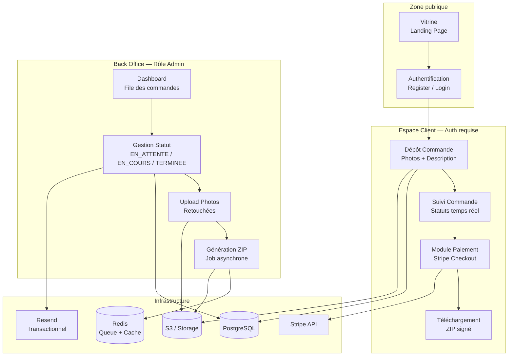
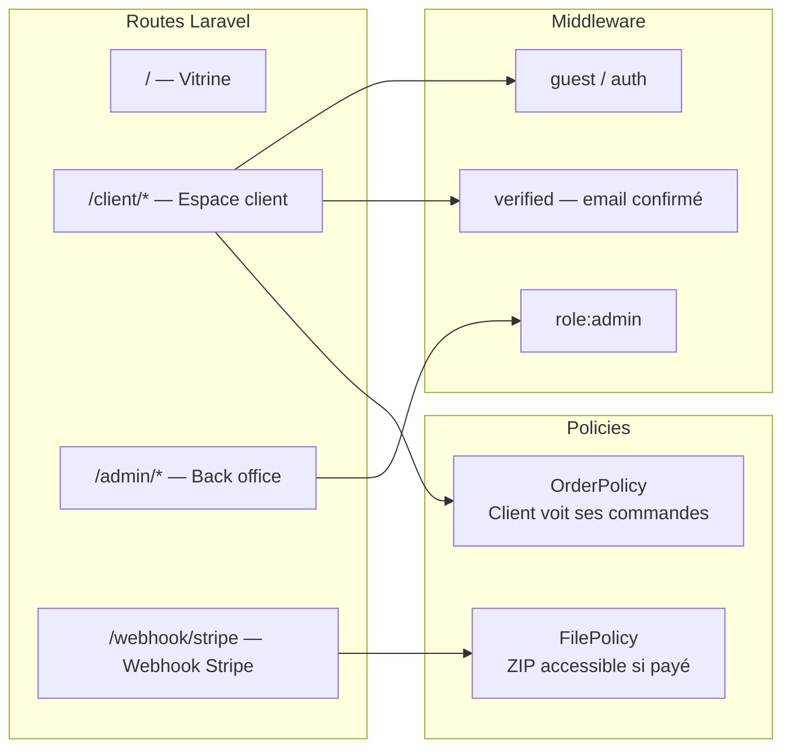
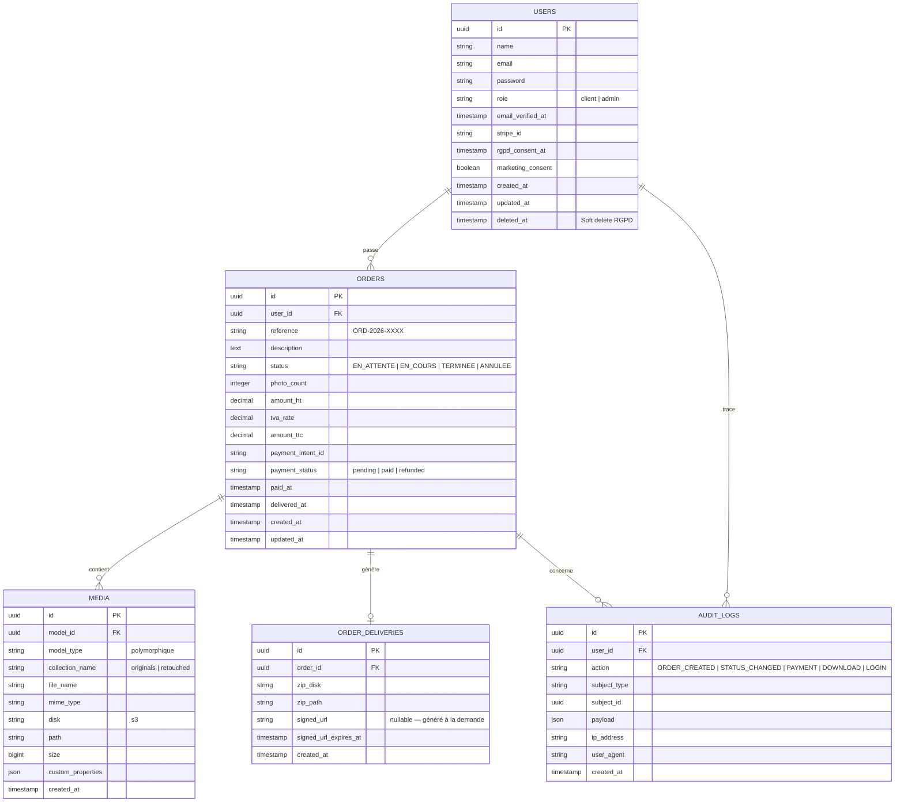
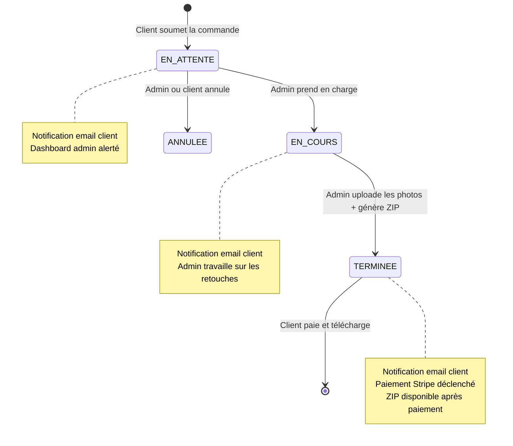
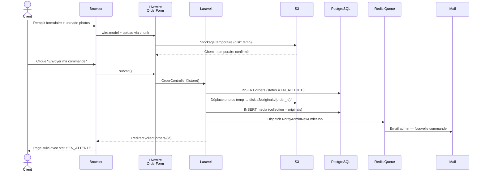
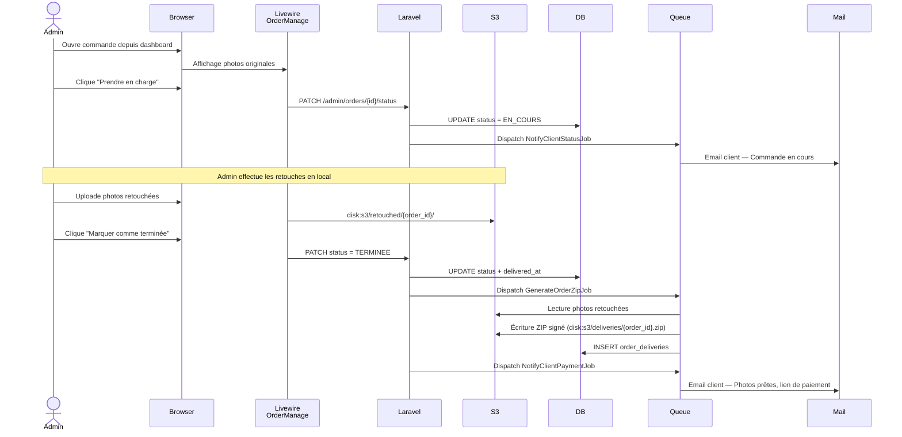
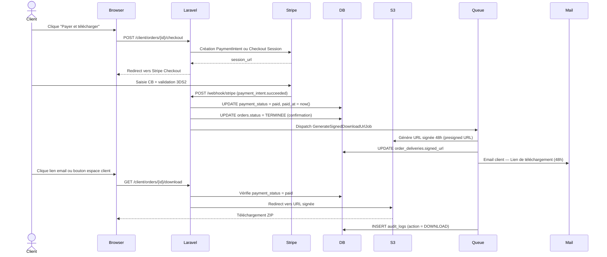

# OmnyRestore — Documentation Architecturale v0.0.1

**Projet** : Plateforme de restauration de photographies anciennes  
**Stack** : TALL (Tailwind CSS 4 / Alpine.js 3 / Laravel 12 / Livewire 3)  
**Auteur** : Alain Guillon — OmnyVia  
**Version** : 1.0 — Mai 2026  
**Statut** : Spécification technique initiale

---

## Sommaire

1. [Résumé exécutif](#1-résumé-exécutif)
2. [Stack technique retenue](#2-stack-technique-retenue)
3. [Architecture applicative globale](#3-architecture-applicative-globale)
4. [Modèle de données](#4-modèle-de-données)
5. [Flux métier — Diagrammes de séquence](#5-flux-métier--diagrammes-de-séquence)
6. [Modules applicatifs](#6-modules-applicatifs)
7. [Conformité RGPD / CNIL / NIS2](#7-conformité-rgpd--cnil--nis2)
8. [Structure de projet Laravel recommandée](#8-structure-de-projet-laravel-recommandée)
9. [Axes d'amélioration et Roadmap](#9-axes-damélioration-et-roadmap)

---

## 1. Résumé exécutif

OmnyRestore est une plateforme web professionnelle à double interface :

- **Vitrine publique** : présentation du service de restauration photographique, appel à l'action, portfolio de réalisations.
- **Espace client** : dépôt de commande (photos + description de la demande), suivi de l'avancement, paiement sécurisé, téléchargement du livrable compressé.
- **Back office administrateur** : réception des commandes, gestion des statuts, upload des photos retouchées, déclenchement de la livraison.

Le modèle métier repose sur trois statuts de commande : `EN_ATTENTE` → `EN_COURS` → `TERMINEE`. Le paiement n'est déclenché qu'au passage au statut `TERMINEE`. Le livrable est un fichier ZIP généré à la volée et accessible via une URL signée temporaire.

---

## 2. Stack technique retenue

| Couche | Technologie | Version | Justification |
|---|---|---|---|
| Framework back-end | Laravel | 12.x | Écosystème mature, Cashier, Livewire natif |
| Réactivité UI | Livewire | 3.x | Composants dynamiques sans JS complexe |
| Interactions JS légères | Alpine.js | 3.x | Modals, dropdowns, état local |
| CSS utilitaire | Tailwind CSS | 4.x | Productivité, cohérence, purge automatique |
| Base de données | PostgreSQL | 16 | Robustesse, contraintes FK, JSON natif |
| Stockage fichiers | Laravel Storage + S3 | — | Séparation stockage / application |
| Paiement | Stripe via Laravel Cashier | — | Standard du marché, conformité PCI-DSS |
| Compression ZIP | PHP ZipArchive natif | — | Pas de dépendance tierce critique |
| Gestion médias | Spatie Media Library | 11.x | Upload, conversions, UUID, politiques |
| Authentification | Laravel Breeze (TALL) | — | Scaffolding rapide, 2FA possible |
| Queue / Jobs | Laravel Horizon (Redis) | — | Génération ZIP, envoi email, async |
| Envoi email | Laravel Mail + Resend | — | Transactionnel, logs, taux de délivrabilité |
| Tests | Pest PHP | 3.x | Syntaxe concise, couverture complète |

---

## 3. Architecture applicative globale

### 3.1 Vue d'ensemble des couches



### 3.2 Séparation des responsabilités



---

## 4. Modèle de données

### 4.1 Diagramme Entité-Relation



### 4.2 États de la commande



---

## 5. Flux métier — Diagrammes de séquence

### 5.1 Dépôt de commande par le client



### 5.2 Traitement par l'administrateur



### 5.3 Paiement et livraison



---

## 6. Modules applicatifs

### 6.1 Module Vitrine

**Objectif** : Convertir un visiteur en client. Page unique (SPA-like avec Alpine.js).

| Section | Contenu | Composant |
|---|---|---|
| Hero | Accroche, CTA "Déposer mes photos" | Blade + Alpine transition |
| Concept | Explication du service, icônes | Blade statique |
| Portfolio | Avant / Après (slider) | Alpine.js + CSS |
| Tarification | Grille de prix par nombre de photos | Blade |
| FAQ | Accordéon | Alpine.js x-show |
| Confiance | RGPD badge, délai, sécurité | Blade |
| Footer | CGV, politique confidentialité, mentions | Blade |

### 6.2 Module Client

| Fonctionnalité | Composant Livewire | Description |
|---|---|---|
| Inscription / Connexion | Breeze TALL scaffold | Email vérifié obligatoire |
| Dépôt commande | `OrderCreateForm` | Upload multi-fichiers, description |
| Liste commandes | `OrderList` | Statut coloré, tri, pagination |
| Détail commande | `OrderDetail` | Photos originales, statut, timeline |
| Paiement | Redirect Stripe Checkout | Cashier + Webhook |
| Téléchargement | `OrderDownload` | Bouton actif si payé, URL signée |
| Profil / RGPD | `ProfileSettings` | Export données, suppression compte |

### 6.3 Module Back Office

| Fonctionnalité | Composant Livewire | Description |
|---|---|---|
| Dashboard | `AdminDashboard` | KPIs, file EN_ATTENTE |
| Liste commandes | `AdminOrderList` | Filtres par statut, recherche, export CSV |
| Gestion commande | `AdminOrderManage` | Vue photos, changement statut, upload retouches |
| Upload retouches | `AdminPhotoUpload` | Multi-upload, prévisualisation, progression |
| Génération ZIP | Job asynchrone | Déclenché automatiquement au statut TERMINEE |
| Historique | `AdminAuditLog` | Traçabilité complète des actions |

### 6.4 Module Paiement (Stripe + Cashier)

```
Flux de paiement retenu : Stripe Checkout (hébergé par Stripe)
Avantages : PCI-DSS déporté, 3DS2 natif, SCA européenne gérée
```

**Éléments à configurer :**

- `STRIPE_KEY`, `STRIPE_SECRET`, `STRIPE_WEBHOOK_SECRET` dans `.env`
- Webhook endpoint : `POST /webhook/stripe` — route sans CSRF
- Events à écouter : `payment_intent.succeeded`, `payment_intent.payment_failed`
- Cashier : `billable` trait sur `User`, création `stripe_id` à la registration

**Sécurité webhook :**
```php
// StripeWebhookController
// Vérification signature HMAC-SHA256 obligatoire
// Laravel Cashier le gère via WebhookController::class
```

### 6.5 Module Livraison ZIP

**Architecture du Job `GenerateOrderZipJob`** :

```
1. Récupère tous les médias de collection "retouched" pour l'order_id
2. Crée un fichier ZIP en mémoire avec ZipArchive
3. Nomme le ZIP : ORD-2026-XXXX_restauration.zip
4. Upload vers S3 disk:deliveries
5. Enregistre le chemin dans order_deliveries
6. L'URL signée est générée à la demande (TTL : 48h, renouvelable)
```

**Politique d'accès :** Le fichier ZIP n'est jamais accessible directement. Toute demande passe par `OrderDownloadController` qui vérifie :
- Authentification
- `OrderPolicy::download()` — l'utilisateur est bien le propriétaire
- `payment_status = paid`
- Génère une URL pré-signée S3 valide 48h

---

## 7. Conformité RGPD / CNIL / NIS2

### 7.1 Obligations RGPD applicables

| Obligation | Mise en oeuvre technique |
|---|---|
| Consentement explicite | Case à cocher obligatoire à l'inscription, stocké dans `users.rgpd_consent_at` |
| Finalité du traitement | Politique de confidentialité lisible, version horodatée |
| Minimisation des données | Aucun champ optionnel non justifié, pas de tracking tiers |
| Droit d'accès | Export JSON de toutes les données via `ProfileSettings` |
| Droit à l'effacement | Soft delete `users.deleted_at` + anonymisation des champs personnels, suppression S3 via Job |
| Droit à la portabilité | Export au format ZIP : données + métadonnées JSON |
| Durée de conservation | Commandes : 5 ans (obligation comptable). Photos : 6 mois après livraison puis suppression automatique (Scheduled Command) |
| Sécurité des données | HTTPS obligatoire, chiffrement S3 at-rest (AES-256), accès IAM least-privilege |
| Sous-traitants | DPA (Data Processing Agreement) signé avec Stripe et AWS/S3 |
| Registre des traitements | Document tenu à jour (obligatoire même en auto-entreprise si traitement de données sensibles) |

### 7.2 Mentions légales et CGV

Documentsà produire (non générés ici — à valider par un juriste) :

- Politique de confidentialité
- Conditions Générales de Vente (droit de rétractation — Article L221-18 Code Conso)
- Mentions légales (Article 6 LCEN)
- Politique de cookies (si analytics)

### 7.3 NIS2 — Positionnement

NIS2 (Directive UE 2022/2555, transposée FR via loi n°2024-449) cible les **entités essentielles et importantes** au sens de l'article 3. En tant qu'auto-entrepreneur sur un service non critique, vous n'êtes **pas directement soumis** à NIS2.

Cependant, les bonnes pratiques NIS2 applicables à votre contexte :

| Mesure NIS2 (Art. 21) | Application concrète |
|---|---|
| Politiques de sécurité des systèmes d'information | `.env` hors dépôt, secrets en vault |
| Gestion des incidents | Logs centralisés, alerting (Laravel Telescope + Slack) |
| Continuité d'activité | Backups DB quotidiens, S3 versioning activé |
| Sécurité de la chaîne d'approvisionnement | Audit `composer.lock` + `package-lock.json`, Dependabot |
| Authentification forte | 2FA optionnel client, obligatoire admin (TOTP via `pragmarx/google2fa`) |
| Chiffrement | HTTPS TLS 1.3, S3 SSE-AES256, bcrypt passwords |
| Journalisation | `AUDIT_LOGS` table, conservation 12 mois |

### 7.4 Sécurité applicative (OWASP Top 10)

| Vecteur | Contre-mesure Laravel |
|---|---|
| Injection SQL | Eloquent ORM + Query Builder — pas de raw SQL |
| XSS | Blade `{{ }}` échappe automatiquement |
| CSRF | Token CSRF sur tous les formulaires POST |
| Upload malveillant | Validation MIME type + extension + taille, stockage S3 non exécutable |
| IDOR | OrderPolicy — vérification ownership systématique |
| Secrets exposés | `.env` dans `.gitignore`, rotation régulière des clés |
| Rate limiting | `throttle:60,1` sur routes auth, `throttle:10,1` sur upload |

---

## 8. Structure de projet Laravel recommandée

```
omnyrestore/
├── app/
│   ├── Http/
│   │   ├── Controllers/
│   │   │   ├── Client/
│   │   │   │   ├── OrderController.php
│   │   │   │   └── OrderDownloadController.php
│   │   │   ├── Admin/
│   │   │   │   ├── OrderController.php
│   │   │   │   └── DashboardController.php
│   │   │   └── Webhook/
│   │   │       └── StripeWebhookController.php
│   │   └── Middleware/
│   │       └── EnsureEmailIsVerified.php
│   ├── Livewire/
│   │   ├── Client/
│   │   │   ├── OrderCreateForm.php
│   │   │   ├── OrderList.php
│   │   │   ├── OrderDetail.php
│   │   │   └── ProfileSettings.php
│   │   └── Admin/
│   │       ├── AdminDashboard.php
│   │       ├── AdminOrderList.php
│   │       ├── AdminOrderManage.php
│   │       └── AdminPhotoUpload.php
│   ├── Models/
│   │   ├── User.php
│   │   ├── Order.php
│   │   ├── OrderDelivery.php
│   │   └── AuditLog.php
│   ├── Jobs/
│   │   ├── GenerateOrderZipJob.php
│   │   ├── GenerateSignedDownloadUrlJob.php
│   │   └── CleanupExpiredMediaJob.php
│   ├── Policies/
│   │   ├── OrderPolicy.php
│   │   └── FilePolicy.php
│   ├── Notifications/
│   │   ├── OrderCreatedAdmin.php
│   │   ├── OrderStatusChanged.php
│   │   └── OrderReadyForPayment.php
│   ├── Services/
│   │   ├── ZipGeneratorService.php
│   │   ├── SignedUrlService.php
│   │   └── AuditService.php
│   └── Console/
│       └── Commands/
│           └── PurgeExpiredMediaCommand.php
├── database/
│   └── migrations/
│       ├── create_users_table.php
│       ├── create_orders_table.php
│       ├── create_order_deliveries_table.php
│       └── create_audit_logs_table.php
├── resources/
│   └── views/
│       ├── layouts/
│       │   ├── app.blade.php
│       │   └── admin.blade.php
│       ├── pages/
│       │   └── vitrine.blade.php
│       ├── livewire/
│       │   ├── client/
│       │   └── admin/
│       └── emails/
│           ├── order-created.blade.php
│           ├── order-status-changed.blade.php
│           └── order-ready-for-payment.blade.php
└── routes/
    ├── web.php
    ├── client.php
    ├── admin.php
    └── webhook.php
```

---

## 9. Axes d'amélioration et Roadmap

### Phase 1 — MVP (4 à 6 semaines)

| Priorité | Tâche |
|---|---|
| P0 | Scaffolding Laravel 12 + TALL + authentification email |
| P0 | Migrations DB + modèles + policies |
| P0 | Formulaire de commande + upload photos (Spatie Media Library) |
| P0 | Back office — dashboard + gestion statuts |
| P0 | Intégration Stripe Checkout + Webhook |
| P0 | Génération ZIP asynchrone + URL signée |
| P0 | Notifications email transactionnelles |
| P1 | Vitrine publique + portfolio avant/après |
| P1 | Page profil client + export RGPD |

### Phase 2 — Consolidation (2 à 3 semaines)

| Priorité | Tâche |
|---|---|
| P1 | 2FA TOTP pour l'administrateur |
| P1 | Laravel Horizon pour monitoring des queues |
| P1 | Tests Pest — couverture > 80% sur les flux critiques |
| P1 | Commande de purge automatique des médias expirés |
| P2 | Export CSV commandes (back office) |
| P2 | Système de devis (avant commande ferme) |

### Phase 3 — Évolutions futures

| Axe | Description |
|---|---|
| Multi-prestataire | Permettre à d'autres retoucheurs de travailler sur les commandes |
| Messagerie in-app | Chat client / admin sur chaque commande (Livewire + Echo) |
| API REST | Exposer les commandes pour une app mobile future |
| Analyse IA | Pré-évaluation automatique de la dégradation des photos |
| Abonnement | Tarification forfaitaire mensuelle (Cashier Subscriptions) |

---

## Notes finales

**Choix de PostgreSQL vs MySQL** : PostgreSQL est préféré pour sa gestion native des UUID, des colonnes JSON interrogeables, et sa solidité sur les contraintes d'intégrité référentielle. Laravel 12 le supporte nativement.

**Choix S3 vs stockage local** : Le stockage local est acceptable en développement. En production, S3 (ou compatible : Cloudflare R2, Scaleway Object Storage) est impératif pour la séparation des responsabilités, la scalabilité, et les URL pré-signées.

**Tests de sécurité recommandés avant mise en production** :
- Audit des dépendances : `composer audit` + `npm audit`
- Analyse statique : PHPStan niveau 8
- Test de pénétration applicatif minimal sur les routes d'upload, de paiement et de téléchargement

---

*Document généré dans le cadre du projet OmnyRestore — OmnyVia*  
*Toute reproduction partielle doit maintenir les références au registre des traitements RGPD*
