# OmnyRestore — Technical Architecture & Developer Guide

> **Stack**: TALL (Tailwind 4 / Alpine.js 3 / Laravel 12 / Livewire 3)  
> **Version**: 0.8.1 — May 2026  
> **Author**: Alain Guillon — OmnyVia

---

## Table of Contents

1. [Executive Summary](#1-executive-summary)
2. [Application Architecture](#2-application-architecture)
3. [Data Model (ERD)](#3-data-model-erd)
4. [Business Flows — Sequence Diagrams](#4-business-flows--sequence-diagrams)
5. [Order State Machine](#5-order-state-machine)
6. [Module Breakdown](#6-module-breakdown)
7. [Payment Flow (Stripe)](#7-payment-flow-stripe)
8. [ZIP Delivery Architecture](#8-zip-delivery-architecture)
9. [AI Restoration Pipeline](#9-ai-restoration-pipeline)
10. [Security Architecture (OWASP)](#10-security-architecture-owasp)
11. [GDPR Compliance Map](#11-gdpr-compliance-map)
12. [Git Workflow & Branching Strategy](#12-git-workflow--branching-strategy)

---

## 1. Executive Summary

OmnyRestore is a **professional web platform** combining:
- A **public showcase** (landing page, portfolio, CTA)
- A **client space** (order submission, real-time tracking, payment, download)
- An **admin back office** (order management, AI-enhanced photo upload, delivery)

The **key differentiator** is the AI-powered restoration pipeline:
the admin uses a precision-crafted ChatGPT prompt to upscale and restore photos to 8K quality.
The client sees a watermarked preview, pays, and downloads the full-resolution ZIP.

This eliminates the classic "pay before work" vs "work before pay" dilemma:
since AI restoration takes minutes, the platform can show results before payment
while maintaining 100% revenue security.

---

## 2. Application Architecture

### 2.1 Global Layer Overview

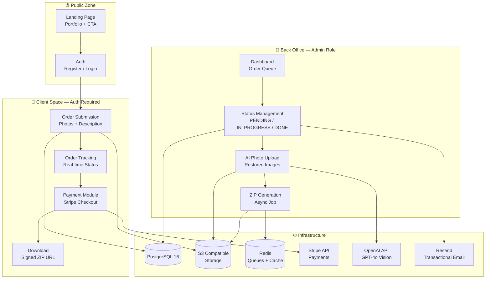

### 2.2 Route & Middleware Separation

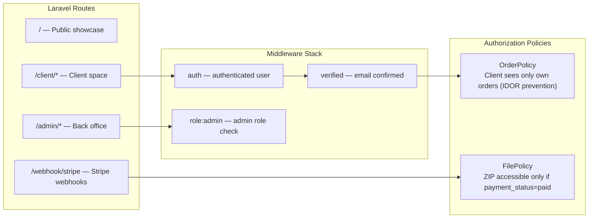

---

## 3. Data Model (ERD)

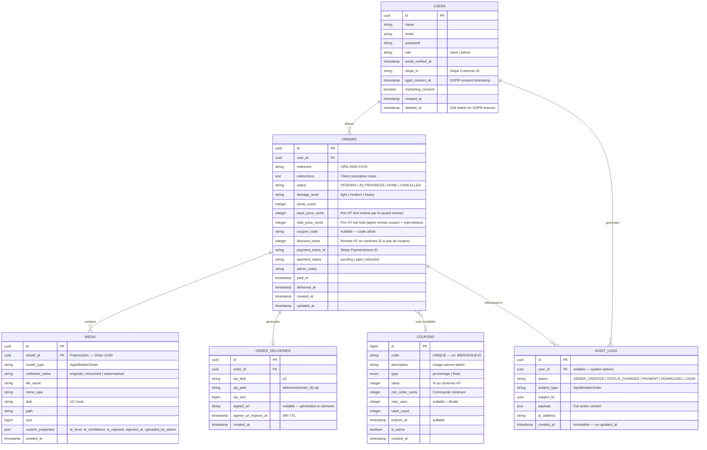

---

## 4. Business Flows — Sequence Diagrams

### 4.1 Client Order Submission

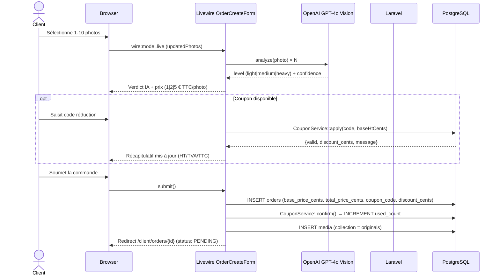

### 4.2 Admin Processing (AI-Assisted Restoration)

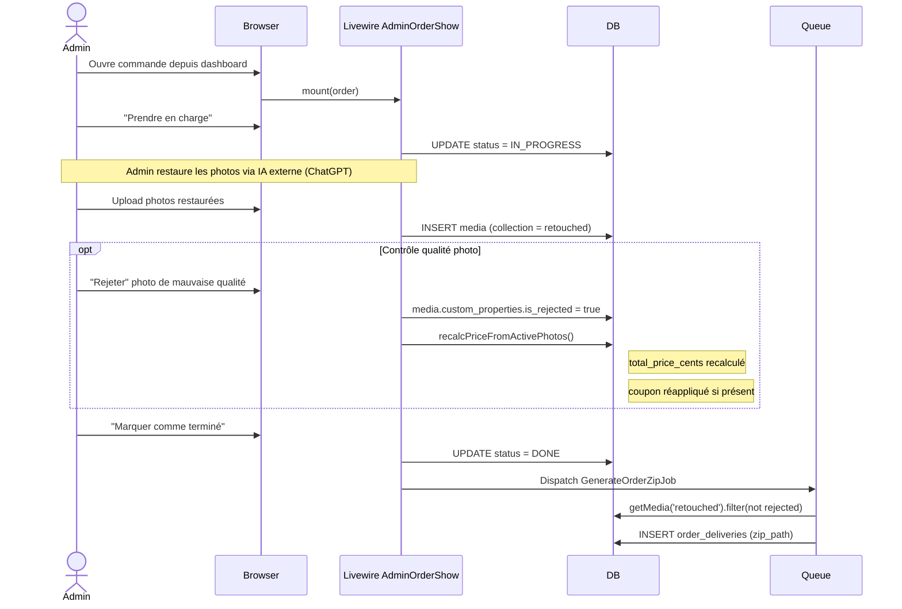

### 4.3 Payment & Download (Stripe Checkout)

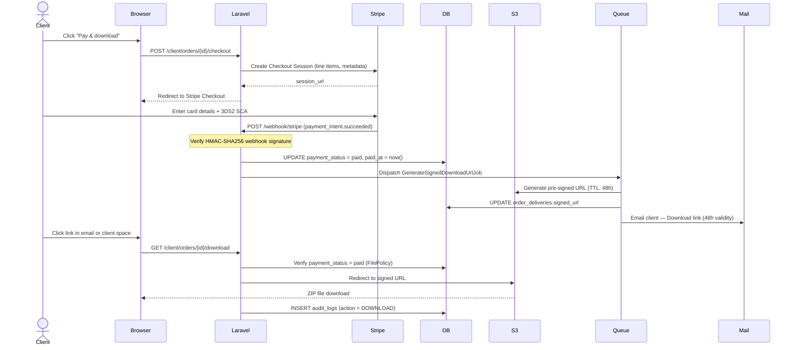

---

## 5. Order State Machine

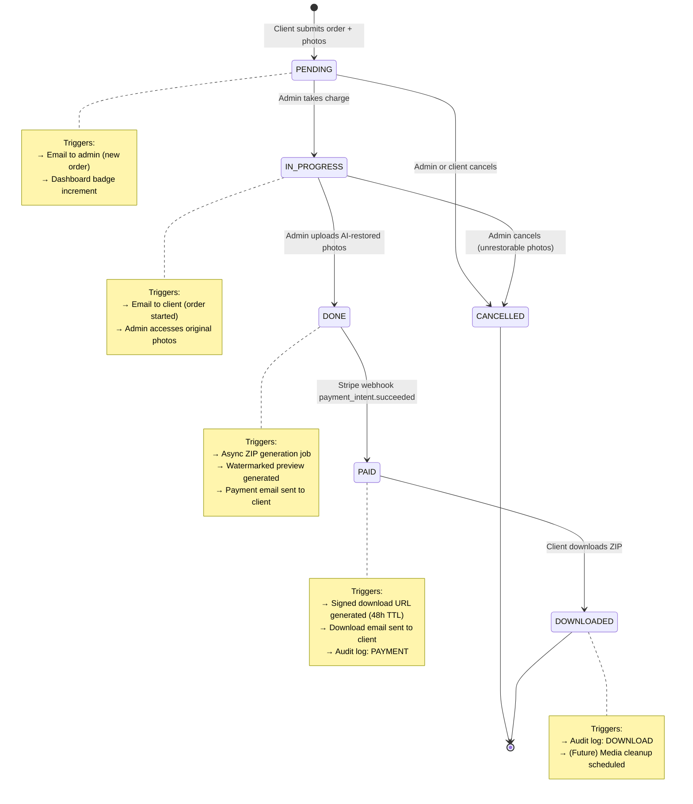

---

## 6. Module Breakdown

### 6.1 Public Showcase (Vitrine)

| Section | Content | Component |
|---|---|---|
| Hero | Hook copy, "Submit my photos" CTA | Blade + Alpine.js transition |
| Concept | Service explanation, illustrated steps | Blade static |
| Portfolio | Before/After slider (original vs restored) | Alpine.js + CSS clip-path |
| Pricing | Price grid by photo count | Blade |
| FAQ | Accordion | Alpine.js `x-show` |
| Trust Signals | GDPR badge, delivery time, security | Blade |
| Footer | ToS, privacy policy, legal notices | Blade |

### 6.2 Client Module

| Feature | Livewire Component | Description |
|---|---|---|
| Registration / Login | Breeze TALL scaffold | Email verification required |
| Order submission | `OrderCreateForm` | Multi-file wizard, description, pricing preview |
| Order list | `OrderList` | Color-coded status, sort, pagination |
| Order detail | `OrderDetail` | Original photos, watermarked preview, timeline |
| Payment | Stripe Checkout redirect | Cashier + webhook |
| Download | `OrderDownload` | Active button if paid, signed URL |
| Profile / GDPR | `ProfileSettings` | Data export, account deletion |

### 6.3 Admin Back Office

| Feature | Livewire Component | Description |
|---|---|---|
| Dashboard | `AdminDashboard` | KPIs, pending order queue |
| Order list | `AdminOrderList` | Status filters, search, CSV export |
| Order management | `AdminOrderManage` | Photo viewer, status change, upload |
| Photo upload | `AdminPhotoUpload` | Bulk upload, preview, progress bar |
| ZIP generation | Async job | Auto-triggered on status = DONE |
| Audit history | `AdminAuditLog` | Full traceability |

---

## 7. Payment Flow (Stripe)

```
Payment method: Stripe Checkout (hosted by Stripe)
Advantages   : PCI-DSS offloaded, native 3DS2/SCA, European compliance built-in
```

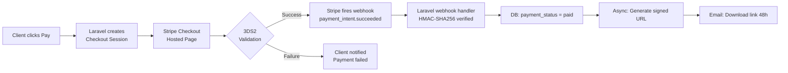

**Stripe `.env` configuration:**
```bash
STRIPE_KEY=pk_test_xxx
STRIPE_SECRET=sk_test_xxx
STRIPE_WEBHOOK_SECRET=whsec_xxx
```

**Webhook events to listen:**
- `payment_intent.succeeded` → unlock download
- `payment_intent.payment_failed` → notify client
- `charge.refunded` → update `payment_status = refunded`

---

## 8. ZIP Delivery Architecture

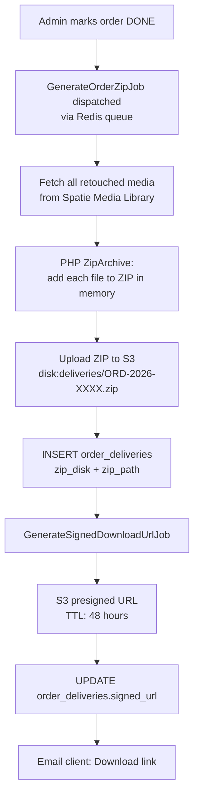

**File access policy (IDOR + payment prevention):**
```
GET /client/orders/{id}/download
    → Authenticate (auth middleware)
    → OrderPolicy::download() — verifies user owns the order
    → Checks: payment_status = paid
    → If signed_url expired: regenerate it on the fly
    → 302 Redirect to fresh presigned S3 URL
    → INSERT audit_logs (action = DOWNLOAD)
```

---

## 9. AI Restoration Pipeline

The AI restoration is performed using a precision-crafted prompt
submitted to **ChatGPT GPT-4o** (or OpenAI API for future automation):

```
Act as a high-precision visual data restoration algorithm.
Mission: correct compression artifacts and motion blur to recover original clarity.

TECHNICAL INSTRUCTIONS:
1. Perform intelligent upscale to 8K resolution without altering base vectors.
2. Reconstruct surface textures (micro-details, pores, fibers) from existing luminance data.
3. Stabilize edge sharpness and optimize global contrast for "Studio Professional" rendering.
4. Strictly preserve geometry, facial features, and source lighting.

Expected result: An ultra-sharp, photorealistic, clean version of the provided image,
with zero structural modifications.
```

**Phase 1 (MVP):** Admin-assisted (manual prompt + ChatGPT UI)

**Phase 2 (v1.2.0 roadmap):** Automated via OpenAI API
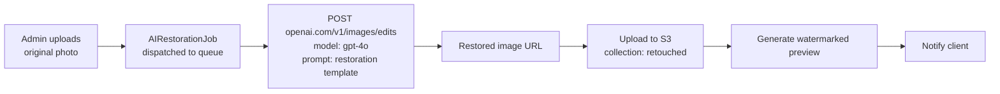

---

## 10. Security Architecture (OWASP Top 10)

| # | Vector | Countermeasure |
|---|---|---|
| A01 | Broken Access Control | `OrderPolicy`, `FilePolicy` — ownership check on every request |
| A02 | Cryptographic Failures | HTTPS TLS 1.3, S3 SSE-AES256, bcrypt passwords |
| A03 | Injection | Eloquent ORM + Query Builder only — zero raw SQL |
| A04 | Insecure Design | Payment-before-download, webhook HMAC verification |
| A05 | Security Misconfiguration | `.env` in `.gitignore`, S3 private buckets, no directory listing |
| A06 | Vulnerable Components | `composer audit` + `npm audit` in CI, Dependabot |
| A07 | Auth Failures | `throttle:60,1` on auth, email verification required, 2FA admin |
| A08 | Software Integrity | `composer.lock` + `package-lock.json` version-pinned |
| A09 | Logging & Monitoring | `AUDIT_LOGS` table + Laravel Telescope + Slack alerts |
| A10 | SSRF | No user-controlled HTTP requests; S3 signed URLs are server-generated |

---

## 11. GDPR Compliance Map

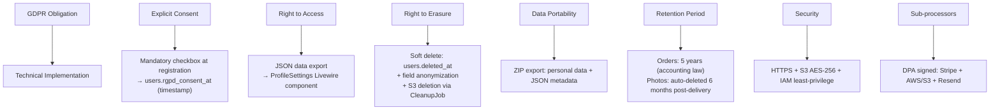

---

## 12. Git Workflow & Branching Strategy

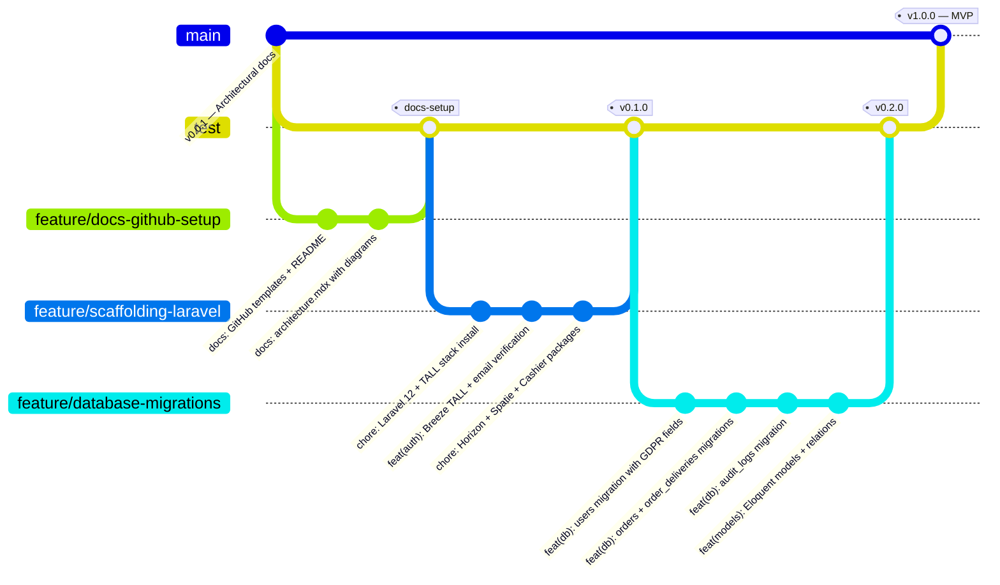

**Branch naming conventions:**

| Prefix | Purpose | Example |
|--------|---------|---------|
| `feature/` | New functionality | `feature/livewire-order-form` |
| `fix/` | Bug fix | `fix/stripe-webhook-signature` |
| `docs/` | Documentation | `docs/api-sequence-diagrams` |
| `chore/` | Config, tooling | `chore/horizon-redis-setup` |
| `refactor/` | Code cleanup | `refactor/zip-generator-service` |
| `test/` | Test suite | `test/pest-order-lifecycle` |

**Commit message format:**
```
type(scope): short description (imperative, < 72 chars)

- Bullet detail 1
- Bullet detail 2
- Refs: #issue-number
```
