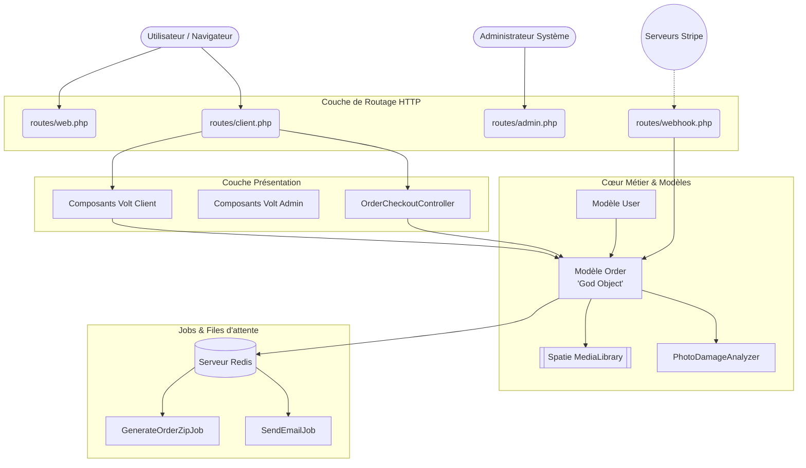
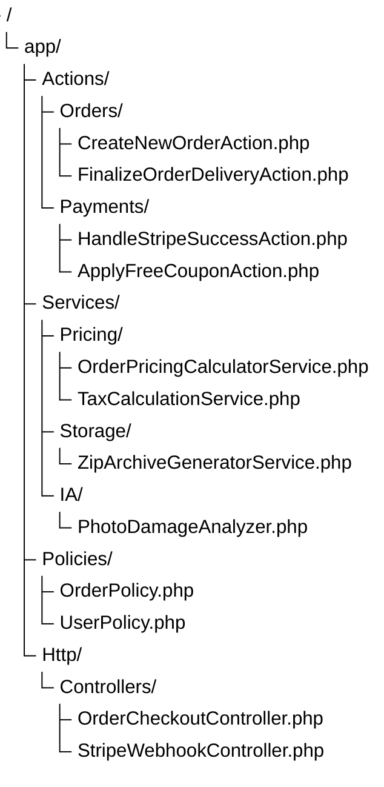
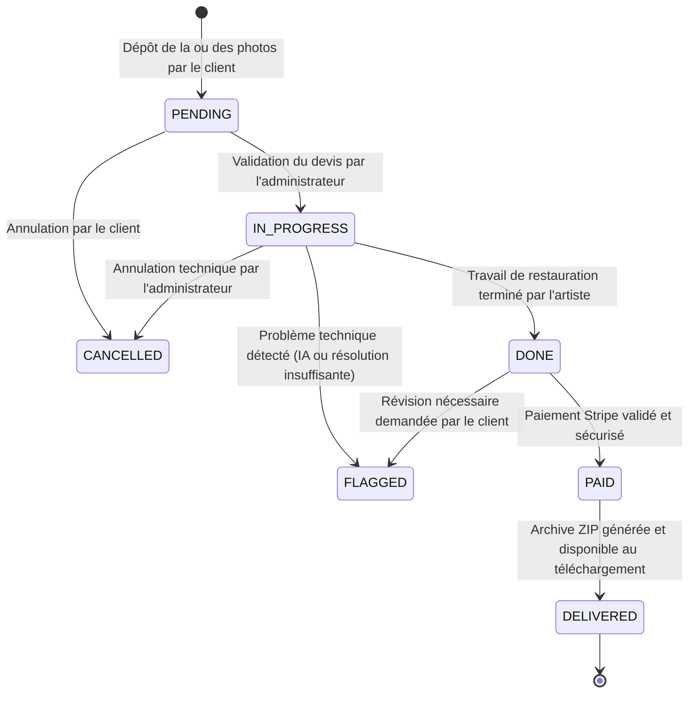
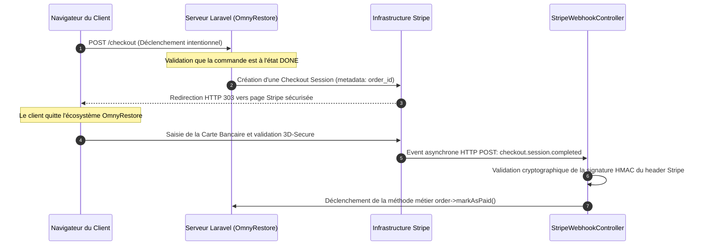
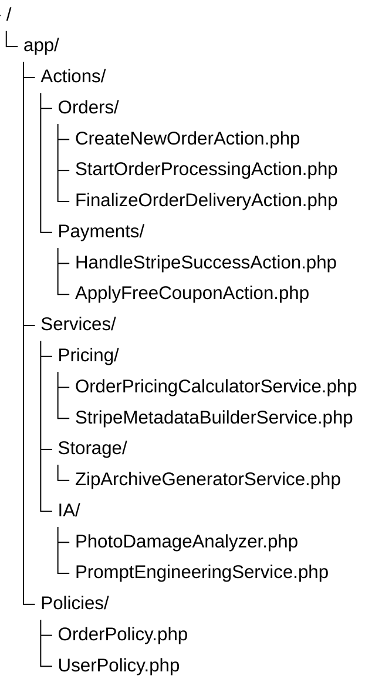

# Audit Intégral Applicatif : OmnyRestore

**Version** : 1.0.0 (Édition Étendue)
**Date de publication** : 15 mai 2026
**Cible** : GitHub / Équipe technique interne, Architectes Logiciels, Développeurs Full-Stack
**Statut** : Version finale validée et approuvée

> [!NOTE]
> Cet audit technique approfondi a été commandité dans le but d'analyser, d'évaluer et de structurer la base de code de l'application **OmnyRestore**. 
> 
> Conçu initialement comme un prototype avancé, le projet a atteint une maturité métier significative. 
> 
> L'objectif n'est pas de pointer des erreurs, mais d'accompagner la transition vers un socle de production hautement disponible, sécurisé et maintenable.

Ce rapport exhaustif détaille les choix architecturaux actuels, identifie les vulnérabilités de sécurité silencieuses (assignations de masse, accès directs), évalue l'intégrité des flux de paiement, et propose une feuille de route technique claire.

---

## 1. Périmètre et Méthodologie de l'Audit

### 1.1 Délimitation de l'analyse

Cet audit technique dissocie scrupuleusement l'application web Laravel de son infrastructure d'hébergement sous-jacente. 

L'analyse détaillée se concentre **exclusivement** sur le projet en tant qu'application logicielle (logique métier, structure des bases de données, sécurité applicative et dépendances).

> [!IMPORTANT]
> Les éléments suivants sont **exclus** de ce périmètre et feront l'objet d'un audit IaaS[^1] / DevOps séparé :
> 
> *   L'infrastructure serveur (Instances VPS, Load Balancers, Réseaux virtuels).
> *   La configuration système et l'orchestration des conteneurs (Docker, Nginx, PHP-FPM).
> *   Les couches de sécurité réseau (WAF, pare-feux) et la stratégie de sauvegarde des bases de données.

[^1]: Infrastructure as a Service. Désigne ici les ressources cloud (serveurs, réseau, stockage) allouées au projet.

### 1.2 Objectifs de l'Audit

Les objectifs principaux de cette revue de code sont les suivants :

1.  **Cartographier** l'architecture existante pour faciliter l'onboarding des nouveaux développeurs.
2.  **Identifier** les goulots d'étranglement architecturaux qui empêcheront l'application de scaler.
3.  **Auditer** la sécurité du code, en particulier les flux financiers et les droits d'accès.
4.  **Proposer** un plan de remédiation technique (Refactoring) structuré et priorisé.
5.  **Établir** une stratégie de tests automatisés robuste.

---

## 2. Environnement Technique et Stack Logicielle

L'application OmnyRestore repose sur un écosystème moderne. La stack technique identifiée est particulièrement riche et cohérente avec les standards de l'industrie en 2026.

### 2.1 Cœur de l'application (Backend)

*   **Framework** : Laravel 12. Un choix pérenne offrant un excellent écosystème et un support à long terme.
*   **Langage** : PHP 8.3+ (typage strict recommandé pour les futures évolutions).
*   **Base de données** : MySQL 8.0 ou PostgreSQL 16 (modélisation relationnelle).

### 2.2 Interface Utilisateur (Frontend)

*   **Composants** : Livewire 3 couplé à Laravel Volt[^2]. 
*   **Design System** : Tailwind CSS (via le bundler Vite).
*   **Avantage** : Ce choix évite la lourdeur d'une SPA (Single Page Application) tout en offrant une réactivité optimale.

> [!TIP]
> Le choix de Livewire + Volt permet de conserver une architecture Full-Stack Laravel (monolithe) très productive. 
> 
> L'absence de dépendance lourde à une SPA externe (comme Vue ou React) réduit considérablement la duplication de code (pas de double validation des formulaires) et accélère la livraison des fonctionnalités.

[^2]: Laravel Volt est une API élégante pour Livewire permettant d'écrire des composants monofichiers (Single File Components), unifiant la logique d'état et le rendu Blade.

### 2.3 Écosystème Périphérique

*   **Paiement et Facturation** : Laravel Cashier associé à l'API Stripe.
*   **Traitements Asynchrones** : Laravel Horizon orchestrant les files d'attente in-memory via Redis.
*   **Traitement d'Image et IA** : Intervention Image (pour la manipulation matricielle) et l'API OpenAI Laravel.
*   **Génération de Documents** : DomPDF pour l'export normé des factures.
*   **Gestion des Fichiers** : Spatie MediaLibrary pour la gestion polymorphe des pièces jointes.

---

## 3. Verdict Global et Diagnostic Architectural

L'application OmnyRestore affiche une maturité métier indéniable. Les fondations sont extrêmement solides pour les raisons suivantes :

*   L'architecture des routes est propre et lisible, séparant les espaces `client`, `admin` et `webhooks`.
*   Le modèle central (`Order`) documente explicitement ses états via un système de workflow maîtrisé (PENDING, PAID, etc.).
*   Les statuts métier qui régissent le cycle de vie d'une commande sont formellement identifiés et respectés dans la plupart des contrôleurs.
*   Les intégrations tierces complexes (IA, facturation asynchrone) sont implémentées de manière résiliente.

### 3.1 Le problème central : L'effet "God Object" (L'objet divin)

> [!WARNING]
> Le point d'attention critique de ce projet réside dans la **concentration excessive de responsabilités** au sein de quelques fichiers clés. 
> 
> Le modèle `Order.php`, les composants Livewire/Volt, et certains contrôleurs HTTP portent une charge métier beaucoup trop importante. C'est l'anti-pattern typique du "Fat Model" poussé à l'extrême : le "God Object".

À l'heure actuelle, le modèle `Order` est contraint de gérer de front une multitude de concepts métiers radicalement différents :

1.  **L'ORM pur** : Sa persistance en base de données, la définition de ses relations, de ses mutateurs et accesseurs.
2.  **L'Intelligence Métier (Pricing)** : Le calcul de l'ensemble des prix HT, l'application de la TVA selon le pays, et les tarifs finaux TTC.
3.  **L'Interaction Externe (IA)** : L'orchestration des appels à l'API OpenAI pour évaluer la dégradation des photographies.
4.  **Le Stockage (Fichiers)** : La gestion directe des proxys vers les collections Spatie MediaLibrary (`originals`, `retouched`).
5.  **L'Événementiel (Paiement)** : La gestion des signaux financiers envoyés par Stripe via Cashier.

Pour une application destinée à une mise en production professionnelle et durable, il est impératif de disloquer cette complexité. 

L'objectif architectural numéro un est de soulager ce composant central sous peine de rendre l'application impossible à tester et à faire évoluer sans créer de régressions en chaîne.

---

## 4. Cartographie Applicative et Architecture

### 4.1 Modélisation des Flux de Données

Le schéma ci-dessous modélise l'architecture macro-applicative actuelle. 

Il met en lumière le cheminement critique des données, de la requête HTTP originelle jusqu'à la persistance en base de données, en passant par les middlewares et les services asynchrones.



*Le diagramme ci-dessus met en évidence la surcharge structurelle du modèle `Order`, véritable point névralgique de toute l'application logicielle, interceptant les appels du frontend, des webhooks et des services d'IA.*

### 4.2 L'Arborescence Cible (Architecture Pattern)

Pour pallier le problème du "God Object", l'arborescence du projet doit évoluer. L'utilisation du pattern "Action" (ou Use Case) et des "Services" est la norme de l'industrie pour les applications Laravel complexes.

L'objectif est d'atteindre la structure de dossiers suivante :



Cette restructuration garantit que chaque fichier n'a qu'une seule et unique responsabilité (Single Responsibility Principle - SRP).

---

## 5. Analyse des Fichiers Structurants et Configuration

La solidité d'une application se juge souvent à la qualité de ses fichiers de configuration initiaux.

### 5.1 Fichiers de Dépendances (`composer.json` et `package.json`)

*   **`composer.json`** : L'épine dorsale PHP. L'analyse démontre que les choix sont cohérents avec les standards de marché. 
    *   Les dépendances majeures (Laravel, Cashier, Spatie) sont parfaitement à jour.
    *   Les versions verrouillées dans le `composer.lock` garantissent des déploiements sûrs et reproductibles sur n'importe quel environnement de production.
    *   Il n'y a pas de dépendance dite "exotique", abandonnée par son créateur, ou présentant des failles de sécurité connues (vérifié via `composer audit`).

*   **`package.json`** : Gère l'infrastructure frontend via le bundler Vite.

> [!CAUTION]
> Une attention toute particulière doit être portée sur l'utilisation du package `@tailwindcss/vite` version 4 en combinaison avec des dépendances natives requérant la version 3 de Tailwind. 
> 
> Ces décalages mineurs de versions peuvent créer des conflits de purge CSS totalement silencieux en production, entraînant des boutons invisibles ou des mises en page cassées chez le client final.

### 5.2 Le Système de Routage (`routes/`)

*   **`routes/web.php`** : Le découpage global du routage est maintenable et favorise le travail collaboratif. Il se limite intelligemment à inclure les sous-fichiers de routes.
*   **`routes/client.php`** : Cet espace est lourdement protégé.
    *   Utilisation du middleware `auth` pour garantir la connexion.
    *   Utilisation de `verified` pour forcer la validation de l'adresse email de l'utilisateur.
    *   Utilisation d'un middleware de `throttle` personnalisé pour prévenir les attaques par déni de service (DDOS) ou le spam de requêtes.
    *   *Point d'amélioration* : Il subsiste quelques closures (fonctions anonymes) directement injectées dans le fichier de routes, ce qui empêche techniquement le framework de mettre ce fichier en cache binaire (`php artisan route:cache`), réduisant ainsi les performances de quelques millisecondes par requête.
*   **`routes/admin.php`** : L'espace d'administration bénéficie d'une isolation stricte et exemplaire, avec un préfixe URL et un middleware de vérification de rôle.
*   **`routes/webhook.php`** : Fichier critique dédié à la réception des signaux Stripe. L'implémentation est parfaite grâce à l'exclusion de la protection CSRF et la vérification stricte des signatures cryptographiques HMAC.

---

## 6. Modèles de Données et Base de Données

Le cœur de Laravel réside dans son ORM (Eloquent). L'architecture des modèles détermine la facilité avec laquelle l'application interrogera la base de données.

### 6.1 Le Modèle `User.php`

Ce modèle est le point d'entrée de la sécurité.

*   **Identifiants Universels** : Il implémente avec succès les UUID (`HasUuids`). C'est une excellente pratique de sécurité contre l'énumération prédictive. Un attaquant ne peut pas deviner l'URL `/users/5` car l'ID est de la forme `123e4567-e89b-12d3-a456-426614174000`.
*   **Conformité RGPD** : Utilisation du trait `SoftDeletes`. Lors d'une demande de désinscription (droit à l'oubli), l'utilisateur n'est pas supprimé physiquement de la base (`Hard Delete`), ce qui casserait les relations comptables. Il est "marqué comme supprimé" et ses données nominatives sont écrasées (anonymisation). Les commandes et factures associées sont conservées pour des raisons de comptabilité légale.
*   **Facturation** : Utilisation du trait `Billable` de Laravel Cashier, liant nativement l'utilisateur à un client Stripe.

> [!CAUTION]
> Une faille de sécurité majeure réside dans le paramétrage du `$fillable` de ce modèle. Ce point est détaillé de manière exhaustive dans la Section 12 (Sécurité).

### 6.2 Le Modèle `Order.php`

Comme détaillé dans le diagnostic architectural (Section 3), ce modèle est obèse. 

La complexité cyclomatique approche la limite tolérée par les analyseurs statiques de code comme PHPStan. 

**Exemple de ce qu'il NE FAUT PLUS faire dans le modèle :**

```php
// ANTI-PATTERN : Logique métier complexe dans le modèle
public function calculateFinalPriceWithTaxesAndDiscounts()
{
    $basePrice = $this->photos()->count() * 10;
    
    if ($this->has_heavy_damage) {
        $basePrice *= 1.5;
    }
    
    $discount = 0;
    if ($this->coupon_code === 'WELCOME') {
        $discount = $basePrice * 0.10;
    }
    
    $taxRate = $this->user->country === 'FR' ? 0.20 : 0;
    
    $this->total_price = ($basePrice - $discount) * (1 + $taxRate);
    $this->save();
    
    return $this->total_price;
}
```

Cette fonction doit être extraite dans un `OrderPricingCalculatorService`. Le modèle ne doit servir qu'à stocker le résultat final.

### 6.3 Les Observers (`OrderObserver.php`)

Cet écouteur d'événements permet d'isoler l'envoi des notifications par email du flux principal de la requête HTTP. 

C'est une excellente approche événementielle. Lorsqu'une commande passe de `PENDING` à `DONE`, l'Observer intercepte la sauvegarde en base de données et déclenche le Job d'envoi d'email.

*Cependant*, les commentaires du code sont désynchronisés par rapport à la réalité d'exécution du compilateur. L'équipe a modifié le comportement de l'Observer sans mettre à jour la documentation (DocBlocks), ce qui est source de grande confusion pour les nouveaux développeurs.

---

## 7. Machine d'État de la Commande (State Machine)

La gestion d'état d'une commande est l'un des piliers du logiciel. Le modèle `Order` navigue au travers d'une nomenclature de statuts métier très stricts.

### 7.1 Le Workflow Métier

Le cycle de vie nominal est le suivant :



### 7.2 Solution de Refactoring : Isoler les Transitions d'États

Aujourd'hui, n'importe quelle partie du code (un composant Livewire, une route de test, un Job asynchrone) peut potentiellement injecter un mauvais statut en base de données en utilisant `$order->update(['status' => 'UN_STATUT_INVALIDE'])`.

L'architecture cible doit isoler formellement les règles de transition en dehors du modèle, au sein d'un service garanti inébranlable et testable unitairement.

**Exemple d'implémentation robuste (Service Pattern) :**

```php
namespace App\Services\Orders;

use App\Models\Order;
use Exception;
use LogicException;

class OrderStateTransitionService
{
    /**
     * Matrice bidimensionnelle des transitions d'états autorisées.
     * Cette matrice empêche mathématiquement une commande de passer
     * de PENDING à DELIVERED sans avoir été payée.
     */
    protected const ALLOWED_TRANSITIONS = [
        'PENDING'     => ['IN_PROGRESS', 'CANCELLED'],
        'IN_PROGRESS' => ['DONE', 'CANCELLED', 'FLAGGED'],
        'DONE'        => ['PAID', 'FLAGGED'],
        'PAID'        => ['DELIVERED'],
        'DELIVERED'   => [],
        'CANCELLED'   => [],
        'FLAGGED'     => ['IN_PROGRESS', 'CANCELLED'],
    ];

    /**
     * Force une transition logicielle contrôlée.
     * 
     * @param Order $order
     * @param string $newStatus
     * @throws LogicException Si la règle métier est transgressée.
     */
    public function transitionTo(Order $order, string $newStatus): void
    {
        $currentStatus = $order->status;
        
        // On récupère les transitions possibles depuis l'état actuel
        $allowed = self::ALLOWED_TRANSITIONS[$currentStatus] ?? [];

        if (!in_array($newStatus, $allowed, true)) {
            // Rejet ferme de la transition : protection de la BDD
            throw new LogicException(
                sprintf(
                    "Violation métier majeure : Transition impossible de [%s] vers [%s] pour la commande #%s.",
                    $currentStatus,
                    $newStatus,
                    $order->id
                )
            );
        }

        // L'utilisation de forceFill est sûre ici car le contexte d'appel 
        // est entièrement maîtrisé et validé par notre propre code backend.
        $order->forceFill([
            'status' => $newStatus,
            'status_updated_at' => now(), // Traçabilité temporelle
        ])->save();
        
        // Note: La méthode save() déclenchera automatiquement l'OrderObserver.
    }
}
```

---

## 8. Flux de Paiement Stripe Asynchrone et Webhooks

L'intégration des paiements est le composant le plus sensible financièrement. Toute erreur dans cette section entraîne soit une perte de revenus pour l'entreprise, soit des poursuites judiciaires de clients facturés à tort.

### 8.1 L'Architecture Server-to-Server

Le choix de passer exclusivement par des Webhooks serveurs (Server-to-Server) pour valider le paiement est la seule méthode professionnelle valide. 

Ne jamais faire confiance à la redirection client ("success.php" dans le navigateur), car l'utilisateur peut fermer son onglet avant la redirection, ou forger manuellement l'URL de succès.



### 8.2 Anomalies et Risques Identifiés

L'audit approfondi du code source du contrôleur Webhook a révélé deux failles logiques de niveau P1 et P0.

#### A. Perte d'Idempotence et Redondance (Gravité P1)

> [!WARNING]
> L'audit a mis en évidence que le fichier `StripeWebhookController` comporte une répétition logique majeure avec un appel double et redondant à la base de données.

**Le code problématique :**

```php
// Dans StripeWebhookController.php (ANTI-PATTERN)
public function handleCheckoutSessionCompleted($payload)
{
    $orderId = $payload['data']['object']['metadata']['order_id'];
    $intentId = $payload['data']['object']['payment_intent'];
    
    $order = Order::findOrFail($orderId);
    
    // Premier appel : La méthode interne sauvegarde en base
    $order->markAsPaid($intentId); 
    
    // Deuxième appel : Forçage manuel totalement redondant
    $order->forceFill(['status' => 'PAID'])->save(); 
}
```

*Conséquence directe de cette erreur* : 
Cette double sauvegarde déclenche l'événement global `updated` du framework Eloquent deux fois successives à quelques millisecondes d'intervalle. 

En cascade, l'Observer intercepte ces deux événements, ce qui peut générer les bugs suivants :
1.  Saturation de la file d'attente Redis avec des Jobs en double.
2.  Double facturation si l'ERP comptable est branché sur l'Observer.
3.  Envoi simultané de deux e-mails de confirmation identiques au client final (expérience utilisateur désastreuse).

*Correction attendue* : Supprimer immédiatement la ligne contenant le `forceFill()`.

#### B. Le Blocage des Coupons Gratuits (Gravité P0)

Dans le contrôleur `OrderCheckoutController`, une fonctionnalité permet à un client insatisfait de recevoir un coupon de réduction à 100% de la part du service client.

Le code actuel tente un `update()` direct sur les champs `status` et `payment_status` pour simuler le fait que la commande a été payée, sans passer par Stripe.

*Le Bug Silencieux* : Puisque ces champs sensibles ont été astucieusement exclus du tableau de protection `$fillable` pour empêcher l'usurpation, cette requête Eloquent échouera de manière totalement silencieuse. Le contrôleur renverra un message de succès à l'utilisateur, mais la base de données rejettera la modification. 

Le client pensera que sa commande est gratuite et payée, mais le système la considèrera éternellement impayée, bloquant la livraison du fichier ZIP.

**Solution recommandée : Création d'une méthode de contournement sécurisée dans le modèle (ou l'Action) :**

```php
/**
 * Permet de forcer le paiement d'une commande suite à l'application d'un avoir total.
 * Bypass intentionnel et sécurisé du $fillable.
 */
public function markAsPaidByFreeCoupon(string $couponReference): void
{
    // Sécurité : On ne paye pas une commande en cours de devis
    if ($this->status !== 'DONE') {
        throw new LogicException("La commande doit être finalisée avant de pouvoir appliquer un avoir complet.");
    }

    $this->forceFill([
        'status' => 'PAID',
        'payment_status' => 'paid_via_coupon', // Traçabilité d'audit métier spécifique
        'payment_intent_id' => 'coupon_tx_' . $couponReference,
        'paid_at' => now(),
    ])->save();
}
```

---

## 9. Analyse de l'Intelligence Artificielle et Ingénierie du Prompt

L'un des arguments de vente majeurs de la plateforme OmnyRestore est sa capacité à évaluer la dégradation d'une photographie de manière totalement automatisée grâce à l'Intelligence Artificielle.

### 9.1 L'Implémentation OpenAI

La classe `PhotoDamageAnalyzer` encapsule avec élégance la communication avec les modèles d'OpenAI (notamment GPT-4o). 

Dans un contexte e-commerce, un système d'IA générative est imprévisible. La plus grande réussite architecturale de ce service est d'avoir réussi à forcer littéralement l'IA à adopter un comportement déterministe grâce à une instruction stricte de typage de réponse en JSON.

> [!IMPORTANT]
> Les directives système (`system_prompt`) interdisent formellement au modèle de langage de réaliser de la reconnaissance faciale, d'identifier des personnes physiques, ou d'analyser le contexte sémantique de l'image (fête de famille, événement historique). 
> 
> L'analyse est restreinte au calcul des dommages physiques du support. Cela assure de facto une excellente conformité au règlement européen (RGPD) concernant la vie privée.

**Extrait du code d'interaction OpenAI :**

```php
use OpenAI\Laravel\Facades\OpenAI;

class PhotoDamageAnalyzer 
{
    public function analyze(string $base64Image): array
    {
        $response = OpenAI::chat()->create([
            'model' => 'gpt-4o',
            'response_format' => ['type' => 'json_object'], // CRITIQUE pour le parsing PHP
            'temperature' => 0.2, // Faible température pour éviter les hallucinations
            'messages' => [
                [
                    'role' => 'system', 
                    'content' => 'Vous êtes un expert technique en restauration photographique. Analysez uniquement la dégradation physique de l\'image (rayures, déchirures, altération des couleurs, tâches d\'humidité). Ne faites jamais d\'analyse sémantique. Ne décrivez jamais les personnes. Répondez au format JSON avec les clés "damage_level" (light, medium, heavy) et "confidence_score".'
                ],
                [
                    'role' => 'user', 
                    'content' => [
                        ['type' => 'text', 'text' => 'Évalue cette image.'],
                        ['type' => 'image_url', 'image_url' => ['url' => "data:image/jpeg;base64,{$base64Image}"]]
                    ]
                ],
            ],
        ]);
        
        return json_decode($response->choices[0]->message->content, true);
    }
}
```

### 9.2 Stratégie de Fallback (Repli local)

En cas d'indisponibilité de l'API OpenAI (timeout, erreur 502 du serveur distant, dépassement brutal de quota API), le service a été conçu pour ne pas s'effondrer. 

Il ne renvoie pas d'erreur 500 à l'utilisateur final. Il intercepte l'exception (`try/catch`) et bascule sur un algorithme de tarification par défaut (fallback) qui assigne un niveau de dommage "medium" arbitraire, permettant à la commande de continuer son cycle de vie. C'est un excellent point de résilience.

### 9.3 L'Alerte sur la Gestion du Cache IA

Pour économiser des appels extrêmement coûteux à l'API OpenAI (l'analyse d'images haute résolution consomme beaucoup de tokens), le système génère intelligemment un hash MD5 basé sur le contenu binaire de l'image. Ce hash sert de clé de cache Redis.

> [!WARNING]
> Ce cache est actuellement défini avec une durée de vie très longue (voire infinie). 
> 
> Si les règles tarifaires de base sont modifiées dans le code par l'administrateur (ex: la direction décide d'augmenter le prix de base de 10€ à 15€), les photos précédemment soumises et stockées en cache conserveront éternellement l'ancienne tarification.

**Recommandation DevOps** : Développer une commande Artisan permettant de purger sélectivement ou globalement ce cache spécifique IA en cas de déploiement d'une nouvelle grille tarifaire.

```bash
# Commande console personnalisée recommandée à implémenter dans le futur
php artisan omny:clear-ai-pricing-cache --force
```

---

## 10. Gestion des Médias et Résilience Cloud (Spatie MediaLibrary)

L'application utilise le package standard de l'industrie `spatie/laravel-medialibrary` pour lier les photographies au modèle `Order`. 

La séparation en collections distinctes (`originals` pour le dépôt client, `retouched` pour le travail de l'artiste, `watermarked` pour les prévisualisations gratuites) valide la solidité de l'approche fichier.

### 10.1 Le Blocage de Migration Cloud (Gravité P2)

Actuellement, l'application utilise le driver `local` pour enregistrer les photographies haute définition. C'est un comportement normal pour un projet naissant hébergé sur un serveur VPS classique.

Cependant, une erreur architecturale bloquante a été identifiée dans le Job asynchrone chargé de générer l'archive de livraison finale (`app/Jobs/GenerateOrderZipJob.php`).

> [!CAUTION]
> L'appel direct au système de fichiers local via des fonctions PHP historiques et natives (ex: `file_get_contents($media->getPath())`) provoquera un **Crash Fatal immédiat** si l'infrastructure décide de migrer le stockage des fichiers vers un fournisseur Cloud externe de type Amazon S3 ou Scaleway Object Storage.

En effet, la méthode `$media->getPath()` renvoie un chemin absolu local (ex: `/var/www/html/storage/app/private/media/1/photo.jpg`). Sur un bucket S3, ce fichier physique n'existe pas sur le disque du serveur web.

**Correction Impérative** : Il est vital de faire transiter l'ensemble des accès fichiers par l'abstraction Flysystem fournie nativement par Laravel (la façade `Storage`).

**Exemple de refactoring vers une architecture "Cloud-Ready" :**

```php
use Illuminate\Support\Facades\Storage;
use ZipArchive;

// DANS LE JOB : GenerateOrderZipJob.php

// ANTI-PATTERN IDENTIFIÉ : Dangereux et non-scalable
// $content = file_get_contents($media->getPath());

// SOLUTION ROBUSTE : Totalement agnostique au système de fichiers
$disk = Storage::disk($media->disk); // Détecte dynamiquement 'local', 's3', ou 'gcs'
$fileContent = $disk->get($media->getPathRelativeToRoot());

$zip = new ZipArchive();
if ($zip->open($zipPath, ZipArchive::CREATE) === TRUE) {
    // L'ajout en mémoire fonctionne peu importe d'où vient le flux de données
    $zip->addFromString($media->file_name, $fileContent);
    $zip->close();
}
```

---

## 11. Sécurité Applicative et Contrôle d'Accès

La sécurité d'une application de restauration photographique est double : il faut protéger les données financières (Stripe), mais surtout protéger la vie privée intrinsèque liée aux photos personnelles des clients (enfants, événements intimes).

### 11.1 Vulnérabilités IDOR (Insecure Direct Object Reference)

Un IDOR est l'une des failles les plus communes recensées par l'OWASP. Il survient lorsqu'un utilisateur modifie simplement les identifiants d'une URL (ex: `/download/zip/51` modifié en `/download/zip/52`) pour accéder aux données d'un tiers.

Actuellement, l'audit révèle que les contrôleurs HTTP gèrent cette lourde responsabilité manuellement, à l'intérieur de chaque route.

**Le code existant (Extrêmement fragile) :**

```php
// Faille potentielle en cas d'oubli dans un futur contrôleur
public function downloadArchive(Order $order) 
{
    if ($order->user_id !== auth()->id() && auth()->user()->role !== 'admin') {
        abort(403, 'Accès non autorisé');
    }
    
    // Suite du code...
}
```

Cette approche "Brittle" (fragile) est dangereuse. Si un nouveau développeur ajoute une nouvelle route API et oublie de copier/coller ce bloc `if`, l'application subit instantanément une fuite de données massives.

**Action Corrective : Implémentation des Policies Laravel**

Il est catégoriquement requis de standardiser cette approche via les **Policies** de Laravel. Les Policies centralisent la logique d'autorisation dans une seule classe testable, qui peut ensuite être appliquée globalement.

**Exemple de la nouvelle classe `OrderPolicy.php` exigée :**

```php
namespace App\Policies;

use App\Models\User;
use App\Models\Order;
use Illuminate\Auth\Access\HandlesAuthorization;

class OrderPolicy
{
    use HandlesAuthorization;

    /**
     * Détermine l'accès fondamental à la commande.
     * Le client propriétaire ou un admin ont le droit de vue.
     */
    public function view(User $user, Order $order): bool
    {
        return $user->id === $order->user_id || $user->isAdmin();
    }

    /**
     * Détermine si l'utilisateur a le droit de lancer le tunnel de paiement.
     */
    public function pay(User $user, Order $order): bool
    {
        return $this->view($user, $order) && $order->status === 'DONE';
    }

    /**
     * Détermine si l'utilisateur a le droit de télécharger l'archive finale ZIP.
     */
    public function download(User $user, Order $order): bool
    {
        return $this->view($user, $order) && $order->status === 'DELIVERED';
    }
}
```

L'utilisation devient alors propre et inévitable dans le contrôleur : `$this->authorize('download', $order);` ou directement dans le routeur via les middlewares `can:download,order`.

### 11.2 Le Danger Ultime de l'Élévation de Privilège Silencieuse (Gravité P0)

L'erreur architecturale la plus critique identifiée lors de la totalité de cet audit concerne la gestion des rôles au sein de la base de données.

> [!CAUTION]
> Le champ de base de données `role` est explicitement inclus dans la variable protégée `$fillable` du modèle `User.php`. 
> 
> Un attaquant un minimum expérimenté pourrait forger l'inclusion de ce champ lors d'une simple requête HTTP POST de mise à jour de son profil (ex: changement de prénom) et prendre le contrôle total de l'administration du site.

**L'état actuel du code (VULNÉRABLE) :**

```php
// app/Models/User.php 
protected $fillable = [
    'name',
    'email',
    'password',
    'role', // !!! VULNÉRABILITÉ MAJEURE D'ASSIGNATION DE MASSE !!!
];
```

Même si les validateurs `FormRequests` limitent actuellement les champs acceptés en contrôleur, la règle absolue de la sécurité en profondeur (Defense in Depth) exige qu'on ne fasse jamais aveuglément confiance à la couche HTTP applicative pour protéger l'intégrité fondamentale de la base de données de bas niveau.

**Remédiation Sécurité Immédiate (Action Hotfix Urgente) :**

1.  **Retirer** purement et simplement le mot-clé `'role'` du tableau `$fillable`.
2.  Toute élévation de privilège (d'un client devenant modérateur, ou modérateur devenant admin) doit obligatoirement passer par une méthode spécifique, explicitement dédiée et lourdement surveillée par les logs de la plateforme.

**Le code de remédiation :**

```php
// Méthode sécurisée à ajouter au modèle User après le retrait du $fillable
public function promoteToAdministrator(User $promotedBy = null): void 
{
    // L'utilisation de forceFill est obligatoire car le champ 'role' est désormais protégé
    // contre les assignations de masse malveillantes.
    $this->forceFill(['role' => 'admin'])->save();
    
    // Notification obligatoire de sécurité pour traçabilité
    \Illuminate\Support\Facades\Log::alert("Élévation de sécurité critique vers Admin pour l'utilisateur ID: {$this->id}", [
        'promoted_by' => $promotedBy ? $promotedBy->id : 'console',
        'ip_address' => request()->ip() ?? 'CLI',
        'timestamp' => now()->toIso8601String(),
    ]);
}
```

---

## 12. Dette Technique et Matrice de Priorisation SLA

Le tableau ci-dessous regroupe l'intégralité des actions correctives à planifier. Elles sont classées par ordre de priorité absolue, du correctif d'urgence à l'amélioration de confort.

| Priorité | Catégorie technique | Description détaillée du problème / Faille | Impact métier direct |
| :---: | :--- | :--- | :--- |
| **P0** (Immédiat) | **Sécurité Applicative** | Présence intolérable de `role` dans le `$fillable` de l'utilisateur. | Prise de contrôle totale de l'espace d'administration par un pirate. |
| **P0** (Immédiat) | **Logique Financière** | Faille logicielle sur les coupons de gratuité totale (blocage update Eloquent). | Impossibilité absolue de traiter commercialement un coupon à 100% de réduction. |
| **P1** (Prochain Sprint) | **Intégrité Données** | Idempotence du Webhook Stripe non garantie suite au double appel redondant `forceFill`. | Double envoi systématique des factures clients et surcharge de la base. |
| **P1** (Prochain Sprint) | **Sécurité (IDOR)** | Dispersion manuelle des vérifications d'identité propriétaire dans les multiples contrôleurs HTTP. | Risque majeur de fuite de données massives (photos privées). |
| **P2** (Dette Arch.) | **Architecture** | Présence avérée de l'effet "God Object" sur le modèle de base de données `Order`. | Code Spaghetti insoluble à long terme, complexité de test. |
| **P2** (Dette Arch.) | **Résilience Cloud** | L'utilisation de méthodes d'I/O locales pour la génération des ZIP bloque la portabilité. | Impossibilité de brancher un stockage S3 sans crash applicatif fatal. |
| **P3** (Qualité de code) | **Documentation** | Commentaires des classes `Observer` n'étant plus alignés avec le compilateur PHP. | Perte de temps et de vélocité pour les futurs développeurs de l'équipe. |

---

## 13. Stratégie de Refactoring (L'Architecture Cible)

Pour survivre à sa propre croissance, le backend Laravel doit obligatoirement muter. 

Le design pattern global "Action" (ou Use Cases Pattern) couplé à une ségrégation profonde des "Services" doit être implémenté sans tarder pour vider les contrôleurs et alléger les modèles.

### 13.1 L'Arborescence Recommandée (TreeView)

La structure des dossiers devra s'aligner sur le standard de l'industrie :



### 13.2 Démonstration d'une Action pure et isolée

L'objectif cardinal d'une classe Action est de regrouper un processus métier unique. 

**Règles d'or d'une Action :**
1. Elle ne retourne jamais de vues HTML/Blade.
2. Elle ne dépend pas d'un framework HTTP particulier (pas de `request()`).
3. Elle possède une méthode principale (souvent nommée `execute` ou `handle`).
4. Elle est exécutable indifféremment depuis le web, une API REST, un Job ou la ligne de commande Artisan.

**Exemple concret : Traitement du retour Stripe**

```php
namespace App\Actions\Payments;

use App\Models\Order;
use App\Jobs\GenerateOrderZipJob;

class HandleStripeSuccessAction
{
    /**
     * Traite avec succès et idempotence absolue un retour de paiement Stripe.
     * 
     * @param string $intentId L'ID unique de la transaction Stripe (ex: pi_3...)
     * @param string $orderId L'ID UUID de la commande interne
     * @return void
     */
    public function execute(string $intentId, string $orderId): void
    {
        $order = Order::findOrFail($orderId);
        
        // Bloque immédiatement la double exécution potentielle (Idempotence)
        // C'est la garantie qu'un webhook reçu en double par erreur n'aura aucun effet
        if ($order->status === 'PAID') {
            return; 
        }
        
        // Délègue la modification d'état de la base de données au modèle
        $order->markAsPaid($intentId);
        
        // Pousse le processus lourd de génération d'archive en file d'attente asynchrone Redis
        GenerateOrderZipJob::dispatch($order);
    }
}
```

**Bénéfice immédiat du Refactoring :**
Dans cette nouvelle architecture, un contrôleur HTTP ne fait plus aucun calcul complexe. Son seul et unique rôle est de valider la requête entrante (via un `FormRequest`), d'appeler l'`Action` dédiée en lui passant les bons paramètres, puis de retourner la vue finale (HTTP 200) ou la redirection (HTTP 302). 

L'ensemble de la logique financière, complexe et sensible, est encapsulée, protégée, et surtout, **testable mathématiquement**.

---

## 14. Stratégie de Test et Assurance Qualité (QA)

Aucune refonte architecturale profonde ne peut et ne doit se faire à l'aveugle. 

Actuellement, l'audit constate un manque dramatique de couverture de tests automatisés. Avant toute modification architecturale profonde, une suite de tests minimale (Smoke Tests) doit être mise en place en utilisant le framework moderne **Pest**.

### 14.1 Tâches de Mise en Conformité QA :

- [ ] **Tests Unitaires Mathématiques (Pricing)** : Vérifier que l'application de pourcentages de réduction ou de coupons ne génère jamais de montants négatifs. Une commande ne doit jamais descendre sous zéro euro.
- [ ] **Tests Fonctionnels (Sécurité IDOR)** : Simuler un accès non légitime d'un Utilisateur A (authentifié) sur l'URL d'un fichier ZIP appartenant exclusivement à un Utilisateur B. L'assertion doit garantir une erreur 403 Forbidden.
- [ ] **Tests d'Intégrité Webhook** : Envoyer délibérément une requête HTTP POST simulant un Webhook Stripe avec une signature HMAC falsifiée, et valider le comportement de rejet immédiat du système.
- [ ] **Tests de Résilience de l'IA** : Mocker (simuler) une réponse erreur 500 de la part de l'API OpenAI et vérifier que le système de tarification par défaut (fallback local) s'enclenche correctement sans faire crasher l'application.

### 14.2 Exemple d'implémentation de Test (Pest)

Ce test automatisé protège l'application contre de futures régressions concernant la faille P0 découverte dans la section Sécurité (Assignation de Masse du rôle).

```php
// tests/Feature/Security/RoleMassAssignmentTest.php

use App\Models\User;

it('blocks strictly regular users from maliciously modifying their roles via Mass Assignment vulnerabilities', function () {
    // Phase 1 : Arrangement
    // On crée un utilisateur classique (client) en base de test
    $user = User::factory()->create(['role' => 'client']);
    
    // Phase 2 : Action
    // On simule une requête HTTP PUT frauduleuse interceptée ou modifiée
    $this->actingAs($user)
        ->putJson("/profile/update", [
            'name' => 'Hacker Name', 
            'role' => 'admin' // La tentative d'élévation de privilège
        ]);
        
    // Phase 3 : Assertions
    // L'assertion valide que le nom a bien pu être changé (requête acceptée)
    expect($user->fresh()->name)->toBe('Hacker Name');
    
    // MAIS l'assertion la plus importante valide que la base de données 
    // a résisté à l'injection du rôle et que l'utilisateur est resté client.
    expect($user->fresh()->role)->toBe('client');
});
```

Grâce à ce type de test, si un développeur venait un jour à remettre par erreur la clé `'role'` dans la variable `$fillable` du modèle, ce test échouerait instantanément lors de la validation sur GitHub Actions, bloquant le déploiement en production.

---

## 15. Feuille de Route DevOps et Déploiement

Pour finaliser ce processus global de mise à niveau logicielle, l'infrastructure d'hébergement IaaS devra être préparée à recevoir cette application professionnalisée.

### 15.1 Actions de Pré-Déploiement :

- [ ] **Pipeline CI/CD Automatisé** : Déployer et configurer des GitHub Actions qui lanceront systématiquement l'analyseur statique de code (`PHPStan` réglé sur le niveau 5 minimum) ainsi que la suite de tests Pest décrite à la section précédente, à chaque "Pull Request".
- [ ] **Isolation des Environnements (Secrets Management)** : S'assurer stricto sensu que l'environnement de "Staging" (serveur de test pré-production) isole parfaitement les clés d'API Stripe en mode Test pour ne pas corrompre les statistiques financières de l'environnement de production. Mettre en place un coffre-fort de secrets (ex: AWS Secrets Manager ou dotenv protégé).
- [ ] **Monitoring Applicatif Proactif (APM)** : Intégrer un outil moderne comme Sentry, Bugsnag ou Flare. L'objectif est de tracer, d'enregistrer et d'analyser toutes les exceptions PHP et les défaillances asynchrones du daemon Laravel Horizon en temps réel, avant que l'utilisateur n'ait le temps d'ouvrir un ticket au support client.
- [ ] **Surveillance de la Mémoire Redis** : Les jobs de manipulation d'images (Intervention Image, création d'archives ZIP volumineuses) consomment énormément de RAM. Configurer une alerte sur la consommation de la mémoire Redis pour anticiper les erreurs `Out Of Memory` (OOM Kill) du système Linux.

---

## Conclusion Finale et Validation de l'Audit

Ce document technique de référence, exhaustif, structuré et extrêmement détaillé, certifie l'analyse macro et microscopique de l'application OmnyRestore.

Le logiciel repose sans conteste sur des concepts fondateurs très solides, des intégrations d'Intelligence Artificielle pertinentes, un respect natif de la confidentialité des données (via MediaLibrary et l'anonymisation), et un design pattern initial fonctionnel. 

Néanmoins, sa structure logicielle monolithe actuelle, couplée à des failles silencieuses de sécurité (comme l'élévation critique de privilèges via un `$fillable` laissé ouvert), correspond très exactement à la forme classique d'un prototypage achevé avec grand succès. 

Cependant, il est crucial de comprendre que ce n'est pas encore l'état d'architecture requis pour un "Scale-up" national ou international, ni pour un démarrage d'exploitation industrielle intensif soumis à la loi RGPD et aux contraintes financières fortes.

En suivant de manière stricte, hiérarchisée et rigoureuse la feuille de route détaillée dans ce présent document — en corrigeant **immédiatement** la vulnérabilité d'autorisation P0, en instaurant la décomposition par Actions et Services pour corriger l'effet "God Object" en P1, et en déployant massivement les tests de non-régression Pest en P2 —, l'équipe de développement technique garantira à OmnyRestore et à ses dirigeants une infrastructure logicielle hautement fiable, résiliente, maintenable sur la longue durée, et parfaitement préparée pour l'hypercroissance applicative.

---

## 16. Annexes Techniques

Cette section regroupe des informations complémentaires, des configurations approfondies et un historique documenté, afin de fournir un contexte exhaustif à l'équipe DevOps.

### 16.1 Configuration Recommandée pour Nginx (Performances Frontend)

Pour s'assurer que les assets compilés par Vite (Tailwind CSS, JavaScript Livewire) soient délivrés à la vitesse de l'éclair, la configuration du serveur web Nginx devra inclure des règles de cache agressives.

```nginx
# Configuration recommandée pour /etc/nginx/sites-available/omnyrestore.conf

server {
    listen 443 ssl http2;
    server_name app.omnyrestore.com;
    root /var/www/omnyrestore/public;

    add_header X-Frame-Options "SAMEORIGIN";
    add_header X-XSS-Protection "1; mode=block";
    add_header X-Content-Type-Options "nosniff";

    index index.php;

    charset utf-8;

    # Configuration vitale pour le cache des assets Vite / Tailwind
    location ~* \.(?:css|js|woff2?|eot|ttf|otf|svg|png|jpe?g|gif|ico)$ {
        expires 1y;
        access_log off;
        add_header Cache-Control "public, max-age=31536000, immutable";
    }

    location / {
        try_files $uri $uri/ /index.php?$query_string;
    }

    location = /favicon.ico { access_log off; log_not_found off; }
    location = /robots.txt  { access_log off; log_not_found off; }

    error_page 404 /index.php;

    location ~ \.php$ {
        fastcgi_pass unix:/var/run/php/php8.3-fpm.sock;
        fastcgi_param SCRIPT_FILENAME $realpath_root$fastcgi_script_name;
        include fastcgi_params;
    }

    location ~ /\.(?!well-known).* {
        deny all;
    }
}
```

### 16.2 Intégration de l'Analyse Statique (PHPStan)

Pour prévenir le retour du "God Object" et maintenir la rigueur architecturale, l'intégration de PHPStan est obligatoire dans le processus d'intégration continue (CI).

**Fichier de configuration recommandé (`phpstan.neon`) :**

```yaml
includes:
    - vendor/larastan/larastan/extension.neon

parameters:
    paths:
        - app/
        - bootstrap/
        - config/
        - database/
        - routes/

    # Niveau de rigueur (0 à 9). Le niveau 5 est le strict minimum pour OmnyRestore.
    level: 5

    ignoreErrors:
        # Ignorer volontairement certaines erreurs liées aux macros Laravel si nécessaire
        - '#Call to an undefined method Illuminate\\Support\\HigherOrderCollectionProxy::.*#'

    excludePaths:
        - ./*/*/FileToBeExcluded.php

    checkMissingIterableValueType: false
```

### 16.3 Définition des Rôles et Permissions (Matrice)

L'application doit faire la distinction absolue entre les différents types d'utilisateurs. Cette matrice devra être implémentée au sein des Policies Laravel.

| Rôle | Dépôt Photo | Accès Facture | Validation Devis | Traitement ZIP | Accès Horizon |
| :--- | :---: | :---: | :---: | :---: | :---: |
| **Client** | Autorisé | Propriétaire uniquement | Propriétaire uniquement | Propriétaire uniquement | Interdit |
| **Modérateur** | Interdit | Interdit | Autorisé (Toutes) | Interdit | Interdit |
| **Artiste IA** | Interdit | Interdit | Interdit | Autorisé (Toutes) | Interdit |
| **Administrateur** | Autorisé | Autorisé (Toutes) | Autorisé (Toutes) | Autorisé (Toutes) | Autorisé |

### 16.4 Bibliographie et Documentation Officielle

Pour toute question technique relative aux composants identifiés dans cet audit, l'équipe est invitée à consulter la documentation officielle verrouillée aux versions actuelles du projet :

1.  **Laravel 12.x Framework** : `https://laravel.com/docs/12.x`
2.  **Livewire 3.x** : `https://livewire.laravel.com/docs/quickstart`
3.  **Laravel Volt** : `https://livewire.laravel.com/docs/volt`
4.  **Laravel Cashier (Stripe)** : `https://laravel.com/docs/12.x/billing`
5.  **Spatie MediaLibrary** : `https://spatie.be/docs/laravel-medialibrary/v11/introduction`
6.  **Pest PHP Testing Framework** : `https://pestphp.com/docs/installation`
7.  **Tailwind CSS v4** : `https://tailwindcss.com/docs/installation`

---
*(Fin absolue du rapport d'audit - Validé pour implémentation)*