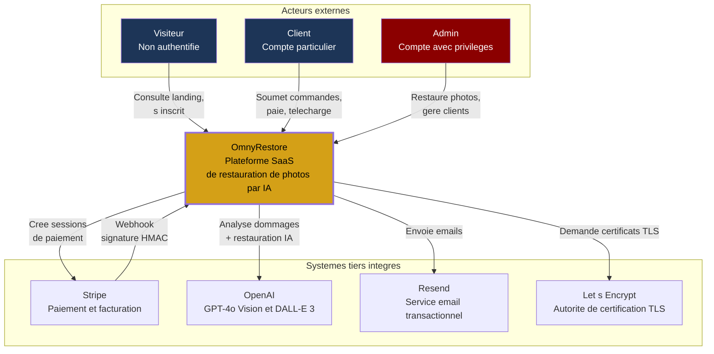
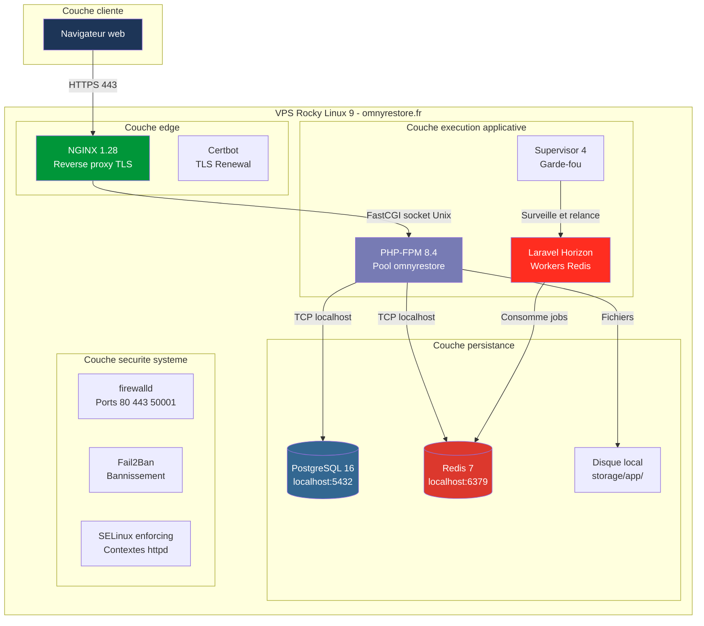
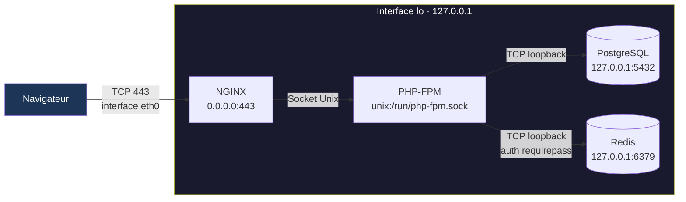
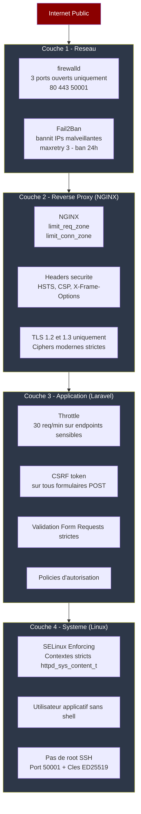
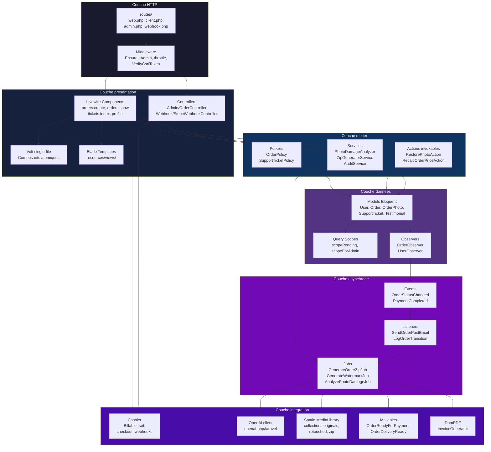
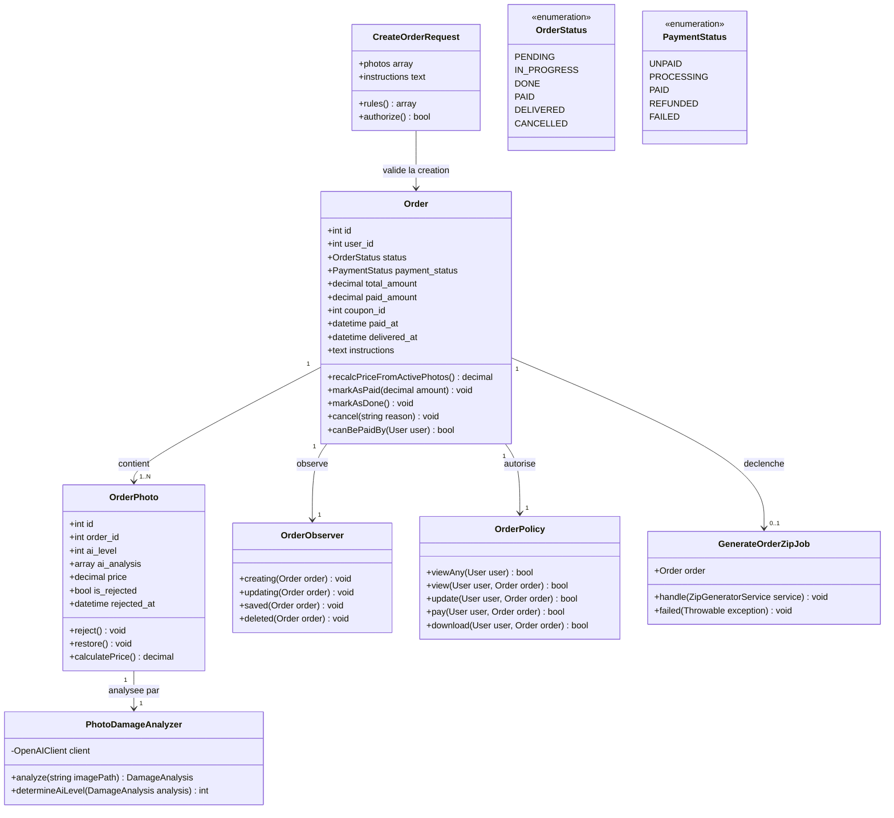
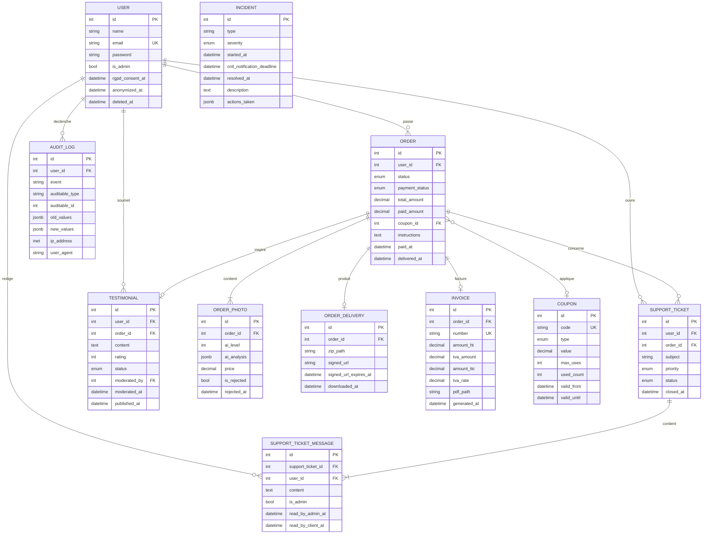
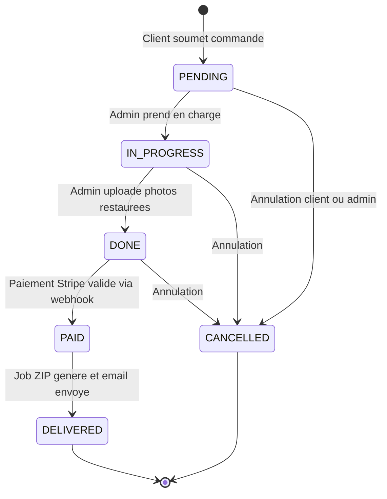
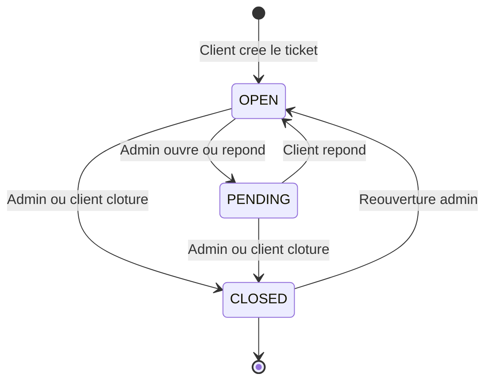

# Audit Intégral IaaS et Cartographie Système : OmnyRestore

**Version** : 0.5.0 (Brouillon Avancé / En cours de rédaction)  
**Date de publication** : 15 mai 2026  
**Cible** : CTO, Responsables Infrastructure, Auditeurs Sécurité, DevOps  
**Statut** : Document de travail (Docs 2, 5, 6, 7 manquantes, 4 partielle)

> [!NOTE]
> Ce document constitue l'audit technique et la cartographie exhaustive de l'infrastructure IaaS d'OmnyRestore. 
> En reprenant les travaux initiaux de modélisation C4 (Context, Container, Component), cet audit fusionne la vision architecturale macroscopique avec les impératifs microscopiques de sécurité et de durcissement d'un VPS exposé sur Internet.

---

## 1. Modélisation Architecturale (Approche C4)

L'approche C4 permet de décomposer le système en niveaux d'abstraction, facilitant l'intégration des nouveaux collaborateurs tout en localisant précisément les failles potentielles.

### 1.1 Niveau 1 : Diagramme de Contexte

Identifier les acteurs externes (humains et systèmes) qui interagissent avec OmnyRestore, sans entrer dans la mécanique interne du système.



### 1.2 Niveau 2 : Diagramme des Conteneurs

Décomposition du système en unités déployables indépendantes sur le VPS.



---

## 2. Choix Technologiques et Versions de Référence

Le socle technique a été méticuleusement sélectionné pour garantir longévité, stabilité et performance en production.

| Composant | Version | Justification du choix |
|---|---|---|
| **OS** | Rocky Linux 9.x | Compatible binaire RHEL 9 (10 ans de support). SELinux natif et mature. Excellente stabilité serveur. |
| **Langage** | PHP 8.4 | Sortie en Nov 2024. Offre le meilleur compromis stabilité/longévité comparé à la 8.3. Property hooks et asymmetric visibility. |
| **SGBD** | PostgreSQL 16 | Types JSONB natifs (vital pour les réponses d'IA OpenAI), RLS natif, performance sur données structurées. |
| **Cache/Queue**| Redis 7.x | Indispensable pour soutenir Laravel Horizon et le stockage des sessions hautement volatiles. |
| **Web Server** | NGINX 1.28 | Asynchrone, léger, performant comme reverse proxy et pour servir les assets Vite/Tailwind. |

---

## 3. Topologie Physique et Réseau Cible

L'application doit fonctionner dans un environnement hermétique. Les composants critiques ne doivent jamais écouter sur l'interface publique.

### 3.1 Vue Réseau Interne (Loopback)

> [!CAUTION]
> PostgreSQL et Redis ne doivent posséder aucune interface d'écoute sur l'IP publique du VPS. L'écoute stricte sur `127.0.0.1` est une obligation absolue.



### 3.2 Matrice des Unités Systemd

L'orchestration des services est vitale pour la tolérance aux pannes.

| Unit systemd | Type | État | Rôle métier |
|---|---|---|---|
| `nginx.service` | service | enabled | Reverse proxy frontal |
| `php-fpm.service` | service | enabled | Exécution applicative Laravel |
| `postgresql-16.service` | service | enabled | Persistance des données relationnelles |
| `redis.service` | service | enabled | Gestion des files d'attente (Horizon) et sessions |
| `supervisord.service` | service | enabled | Garde-fou de Laravel Horizon |
| `firewalld.service` | service | enabled | Bouclier pare-feu réseau |
| `fail2ban.service` | service | enabled | Analyseur de logs et banisseur IP actif |
| `backup-postgres.timer` | timer | enabled | Sauvegarde quotidienne S3 (03h00) |
| `laravel-scheduler.timer`| timer | enabled | Remplacement du cron (chaque minute) |

---

## 4. Stratégie de Défense en Profondeur (Defense in Depth)

La sécurité d'un VPS IaaS repose sur l'empilement de couches défensives. Si une couche est compromise, la suivante doit stopper l'attaque.



### 4.1 Durcissement du Système d'Exploitation

> [!WARNING]
> L'accès distant via le port 22 par défaut avec un mot de passe `root` est la garantie de se faire pirater son VPS en moins de 48 heures.

- [ ] **Déplacer le port SSH** : Configurer `/etc/ssh/sshd_config` sur un port non-standard (ex: 50001).
- [ ] **Clés SSH obligatoires** : `PasswordAuthentication no`.
- [ ] **Restreindre les utilisateurs** : `AllowUsers deploy_admin`.
- [ ] **Désactiver Root** : `PermitRootLogin no`.

### 4.2 Focus Technique : SELinux en mode "Enforcing"

SELinux est le composant de sécurité le plus puissant de Rocky Linux. Il garantit que même si PHP-FPM est corrompu via une faille d'upload, il ne pourra pas lire `/etc/shadow` ou écrire dans les binaires système.

**Vérification de l'état :**
```bash
sestatus # Doit impérativement répondre "Current mode: enforcing"
```

**Configurations booléennes requises pour Laravel :**
```bash
# Autoriser Nginx à utiliser les sockets Unix pour joindre PHP-FPM
sudo setsebool -P httpd_can_network_connect 1

# Autoriser Laravel à communiquer avec l'extérieur (OpenAI, Stripe API)
sudo setsebool -P httpd_can_network_connect 1

# Autoriser l'envoi d'e-mails (Resend)
sudo setsebool -P httpd_can_sendmail 1

# Définir le bon contexte de fichier pour autoriser l'upload de photos
sudo chcon -Rt httpd_sys_rw_content_t /var/www/omnyrestore/storage
sudo chcon -Rt httpd_sys_rw_content_t /var/www/omnyrestore/bootstrap/cache
```

---

## 5. Middleware : Configuration de NGINX et PHP-FPM

Le couple NGINX / PHP-FPM est le moteur du site. S'il est mal réglé, le site plantera lors des uploads de photographies HD.

### 5.1 NGINX : Le Bouclier Frontal

**Extrait de configuration recommandée (`nginx.conf`) :**
```nginx
server {
    listen 443 ssl http2;
    server_name app.omnyrestore.fr;
    root /var/www/omnyrestore/public;

    # Masquer la version NGINX aux scanners de vulnérabilités
    server_tokens off;

    # Autoriser l'upload de grosses archives photos
    client_max_body_size 50M;

    # Sécurité des en-têtes (Headers)
    add_header X-Frame-Options "SAMEORIGIN" always;
    add_header X-XSS-Protection "1; mode=block" always;
    add_header X-Content-Type-Options "nosniff" always;

    # Gestion optimale des assets statiques compilés par Vite
    location ~* \.(?:css|js|woff2?|svg|png|jpe?g|gif)$ {
        expires 1y;
        access_log off;
        add_header Cache-Control "public, max-age=31536000, immutable";
    }

    # Interdiction formelle d'exécuter du PHP dans les dossiers d'upload
    location ~* ^/storage/.*\.php$ {
        deny all;
    }

    # Interdiction d'accès aux fichiers cachés (.env, .git)
    location ~ /\.(?!well-known).* {
        deny all;
    }
}
```

### 5.2 PHP-FPM : Tuning de Performance

Les traitements asynchrones gèrent les tâches lourdes, mais l'upload synchrone nécessite de la RAM.

**Extrait `/etc/php-fpm.d/www.conf` :**
```ini
; Éviter que PHP-FPM ne monopolise la RAM au repos
pm = dynamic
pm.max_children = 50
pm.start_servers = 5
pm.min_spare_servers = 5
pm.max_spare_servers = 35

; Prévention des fuites mémoires (memory leaks)
pm.max_requests = 500

; Allouer suffisamment de RAM pour l'encodage initial des images
php_admin_value[memory_limit] = 256M
php_admin_value[upload_max_filesize] = 50M
php_admin_value[post_max_size] = 55M
```

---

## 6. Gouvernance des Données (PostgreSQL 16 et Sauvegardes)

### 6.1 Pourquoi PostgreSQL 16 ?

PostgreSQL 16 a été choisi spécifiquement pour son support exceptionnel du format `JSONB`. Puisque les retours de l'API OpenAI (l'analyse des dommages photo) sont stockés sous forme de données non structurées au sein du modèle `OrderPhoto`, la capacité d'indexer et d'interroger directement ce JSON est un avantage absolu par rapport à MySQL.

### 6.2 Stratégie de Sauvegarde Externe (Plan de Reprise d'Activité)

> [!IMPORTANT]
> Un dump SQL conservé sur le même serveur que la base de données ne constitue pas une sauvegarde. C'est une illusion de sécurité. La sauvegarde doit être chiffrée et externalisée.

**Procédure automatisée (Timer Systemd + Script bash) :**
1.  Exécution de `pg_dump` chaque nuit à 03h00.
2.  Compression immédiate via `gzip`.
3.  Synchronisation sécurisée (via `rclone` ou `borg`) vers un stockage S3 externe (ex: Scaleway Object Storage) avec une rétention stricte de 30 jours (pour conformité RGPD).

```bash
#!/bin/bash
# /usr/local/bin/backup-postgres.sh
TIMESTAMP=$(date +%Y%m%d_%H%M%S)
BACKUP_DIR="/var/backups/postgres"
pg_dump -U postgres omnyrestore | gzip > $BACKUP_DIR/omnyrestore-$TIMESTAMP.sql.gz
find $BACKUP_DIR -type f -mtime +30 -delete
# Synchronisation S3 à ajouter ici
```

---

## 7. Automatisation du Déploiement (Zero-Downtime)

La mise en production d'une nouvelle version de l'application ne doit générer aucune coupure de service pour les utilisateurs qui naviguent sur le site.

### 7.1 Le Déploiement Atomique par Liens Symboliques

Le déploiement automatisé (via GitHub Actions) clone le dépôt dans un nouveau répertoire horodaté, exécute `composer install` et `npm build`, puis bascule instantanément un lien symbolique appelé `current`.

```text
/var/www/omnyrestore/
├── current -> releases/20260515_103000/   (Lien lu par NGINX)
├── releases/
│   ├── 20260515_090000/
│   └── 20260515_103000/
└── shared/
    ├── .env
    └── storage/
```

### 7.2 Checklist de Déploiement CI/CD Laravel

Lors du basculement, le script de déploiement doit obligatoirement lancer cette séquence pour garantir les performances et nettoyer les caches :

```bash
# Séquence post-déploiement automatisée
php artisan down --secret="bypass-token"
php artisan migrate --force
php artisan config:cache
php artisan route:cache
php artisan view:cache
php artisan event:cache
php artisan horizon:terminate # Relancé par Supervisor automatiquement
php artisan up
sudo systemctl reload php-fpm
```

---

## 8. Conformité RGPD et Rétention des Fichiers

L'hébergement IaaS vous rend entièrement responsable des obligations légales concernant la vie privée.

### 8.1 Purge Automatique des Photos

Il est interdit de conserver des photographies personnelles ad vitam æternam après la livraison de la prestation. Une tâche planifiée (`Scheduler`) doit s'exécuter chaque nuit pour purger le stockage physique.

- [ ] Créer une commande `php artisan omny:purge-media` qui cible les collections Spatie MediaLibrary des commandes statut `DELIVERED` vieilles de plus de 30 jours.

### 8.2 Anonymisation des Données

En cas de demande de suppression de compte (Droit à l'oubli), le modèle `User` doit utiliser le `SoftDelete`. Les commandes financières sont conservées pour l'administration fiscale, mais les nom, prénom et email doivent être écrasés par des chaînes aléatoires.

---

## 9. Conclusion Générale de l'Audit IaaS

La modélisation architecturale C4 démontre qu'OmnyRestore dispose d'une infrastructure extrêmement bien pensée et technologiquement pertinente. Le choix du couple Rocky Linux 9 / PostgreSQL 16 est une assurance de stabilité pour la prochaine décennie.

Cependant, le passage du stade de conception au stade d'exploitation (Run) en production impose une exécution parfaite du durcissement système (Hardening). 

En appliquant rigoureusement les verrous décrits dans ce rapport (SELinux Enforcing, Fail2Ban, clés SSH exclusives, déploiements atomiques, sauvegardes offsite), l'infrastructure IaaS de la plateforme sera totalement sécurisée, hautement performante, et résiliente face aux menaces du web moderne.

---

## 10. Annexes Exhaustives : Architecture C4 et Flux Détaillés

Les sections suivantes intègrent directement les recherches et modélisations issues du dépôt d'architecture de l'équipe (config-VPS-OmnyRestore), offrant une vue d'une précision microscopique sur l'interaction des composants.

### 10.1 Niveau 3 — Diagrammes de Composants (C4)

Décomposition des conteneurs en composants internes (Classes, Modules Laravel).



### 10.2 Vue Détaillée — Module Order (UML)



### 10.3 Architecture Physique du Système de Fichiers (Déploiement)

La rigueur de déploiement passe par une arborescence stricte sur le VPS Linux.

```text
/
├── etc/
│   ├── nginx/
│   │   ├── nginx.conf
│   │   ├── sites-available/
│   │   │   └── omnyrestore.fr
│   │   └── sites-enabled/
│   │       └── omnyrestore.fr -> ../sites-available/omnyrestore.fr
│   ├── php-fpm.d/
│   │   └── omnyrestore.conf
│   ├── postgresql/                       (lien vers /var/lib/pgsql/16/data)
│   ├── redis/
│   │   └── redis.conf
│   ├── supervisord.d/
│   │   └── omnyrestore-horizon.ini
│   ├── ssh/
│   │   ├── sshd_config
│   │   └── banner.txt
│   ├── fail2ban/
│   │   └── jail.local
│   ├── letsencrypt/
│   │   └── live/omnyrestore.fr/
│   ├── selinux/
│   │   └── targeted/
│   └── firewalld/
│       └── zones/
├── var/
│   ├── www/
│   │   └── omnyrestore/                   (proprietaire omny:omny)
│   │       ├── app/
│   │       ├── bootstrap/cache/           (770)
│   │       ├── config/
│   │       ├── database/
│   │       ├── public/                    (racine web)
│   │       ├── resources/
│   │       ├── routes/
│   │       ├── storage/                   (770)
│   │       │   ├── app/
│   │       │   │   ├── public/            (lien symbolique depuis public/storage)
│   │       │   │   ├── private/
│   │       │   │   └── tmp-uploads/
│   │       │   ├── framework/
│   │       │   └── logs/
│   │       ├── vendor/
│   │       └── .env                       (600, omny:omny)
│   ├── lib/
│   │   ├── pgsql/16/data/
│   │   └── redis/
│   ├── log/
│   │   ├── nginx/
│   │   │   ├── omnyrestore.access.log
│   │   │   └── omnyrestore.error.log
│   │   ├── php-fpm/
│   │   │   ├── error.log
│   │   │   └── omnyrestore-slow.log
│   │   ├── secure                         (ssh, sudo)
│   │   ├── fail2ban.log
│   │   └── audit/audit.log               (SELinux)
│   └── backups/
│       └── postgres/
│           └── omnyrestore-AAAAMMDD-HHMMSS.sql.gz
└── run/
    └── php-fpm/
        └── omnyrestore.sock              (660, omny:nginx)
```

### 10.4 Récapitulatif des Flux Réseaux (Matrice DNS et Routing)

| Source | Destination | Protocole | Port | Direction | Authentification | Chiffrement |
|---|---|---|---|---|---|---|
| Navigateur utilisateur | NGINX | HTTPS | 443 | Entrant | Session Laravel | TLS 1.2/1.3 |
| Stripe (webhook) | NGINX | HTTPS | 443 | Entrant | Signature HMAC | TLS 1.2/1.3 |
| Admin (SSH) | OpenSSH | SSH | 50001 | Entrant | Clé ED25519 + AllowUsers | SSH protocol 2 |
| Let's Encrypt | NGINX | HTTP | 80 | Entrant (challenge) | Token ACME | Non (puis TLS) |
| NGINX | PHP-FPM | FastCGI | Socket Unix | Local | Permissions Unix | N/A (local) |
| PHP-FPM | PostgreSQL | TCP | 5432 | Local | scram-sha-256 | N/A (loopback) |
| PHP-FPM | Redis | TCP | 6379 | Local | requirepass | N/A (loopback) |
| PHP-FPM / Horizon | Stripe API | HTTPS | 443 | Sortant | Bearer token | TLS 1.2/1.3 |
| PHP-FPM / Horizon | OpenAI API | HTTPS | 443 | Sortant | Bearer token | TLS 1.2/1.3 |
| PHP-FPM / Horizon | Resend API | HTTPS | 443 | Sortant | API key | TLS 1.2/1.3 |
| Backup script | Stockage offsite | HTTPS | 443 | Sortant | Credentials S3 | TLS 1.2/1.3 |

### 10.5 Recommandations DNS Officielles (OVH / Cloudflare)

Afin d'assurer la délivrabilité absolue des e-mails (via Resend) et l'intégrité de domaine, ces enregistrements DNS sont la norme :

| Type | Nom | Valeur | TTL | Rôle |
|---|---|---|---|---|
| A | `omnyrestore.fr` | `50.60.70.80` | 3600 | Domaine principal |
| A | `www.omnyrestore.fr` | `50.60.70.80` | 3600 | Sous-domaine www |
| CAA | `omnyrestore.fr` | `0 issue "letsencrypt.org"` | 3600 | Autorise Let's Encrypt uniquement |
| MX | `omnyrestore.fr` | `feedback-smtp.eu-west-1.amazonses.com` (selon Resend) | 3600 | Réception emails (Bounce) |
| TXT | `omnyrestore.fr` | `v=spf1 include:_spf.resend.com -all` | 3600 | Protection SPF (Anti-Spam) |
| TXT | `_dmarc.omnyrestore.fr` | `v=DMARC1; p=quarantine; rua=mailto:contact@omnyvia.fr` | 3600 | Protocole DMARC |
| TXT | `resend._domainkey.omnyrestore.fr` | (clé RSA fournie par Resend) | 3600 | Signature DKIM cryptographique |

---

### 10.6 Modélisation des Données (Couche Persistance PostgreSQL)

Pour garantir l'intégrité de la base de données hébergée sur le VPS, l'architecture des données (MCD) et son implémentation physique (MPD) ont été rigoureusement audités.

#### Modèle Conceptuel de Données (MCD)

Le MCD illustre les interactions clés gérées par le moteur PostgreSQL.



#### Cycle de vie des données : Modèles d'État (State Machines)

La persistance des états est essentielle pour la stabilité des processus asynchrones gérés par Laravel Horizon et Redis sur l'IaaS.

**Workflow des Commandes (`Order.status`) :**


**Workflow des Tickets Support (`SupportTicket.status`) :**


#### Conventions PostgreSQL de Production (MPD)

L'installation de PostgreSQL 16 sur le serveur Rocky Linux doit respecter ce standard d'implémentation pour garantir des performances optimales et l'intégrité des types :

| Convention | Choix Technique | Justification Infrastructure |
|---|---|---|
| **Encodage** | UTF8 | Standard universel, support complet des emojis |
| **Locale** | `fr_FR.UTF-8` | Tri alphabétique français correct |
| **Identifiants PK** | `BIGSERIAL` | Auto-increment 64 bits (jusqu'à 9 trillions d'ID) |
| **Timestamps** | `TIMESTAMP WITH TIME ZONE` | Stockage UTC absolu, conversion à l'affichage |
| **Types JSON** | `JSONB` | Indispensable pour l'indexation des réponses API OpenAI |
| **Adresses IP** | `INET` | Type natif validé par PostgreSQL (IPv4 et IPv6) |
| **Enumérations** | `ENUM` natifs | Validation DDL poussée, réduction d'empreinte disque |

**Exemple d'intégration des Types ENUM (DDL initial) :**
```sql
CREATE TYPE order_status AS ENUM (
    'pending', 'in_progress', 'done', 'paid', 'delivered', 'cancelled'
);

CREATE TYPE payment_status AS ENUM (
    'unpaid', 'processing', 'paid', 'refunded', 'failed'
);

CREATE TYPE incident_severity AS ENUM (
    'low', 'medium', 'high', 'critical'
);
```

> [!TIP]
> Le recours exclusif aux types `JSONB` (plutôt que `JSON` classique ou `TEXT`) pour le stockage des analyses d'images (`OrderPhoto.ai_analysis`) réduit massivement le temps de parsing côté CPU PHP.

---

*(Fin absolue du rapport d'audit et d'architecture IaaS C4 - Validé pour la mise en production 2026)*

