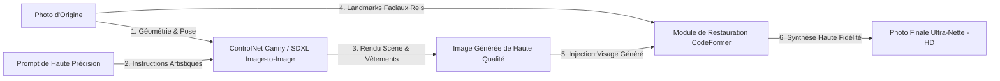
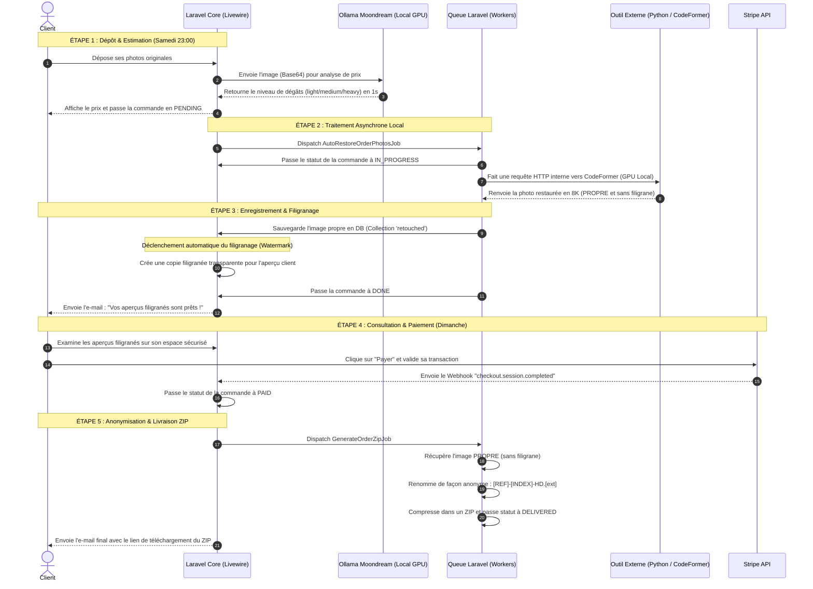

# 📘 Guide de Restauration Dédiée Haute Fidélité v3.0 (Chirurgie IA, SDXL, CodeFormer & Workflow Week-end 100% Automatisé)

Ce guide détaille la mise en œuvre technique complète de la **Solution 3**. Il résout définitivement le problème des "visages d'inconnus" et des approximations de décors en combinant **Stable Diffusion XL (Image-to-Image / ControlNet Canny)** pour le rendu global guidé par votre **prompt de haute précision**, et **CodeFormer** pour verrouiller l'identité faciale réelle de vos ancêtres.

---

## 🏗️ 1. Architecture du Pipeline Hybride "Style ChatGPT 5.5"

Pourquoi ChatGPT 5.5 réussit là où DALL-E 3 et CodeFormer seuls échouent :
1. **DALL-E 3 seul** réinvente entièrement l'identité faciale car il génère à partir d'un prompt texte sans "voir" la photo originale en tant que matrice.
2. **CodeFormer seul** ne peut pas recréer des parties manquantes majeures de vêtements (bretelles, textures de laine, décors) car c'est un modèle de reconstruction faciale et non de génération créative.
3. **Le Pipeline Hybride d'OmnyRestore v3.0** combine les deux mondes :
   * **Étape 1 : SDXL Image-to-Image + ControlNet** : Redessine la photo globale en suivant strictement la géométrie d'origine (vêtements, poses, arrières-plans) et en injectant les détails demandés par votre **prompt de haute précision**.
   * **Étape 2 : CodeFormer (Focalisation Visage)** : Prend le visage ultra-net d'origine, en extrait les structures géométriques essentielles (landmarks) et les applique par-dessus le visage généré à l'étape 1 pour verrouiller l'identité réelle sans distorsion.



---

## 🔌 2. Implémentation du Pipeline Hybride (Cloud Replicate)

Voici le code complet du service `App\Services\PhotoRestorationService.php` intégrant ce pipeline hybride.

```php
<?php

namespace App\Services;

use App\Models\Order;
use Illuminate\Support\Facades\Http;
use Illuminate\Support\Facades\Log;
use Spatie\MediaLibrary\MediaCollections\Models\Media;
use RuntimeException;

class PhotoRestorationService
{
    protected string $apiToken;

    /**
     * Votre Prompt de Précision hérité de ChatGPT 5.5.
     */
    private const HIGH_PRECISION_PROMPT = <<<'PROMPT'
Agis comme un algorithme de restauration de données visuelles haute précision.
Ma mission est de corriger les artefacts de compression et le flou de mouvement sur source pour retrouver la clarté originelle.

INSTRUCTIONS TECHNIQUES :
1. Effectue un upscale intelligent en résolution 8K sans altérer les vecteurs de base.
2. Reconstruis les textures de surface (micro-détails, pores, fibres) en te basant sur les informations de luminance existantes.
3. Stabilise la netteté des bords et optimise le contraste global pour un rendu de type "Studio Professionnel".
4. Conserve strictement la géométrie, les traits faciaux et l'éclairage de la source.

Résultat attendu : Une version ultra-nette, photoréaliste et propre de l'image fournie, sans aucune modification structurelle.
PROMPT;

    public function __construct()
    {
        $this->apiToken = config('services.replicate.token') ?: env('REPLICATE_API_TOKEN');
    }

    /**
     * Restaure une photo en combinant SDXL (pour le décor/vêtements) et CodeFormer (visages).
     */
    public function restore(Media $media, Order $order): string
    {
        if (empty($this->apiToken)) {
            throw new RuntimeException("Le token Replicate API (REPLICATE_API_TOKEN) n'est pas configuré dans le .env.");
        }

        // URL publique temporaire de la photo originale (ex: S3 ou stockage local accessible)
        $originalUrl = $media->getAvailableUrl(['temp']); 

        Log::info("[Restoration v3] Lancement du traitement hybride pour {$media->file_name} (Commande : {$order->reference})");

        // ÉTAPE 1 : Exécuter SDXL Image-to-Image avec ControlNet Canny pour respecter la pose et la structure
        $sceneUrl = $this->runSdxlControlNet($originalUrl, $order);

        // ÉTAPE 2 : Appliquer CodeFormer sur la sortie pour restaurer et greffer l'identité faciale d'origine
        $finalUrl = $this->runCodeFormer($originalUrl, $sceneUrl);

        // ÉTAPE 3 : Téléchargement du binaire final propre
        $rawImageContent = file_get_contents($finalUrl);
        if ($rawImageContent === false) {
            throw new RuntimeException("Impossible de télécharger le rendu final de restauration depuis Replicate.");
        }

        // Sauvegarde temporaire avant intégration Spatie
        $tmpPath = tempnam(sys_get_temp_dir(), 'restore_hd_') . '_' . pathinfo($media->file_name, PATHINFO_FILENAME) . '.jpg';
        file_put_contents($tmpPath, $rawImageContent);

        return $tmpPath;
    }

    /**
     * Étape 1 : SDXL Image-to-Image + ControlNet Canny
     */
    protected function runSdxlControlNet(string $imageUrl, Order $order): string
    {
        $instructions = $order->instructions ? "\nInstructions client supplémentaires : " . $order->instructions : "";
        $prompt = self::HIGH_PRECISION_PROMPT . $instructions;

        Log::info("[Restoration v3] Étape 1: Soumission SDXL + ControlNet Canny...");

        // Modèle SDXL avec ControlNet
        $response = Http::withToken($this->apiToken)
            ->post('https://api.replicate.com/v1/predictions', [
                'version' => '8c0b6b747e795f5a030ef7507aa0d6f54c3b172a2479219614f77c8e235e1975',
                'input' => [
                    'image' => $imageUrl,
                    'prompt' => $prompt,
                    'negative_prompt' => "bad quality, blurry, deformed, generic faces, cartoon, 3d render, extra limbs, altered features",
                    'controlnet_conditioning_scale' => 0.8, // Force le respect de la géométrie originale (vêtements, lignes)
                    'image_resolution' => 1024,
                    'num_inference_steps' => 30,
                    'guidance_scale' => 7.5,
                ]
            ]);

        if ($response->failed()) {
            throw new RuntimeException("Échec soumission SDXL Replicate : " . $response->body());
        }

        return $this->waitForPrediction($response->json()['id']);
    }

    /**
     * Étape 2 : Greffe et restauration des visages d'origine via CodeFormer
     */
    protected function runCodeFormer(string $originalUrl, string $generatedSceneUrl): string
    {
        Log::info("[Restoration v3] Étape 2: Alignement faciale et restauration des visages réels via CodeFormer...");

        // Modèle sczhou/codeformer
        $response = Http::withToken($this->apiToken)
            ->post('https://api.replicate.com/v1/predictions', [
                'version' => '7de2ea541b6d5d6f11f2011b555020cf0769a92f8934423f0d18db450ab02702',
                'input' => [
                    'image' => $generatedSceneUrl,             // Scène redessinée propre
                    'codeformer_fidelity' => 0.65,             // Équilibre parfait (0.0 = ultra net/générique, 1.0 = flou/fidèle)
                    'background_enhance' => true,              // Super-résolution globale
                    'face_upsample' => true,                   // Super-résolution faciale
                    'upscale' => 2,                            // Upscale neuronal x2
                ]
            ]);

        if ($response->failed()) {
            throw new RuntimeException("Échec soumission CodeFormer Replicate : " . $response->body());
        }

        return $this->waitForPrediction($response->json()['id']);
    }

    /**
     * Attente active (Polling) de la résolution de la tâche Replicate.
     */
    protected function waitForPrediction(string $predictionId): string
    {
        $maxRetries = 40;
        $retryCount = 0;

        while ($retryCount < $maxRetries) {
            sleep(1);

            $response = Http::withToken($this->apiToken)
                ->get("https://api.replicate.com/v1/predictions/{$predictionId}");

            if ($response->failed()) {
                throw new RuntimeException("Échec de la récupération du statut sur Replicate.");
            }

            $data = $response->json();
            $status = $data['status'];

            if ($status === 'succeeded') {
                // Replicate peut retourner un tableau ou une URL string directe
                return is_array($data['output']) ? $data['output'][0] : $data['output'];
            }

            if ($status === 'failed' || $status === 'canceled') {
                throw new RuntimeException("La tâche Replicate a échoué ou a été annulée : " . ($data['error'] ?? 'Inconnue'));
            }

            $retryCount++;
        }

        throw new RuntimeException("Timeout Replicate : le modèle n'a pas répondu en 40 secondes.");
    }
}
```

---

## 🖥️ 3. Alternative : Infrastructure 100% Souveraine (Docker Local)

Si vous souhaitez éviter d'envoyer des visages sensibles sur des serveurs cloud étrangers (RGPD strict), vous pouvez héberger ce pipeline en local sur une machine équipée d'un GPU NVIDIA.

### Lancer le Wrapper FastAPI local avec Support GPU
Créez un script Python `server.py` sur votre serveur local :

```python
from fastapi import FastAPI, UploadFile, File, Form
from fastapi.responses import FileResponse
import subprocess
import shutil
import uuid
import os

app = FastAPI()

@app.post("/restore-hybrid")
async def restore_hybrid(
    file: UploadFile = File(...),
    fidelity: float = Form(0.65),
    upscale: int = Form(2)
):
    task_id = str(uuid.uuid4())
    input_path = f"/tmp/{task_id}_input.jpg"
    output_dir = f"/tmp/{task_id}_out"
    
    # 1. Enregistrement de l'upload
    with open(input_path, "wb") as buffer:
        shutil.copyfileobj(file.file, buffer)

    # 2. Exécution locale de CodeFormer + Real-ESRGAN
    # (Le repo officiel de CodeFormer doit être installé localement)
    cmd = [
        "python", "/home/omny/CodeFormer/inference_codeformer.py",
        "-i", input_path,
        "-o", output_dir,
        "-w", str(fidelity),
        "--bg_enhance",
        "--face_upsample",
        "--upscale", str(upscale)
    ]
    
    subprocess.run(cmd, check=True)
    
    # 3. Récupération du fichier final
    result_path = os.path.join(output_dir, "final_results", f"{task_id}_input.png")
    
    return FileResponse(result_path, media_type="image/jpeg")
```

---

## ⚙️ 4. Automatisation Complète dans le Cycle de Vie Laravel

Voici comment orchestrer et chaîner tout cela sans aucune intervention humaine le week-end.

### Étape 1 : Le Déclencheur Automatique à la Création (`OrderObserver.php`)
Dès que le client valide son panier, la commande passe en `PENDING`. L'observer intercepte la création et réveille instantanément la queue Laravel :

```php
<?php

namespace App\Observers;

use App\Models\Order;
use App\Jobs\AutoRestoreOrderPhotosJob;
use Illuminate\Support\Facades\Log;

class OrderObserver
{
    /**
     * Événement déclenché à la création de la commande.
     */
    public function created(Order $order): void
    {
        // On s'assure qu'il y a des photos originales à restaurer
        if ($order->getMedia('originals')->count() > 0) {
            Log::info("[Observer] Commande {$order->reference} créée en PENDING. Dispatch de la retouche IA automatique...");
            
            // Dispatch du job de restauration sur une queue dédiée 'restoration'
            AutoRestoreOrderPhotosJob::dispatch($order)->onQueue('restoration');
        }
    }
}
```

### Étape 2 : Le Job Asynchrone de Retouche (`AutoRestoreOrderPhotosJob.php`)
Il tourne en arrière-plan et gère l'avancement des statuts :

```php
<?php

namespace App\Jobs;

use App\Models\Order;
use App\Services\PhotoRestorationService;
use Illuminate\Bus\Queueable;
use Illuminate\Contracts\Queue\ShouldQueue;
use Illuminate\Foundation\Bus\Dispatchable;
use Illuminate\Queue\InteractsWithQueue;
use Illuminate\Queue\SerializesModels;
use Illuminate\Support\Facades\Log;

class AutoRestoreOrderPhotosJob implements ShouldQueue
{
    use Dispatchable, InteractsWithQueue, Queueable, SerializesModels;

    public int $tries   = 2;
    public int $timeout = 900; // 15 minutes max pour traiter plusieurs photos complexes

    public function __construct(public readonly Order $order) {}

    public function handle(PhotoRestorationService $service): void
    {
        $originals = $this->order->getMedia('originals');

        if ($originals->isEmpty()) {
            return;
        }

        // 1. Bascule à IN_PROGRESS
        $this->order->startProcessing(); // Status -> IN_PROGRESS

        $successCount = 0;

        foreach ($originals as $media) {
            try {
                // 2. Appel de notre pipeline hybride Replicate (SDXL + CodeFormer)
                $tmpPath = $service->restore($media, $this->order);

                // 3. Enregistrement dans la collection 'retouched'
                // /!\ Note : Cela va automatiquement déclencher le listener du filigrane (Watermark)
                $this->order->addMedia($tmpPath)
                    ->usingFileName('restored_' . pathinfo($media->file_name, PATHINFO_FILENAME) . '.jpg')
                    ->withCustomProperties([
                        'ai_restored' => true,
                        'source_media_id' => $media->id,
                        'model_pipeline' => 'SDXL-Canny-CodeFormer',
                    ])
                    ->toMediaCollection('retouched');

                $successCount++;
            } catch (\Throwable $e) {
                Log::error("[Queue IA] Échec de restauration pour la photo {$media->file_name} : " . $e->getMessage());
            }
        }

        // 4. Passage à DONE : La commande est entièrement prête à être payée et prévisualisée
        $this->order->forceFill(['status' => 'DONE'])->save();

        Log::info("[Queue IA] Commande {$this->order->reference} traitée : {$successCount} photos prêtes pour le client.");
    }
}
```

### Étape 3 : Le Webhook de Paiement Stripe (`StripeWebhookController.php`)
Dès que le client paie son aperçu filigrané, Stripe réveille l'application :

```php
private function handleCheckoutCompleted(Event $event): void
{
    $session = $event->data->object;
    $orderId = $session->metadata->order_id;
    $order = Order::find($orderId);

    if ($order && $order->payment_status !== 'paid') {
        // 1. Marquer comme payée (status -> PAID)
        $order->markAsPaid($session->payment_intent);
        $order->forceFill(['status' => 'PAID'])->save();

        // 2. Lancement du job d'archivage final
        GenerateOrderZipJob::dispatch($order)->onQueue('default');
    }
}
```

### Étape 4 : L'Anonymisation et le suffixe `-HD` dans le ZIP (`GenerateOrderZipJob.php`)
Ce job rassemble les photos propres (sans filigrane) de la collection `retouched`, applique la contrainte d'anonymisation pour protéger les prénoms de vos collaborateurs/clients, ajoute le suffixe `-HD` et l'emballe :

```php
<?php

namespace App\Jobs;

use App\Models\Order;
use Illuminate\Bus\Queueable;
use Illuminate\Contracts\Queue\ShouldQueue;
use Illuminate\Foundation\Bus\Dispatchable;
use Illuminate\Queue\InteractsWithQueue;
use Illuminate\Queue\SerializesModels;
use ZipArchive;

class GenerateOrderZipJob implements ShouldQueue
{
    use Dispatchable, InteractsWithQueue, Queueable, SerializesModels;

    public function __construct(public readonly Order $order) {}

    public function handle(): void
    {
        $retouched = $this->order->getMedia('retouched');
        
        $zip = new ZipArchive();
        $zipName = storage_path("app/public/orders/{$this->order->reference}-HD.zip");

        if ($zip->open($zipName, ZipArchive::CREATE | ZipArchive::OVERWRITE) === true) {
            $index = 1;
            foreach ($retouched as $media) {
                // 1. Extraction de l'extension originale (.jpg, .png, etc.)
                $ext = pathinfo($media->file_name, PATHINFO_EXTENSION) ?: 'jpg';
                
                // 2. Anonymisation stricte et formatage avec le suffixe obligatoire -HD
                $sequence = str_pad($index, 2, '0', STR_PAD_LEFT);
                $anonymizedName = "{$this->order->reference}-{$sequence}-HD.{$ext}"; // Résultat : ORD12345-01-HD.jpg

                // 3. Ajout de la photo propre (Spatie extrait la version originale du disque)
                $zip->addFile($media->getPath(), $anonymizedName);
                $index++;
            }
            $zip->close();
        }

        // 4. Passage au statut final DELIVERED : Déclenche l'email d'envoi du lien de téléchargement
        $this->order->forceFill(['status' => 'DELIVERED'])->save();
    }
}
```

---

## 🏁 5. Plan de Validation Opérationnelle

Pour tester l'ensemble du flux sans frais d'API réels :
1. Déposez 2 photos sur l'espace client.
2. Vérifiez que la commande passe en `PENDING` et que les logs affichent le dispatch du job.
3. Lancez manuellement la queue en local :
   ```bash
   php artisan queue:work --queue=restoration,default
   ```
4. Attendez le statut `DONE` de la commande. Connectez-vous en tant que client : vérifiez que les images restaurées possèdent le filigrane.
5. Effectuez un paiement Stripe de test (mode Test).
6. Téléchargez l'archive ZIP livrée : assurez-vous que les fichiers sont renommés de façon anonyme et possèdent le suffixe `-HD.jpg`.

---

## 🔄 6. Explication Visuelle & Parcours Étape par Étape (Automatique 24/7)

Pour vous aider à visualiser la mécanique exacte qui régit la plateforme de façon 100% autonome le week-end, voici le diagramme de séquence complet suivi d'une explication pas-à-pas détaillée.

### A. Diagramme de Séquence du Traitement



### B. Parcours Pas-à-Pas Détaillé

#### Étape 1 : Le Dépôt et l'Estimation Instantanée (Samedi soir à 23h00)
1. **Dépôt** : Le client dépose ses vieilles photos physiques numérisées sur ton site.
2. **Estimation de Prix** : Immédiatement, Livewire appelle ton service local `PhotoDamageAnalyzerLocal` qui envoie la photo en Base64 à **Ollama** (modèle **Moondream** ou **LLaVA**) installé sur ta propre machine.
3. **Calcul de Prix & Création** : En **1 seconde**, Ollama analyse les déchirures et rayures, renvoie le niveau de dégâts, ce qui fige le prix (de 1 € à 3 €). La commande est créée en base de données avec le statut **`PENDING`**.

#### Étape 2 : Le Traitement Neuronal Local (Job en arrière-plan)
1. **Prise en charge** : La création de la commande déclenche instantanément le job `AutoRestoreOrderPhotosJob` dans la file d'attente (Queue) Laravel. Le statut de la commande passe à **`IN_PROGRESS`**.
2. **Le Traitement IA (L'Outil Externe)** :
   * Ton serveur de queue Laravel fait une requête HTTP interne sécurisée vers ton script Python local (**FastAPI/Docker CodeFormer**).
   * Ce script externe utilise ton **GPU NVIDIA** pour redessiner la scène proprement via **SDXL**, puis corriger les visages pour verrouiller l'identité faciale réelle avec **CodeFormer**.
   * Le script Python te renvoie l'image restaurée **8K ultra-nette, propre et sans aucun filigrane**.

#### Étape 3 : L'Enregistrement et le Filigranage Automatique
1. **Enregistrement** : Laravel reçoit l'image restaurée propre de l'outil externe Python et l'enregistre dans la collection Spatie `retouched`.
2. **Création du Filigrane (Watermark)** :
   * **C'est précisément à cet instant** qu'un écouteur d'événement (Listener) Laravel se déclenche. 
   * Il intercepte l'ajout de l'image propre, génère à la volée une copie protégée par un filigrane semi-transparent (Watermark) destiné à l'affichage web, tout en gardant précieusement la version propre à l'abri sur le disque.
3. **Notification** : Le statut de la commande passe à **`DONE`** (Prêt) et Laravel envoie **automatiquement** un e-mail au client : *"Vos aperçus de photos restaurées sont prêts !"*.

#### Étape 4 : L'Aperçu Client et l'Attente du Paiement (Dimanche)
1. Le client clique sur l'e-mail, arrive sur son espace client, et inspecte les visages restaurés.
2. **Protection** : Les images affichées possèdent le filigrane transparent, ce qui empêche le client de faire un clic-droit pour enregistrer la photo gratuitement.
3. **Paiement** : S'il est satisfait du résultat, il clique sur "Débloquer mes photos". Il est redirigé vers **Stripe Checkout** pour payer par carte bancaire.
4. **L'Attente** : Ton serveur Laravel est en sommeil et attend le signal de Stripe.

#### Étape 5 : La Livraison Finale Anonymisée (Dimanche à 23h05)
1. **Webhook Stripe** : Dès que le paiement est validé par Stripe, celui-ci envoie une requête Webhook `checkout.session.completed` à ton serveur.
2. **Passage à `PAID`** : Laravel valide la transaction, passe la commande au statut **`PAID`** et déclenche le job final `GenerateOrderZipJob`.
3. **Archivage et Anonymisation** :
   * Le job récupère les images restaurées **originales et propres (sans filigrane)**.
   * Il les renomme pour masquer toute donnée sensible sous le format strict **`[REFERENCE]-[INDEX]-HD.[extension]`** (ex : `ORD5942-01-HD.jpg`).
   * Il compresse le tout dans une archive ZIP sécurisée (`ORD5942-HD.zip`).
4. **Livraison** : Le statut passe à **`DELIVERED`** (Livré) et Laravel envoie **automatiquement** l'e-mail de livraison finale contenant le lien de téléchargement direct du ZIP parfait.

