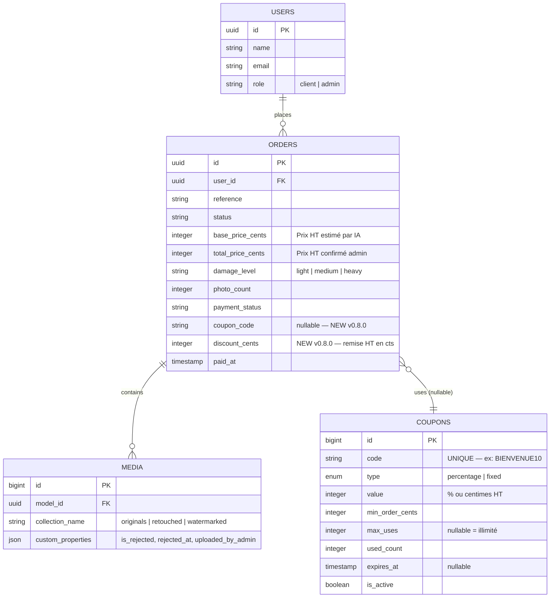

# OmnyRestore — Phase 9 : Guide Technique Complet

> **Version** : 0.8.0 — Mai 2026
> **Auteur** : Alain Guillon — OmnyVia
> **Branche** : `test`

---

## Table des matières

1. [Vue d'ensemble](#1-vue-densemble)
2. [Admin UX — Barre de navigation](#2-admin-ux--barre-de-navigation)
3. [Dashboard en direct](#3-dashboard-en-direct)
4. [Tarification IA — 3 niveaux](#4-tarification-ia--3-niveaux)
5. [TVA & Transparence tarifaire](#5-tva--transparence-tarifaire)
6. [Factures PDF](#6-factures-pdf)
7. [Codes de réduction (Coupons)](#7-codes-de-réduction-coupons)
8. [Rejet de photos restaurées](#8-rejet-de-photos-restaurées)
9. [Tableau des clients (Dashboard)](#9-tableau-des-clients-dashboard)
10. [Base de données — Schéma mis à jour](#10-base-de-données--schéma-mis-à-jour)
11. [Fichiers créés / modifiés](#11-fichiers-créés--modifiés)

---

## 1. Vue d'ensemble

La Phase 9 est une refonte complète du **back-office admin** et du **système de tarification**. Elle introduit :

- Une navigation admin plus claire et distincte (rouge)
- Un dashboard auto-actualisé en temps réel
- Un nouveau modèle de prix à 3 niveaux IA (1/2/5 € TTC)
- La TVA automatique (20%) affichée de façon transparente
- La génération de factures PDF pour les clients
- Un système complet de codes de réduction
- Le rejet de photos de mauvaise qualité côté admin
- Un tableau des clients dans le dashboard

---

## 2. Admin UX — Barre de navigation

### Problème résolu

Le bouton "Mon espace" dans la navigation n'était pas distinctif pour l'admin. Il mêlait le rôle admin avec l'interface client.

### Solution

```
Avant :
  [Dashboard] [Commandes] [Tickets]  ← même style que le client
  Badge "Admin" doré

Après :
  [Dashboard] [Commandes] [Tickets] [Réductions] | [⚙ Panel Admin]
  Badge "Admin" rouge/bordeaux
```

### Détails d'implémentation

**`resources/views/layouts/app.blade.php`** :

```blade
{{-- Séparateur + Panel Admin --}}
<div class="w-px h-4 bg-[#C9A84C]/15 mx-1"></div>
<a href="{{ route('admin.dashboard') }}" wire:navigate
   class="px-3 py-1.5 text-xs font-semibold rounded-sm border transition-all
          border-red-800/30 bg-red-900/10 text-red-500 hover:border-red-700/50 hover:text-red-400">
    ⚙ Panel Admin
</a>
```

**Classes CSS clés** :
- Actif : `border-red-700/60 bg-red-900/20 text-red-400`
- Inactif : `border-red-800/30 bg-red-900/10 text-red-500`
- Hover : `hover:border-red-700/50 hover:text-red-400`

**Largeur maximale** : `max-w-6xl` → `max-w-7xl` (header ET main content)

---

## 3. Dashboard en direct

### Polling Livewire

```blade
{{-- dashboard.blade.php --}}
<div wire:poll.10s>
    {{-- Contenu mis à jour automatiquement --}}
</div>
```

Le `wire:poll.10s` déclenche une requête AJAX toutes les 10 secondes qui :
1. Re-exécute la méthode `with()` du composant Volt
2. Re-rend le HTML différentiel (only changed DOM nodes)
3. Ne recharge PAS la page entière

### Indicateur visuel

```blade
<div class="flex items-center gap-1.5 text-[#7A6E5E] text-xs">
    <span class="w-1.5 h-1.5 rounded-full bg-emerald-500 animate-pulse"></span>
    En direct · {{ now()->format('H:i:s') }}
</div>
```

L'heure s'actualise à chaque poll — l'admin voit visuellement que la page est "vivante".

---

## 4. Tarification IA — 3 niveaux

### Grille tarifaire

| Niveau | `damage_level` | Critères | Prix HT | TVA 20% | Prix TTC |
|--------|---------------|----------|---------|---------|---------|
| Standard | `light` | Jaunissement léger, poussière, petites taches superficielles, légère décoloration | 0,83 € | 0,17 € | **1,00 €** |
| Avancée | `medium` | Rayures visibles, décoloration forte, pliures légères, grain photographique important, taches marquées | 1,67 € | 0,33 € | **2,00 €** |
| Complète | `heavy` | Déchirures, dommages eau, zones manquantes, pliures majeures, moisissures, brûlures | 4,17 € | 0,83 € | **5,00 €** |

### Implémentation — `PhotoDamageAnalyzer`

```php
// app/Services/PhotoDamageAnalyzer.php

public const PRICES = [
    'light'  => 83,    // 0,83 € HT → 1,00 € TTC
    'medium' => 167,   // 1,67 € HT → 2,00 € TTC
    'heavy'  => 417,   // 4,17 € HT → 5,00 € TTC
];

public const TVA_RATE = 20.0;     // TVA standard française
public const AI_COST_CENTS = 1;   // ~0,005 € arrondi, GPT-4o Vision detail=low

public static function htToTtc(int $htCents): int
{
    return (int) round($htCents * (1 + self::TVA_RATE / 100));
}
```

### Prompt IA mis à jour

Le `SYSTEM_PROMPT` envoyé à GPT-4o contient désormais les 3 niveaux :

```
- "light"  : jaunissement léger, poussière, petites taches → 1,00 € TTC
- "medium" : rayures visibles, décoloration forte, pliures légères → 2,00 € TTC
- "heavy"  : déchirures, dommages eau, zones manquantes, moisissures → 5,00 € TTC
```

### Fallback heuristique

Sans API key, le service analyse la luminance de l'image via PHP GD :
- Score ≥ 66 → `light`
- Score 33–65 → `medium` (**défaut conservateur**)
- Score < 33 → `heavy`

---

## 5. TVA & Transparence tarifaire

### Principe

Toutes les commandes sont soumises à la TVA française à 20%. Le prix HT est stocké dans `orders.total_price_cents`. L'affichage décompose automatiquement :

```
Prix HT  : X,XX €
TVA 20%  : X,XX €
────────────────────
Prix TTC : X,XX €
Dont IA  : ~0,01 €
```

### Affichage admin (sidebar)

```blade
@php
    $finalHt = $order->total_price_cents ?? 0;
    $tva     = round($finalHt * 0.2);
    $ttc     = $finalHt + $tva;
    $aiCost  = ($order->photo_count ?? 1) * 1;
@endphp
<div>HT : {{ number_format($finalHt / 100, 2, ',', ' ') }} €</div>
<div>TVA 20% : {{ number_format($tva / 100, 2, ',', ' ') }} €</div>
<div>TTC : {{ number_format($ttc / 100, 2, ',', ' ') }} €</div>
<div>Dont coût IA : ~{{ number_format($aiCost / 100, 2, ',', ' ') }} €</div>
```

> **Note technique** : Le champ `total_price_cents` stocke le prix **HT**. La TVA est calculée à la volée (pas stockée) pour éviter les incohérences. Seule la facture PDF calcule et affiche le TTC final.

---

## 6. Factures PDF

### Dépendance

```bash
# Installation via composer
php composer.phar require barryvdh/laravel-dompdf --ignore-platform-reqs
```

Package : `barryvdh/laravel-dompdf ^3.1`
Facade : `Barryvdh\DomPDF\Facade\Pdf`

### Route

```php
// routes/client.php
Route::get('/orders/{order}/invoice', [InvoiceController::class, 'download'])
     ->name('orders.invoice');
```

### Contrôleur

```php
// app/Http/Controllers/Client/InvoiceController.php

public function download(Order $order): Response
{
    abort_if($order->user_id !== Auth::id(), 403);
    abort_if($order->payment_status !== 'paid', 403);

    $pdf = Pdf::loadView('pdf.invoice', compact('order'))
        ->setPaper('A4')
        ->setOptions(['defaultFont' => 'helvetica', 'dpi' => 150]);

    return response($pdf->output(), 200, [
        'Content-Type'        => 'application/pdf',
        'Content-Disposition' => 'attachment; filename="facture-' . $order->reference . '.pdf"',
    ]);
}
```

### Structure de la facture

```
┌─────────────────────────────────────┐
│  OMNYRESTORE              Facture   │
│  Restauration photographique  ORD-  │
├─────────────────────────────────────┤
│  Prestataire    │  Client           │
│  OmnyRestore    │  Nom / Email      │
├─────────────────────────────────────┤
│           ✓ Payée                   │
├─────────────────────────────────────┤
│  Description           Qté   Total  │
│  Restauration niveau X   N  X,XX € │
│  Code réduction (si)         -X,XX €│
├─────────────────────────────────────┤
│  📌 Note IA : ~0,01€/photo inclus   │
├─────────────────────────────────────┤
│  Total HT :          X,XX €         │
│  TVA 20% :           X,XX €         │
│  Total TTC :         X,XX €         │
└─────────────────────────────────────┘
```

---

## 7. Codes de réduction (Coupons)

### Schéma de la table `coupons`

```sql
CREATE TABLE coupons (
    id              SERIAL PRIMARY KEY,
    code            VARCHAR UNIQUE NOT NULL,         -- ex: "BIENVENUE10"
    description     VARCHAR,                         -- usage interne admin
    type            ENUM('percentage', 'fixed'),     -- % ou montant fixe HT
    value           INTEGER NOT NULL,                -- % ou centimes HT
    min_order_cents INTEGER DEFAULT 0,               -- commande minimum HT
    max_uses        INTEGER,                         -- null = illimité
    used_count      INTEGER DEFAULT 0,               -- compteur utilisations
    expires_at      TIMESTAMP,                       -- null = pas d'expiration
    is_active       BOOLEAN DEFAULT TRUE,
    created_at      TIMESTAMP,
    updated_at      TIMESTAMP
);
```

Champs ajoutés à `orders` :
```sql
ALTER TABLE orders
    ADD COLUMN coupon_code    VARCHAR,               -- code utilisé
    ADD COLUMN discount_cents INTEGER DEFAULT 0;     -- remise en cts HT
```

### Modèle Coupon — Méthodes clés

```php
// app/Models/Coupon.php

// Scope : coupons valides (actifs, non expirés, utilisations disponibles)
public function scopeValid(Builder $query): Builder { ... }

// Vérifie si applicable pour un montant HT donné
public function isApplicableTo(int $amountHtCents): bool { ... }

// Calcule la remise en centimes HT
public function discountCents(int $amountHtCents): int
{
    return match($this->type) {
        'percentage' => round($amountHtCents * $this->value / 100),
        'fixed'      => min($this->value, $amountHtCents),
    };
}

// Libellé : "-10 %" ou "-0,50 €"
public function getDiscountLabelAttribute(): string { ... }
```

### CouponService — Flux d'application

```
1. Client saisit le code
2. CouponService::apply($code, $amountHtCents)
   ├── Cherche coupon via scope valid() + code exact (UPPER)
   ├── Vérifie isApplicableTo($amountHtCents)
   └── Retourne {valid, coupon, discount_cents, final_ht_cents, message}

3. Lors de la création de commande :
   CouponService::confirm($coupon) → INCREMENT used_count
```

### Interface admin `/admin/coupons`

Fonctionnalités :
- **Créer** : code (alpha_dash), type, valeur, min commande, max utilisations, date expiration, description
- **Activer / Désactiver** : toggle `is_active`
- **Supprimer** : suppression définitive avec confirmation
- **Tableau** : code, réduction, utilisations (N/max), expiration, statut (Actif/Désactivé/Expiré/Épuisé)

Statuts visuels :
- `Actif` → badge vert pulsant
- `Désactivé` → badge gris
- `Expiré` → badge rouge
- `Épuisé` → badge orange

---

## 8. Rejet de photos restaurées

### Principe

Lorsqu'une photo restaurée est de mauvaise qualité (artefacts, mauvaise colorisation, recadrage incorrect), l'admin peut la **rejeter** pour :
1. L'exclure du livrable ZIP final
2. Exclure son coût du calcul de prix

### Implémentation technique

**Stockage du statut de rejet** : via `custom_properties` JSON de Spatie MediaLibrary.

> ✅ Avantage : **aucune migration de base de données** requise. La colonne `custom_properties` est déjà présente sur la table `media`.

```php
// Rejeter une photo
$media->setCustomProperty('is_rejected', true)
      ->setCustomProperty('rejected_at', now()->toISOString())
      ->save();

// Réintégrer une photo
$media->forgetCustomProperty('is_rejected')
      ->forgetCustomProperty('rejected_at')
      ->save();

// Lire le statut
$isRejected = $media->getCustomProperty('is_rejected', false);
```

### Actions Livewire

```php
// Dans pages/admin/orders/show.blade.php

public function rejectPhoto(int $mediaId): void
{
    $media = $this->order->getMedia('retouched')->firstWhere('id', $mediaId);
    abort_if(!$media, 404);
    $media->setCustomProperty('is_rejected', true)
          ->setCustomProperty('rejected_at', now()->toISOString())
          ->save();
    session()->flash('success', 'Photo rejetée — exclue du livrable.');
    $this->order->refresh()->load(['user', 'media', 'delivery', 'auditLogs']);
}

public function restorePhoto(int $mediaId): void
{
    $media = $this->order->getMedia('retouched')->firstWhere('id', $mediaId);
    abort_if(!$media, 404);
    $media->forgetCustomProperty('is_rejected')
          ->forgetCustomProperty('rejected_at')
          ->save();
    session()->flash('success', 'Photo réintégrée dans le livrable.');
    $this->order->refresh()->load(['user', 'media', 'delivery', 'auditLogs']);
}
```

### Interface visuelle

```
┌────────────────────┐  ┌────────────────────┐
│  [photo OK]        │  │  [photo REJETÉE]   │
│                    │  │  ░░░░░░░░░░░░░░░░  │
│  ↗ Survol :        │  │  [ REJETÉE ]       │
│    Voir en grand   │  │  (opacité 50%)     │
│    [✕ Rejeter]     │  │  ↗ Survol :        │
│                    │  │    Voir en grand   │
└────────────────────┘  │    [↩ Réintégrer]  │
  border-emerald        └────────────────────┘
                          border-red-500/60
```

### Exclusion du ZIP — À implémenter (prochaine étape)

Le service `GenerateOrderZipJob` doit filtrer les médias rejetés :

```php
// Dans GenerateOrderZipJob::handle()
$retouched = $order->getMedia('retouched')
    ->filter(fn($m) => !$m->getCustomProperty('is_rejected', false));
```

---

## 9. Tableau des clients (Dashboard)

### Query Eloquent

```php
// Dans dashboard.blade.php component

'clients' => User::where('role', 'client')
    ->withCount('orders')
    ->withSum('orders as total_spent_cents', 'total_price_cents')
    ->latest()
    ->limit(20)
    ->get(),
```

`withCount` et `withSum` génèrent des sous-requêtes SQL optimisées :

```sql
SELECT users.*,
       COUNT(orders.id) AS orders_count,
       SUM(orders.total_price_cents) AS total_spent_cents
FROM users
LEFT JOIN orders ON orders.user_id = users.id
WHERE users.role = 'client'
GROUP BY users.id
ORDER BY users.created_at DESC
LIMIT 20
```

### Colonnes affichées

| Colonne | Source | Format |
|---------|--------|--------|
| Client | `users.name` + `users.email` | Avatar initiale + nom/email |
| Commandes | `orders_count` | Nombre entier |
| Dépensé HT | `total_spent_cents / 100` | X,XX € |
| Inscription | `users.created_at` | dd/mm/YYYY |
| Actions | Lien filtré | Voir commandes → |

---

## 10. Base de données — Schéma mis à jour

### ERD Phase 9



---

## 11. Fichiers créés / modifiés

### Nouveaux fichiers

| Fichier | Description |
|---------|-------------|
| `app/Models/Coupon.php` | Modèle Eloquent avec scope valid(), isApplicableTo(), discountCents() |
| `app/Services/CouponService.php` | Application et confirmation des codes de réduction |
| `app/Http/Controllers/Client/InvoiceController.php` | Génération et streaming du PDF facture |
| `resources/views/pdf/invoice.blade.php` | Template HTML de la facture (converti en PDF par DomPDF) |
| `resources/views/livewire/pages/admin/coupons/index.blade.php` | Page admin de gestion des coupons |
| `database/migrations/*_create_coupons_table.php` | Migration table coupons |
| `database/migrations/*_add_coupon_fields_to_orders_table.php` | Migration ajout coupon_code/discount_cents |
| `docs/phase-9.md` | Ce document |

### Fichiers modifiés

| Fichier | Changements |
|---------|-------------|
| `app/Services/PhotoDamageAnalyzer.php` | Refonte 3 niveaux, htToTtc(), TVA_RATE, AI_COST_CENTS, SYSTEM_PROMPT |
| `resources/views/layouts/app.blade.php` | max-w-7xl, Panel Admin rouge, badge rouge, lien Réductions |
| `resources/views/livewire/pages/admin/dashboard.blade.php` | wire:poll.10s, indicateur live, tableau clients |
| `resources/views/livewire/pages/admin/orders/show.blade.php` | Rejet photos, TVA breakdown, labels 3 niveaux |
| `resources/views/livewire/pages/client/orders/show.blade.php` | Bouton facture PDF |
| `routes/admin.php` | Route /admin/coupons |
| `routes/client.php` | Route /client/orders/{order}/invoice |
| `CHANGELOG.md` | Entrée v0.8.0 |
| `README.md` | Badge version 0.8.0, description mise à jour |

---

## Prochaines étapes (v0.9.0)

- [ ] **Coupon côté client** : champ de saisie dans le formulaire de création de commande (`CouponService::apply()` déjà prêt)
- [ ] **Exclusion ZIP** : modifier `GenerateOrderZipJob` pour filtrer les médias `is_rejected = true`
- [ ] **Recalcul de prix** : exclure les photos rejetées du montant final de la commande
- [ ] **Export CSV** : télécharger la liste des commandes au format CSV depuis le dashboard
- [ ] **Conformité RGPD** : export JSON des données personnelles, anonymisation sur suppression de compte
