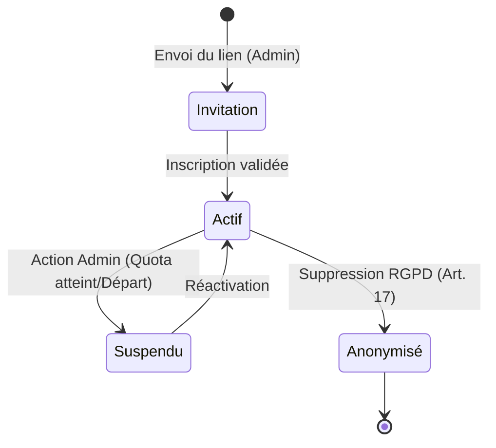
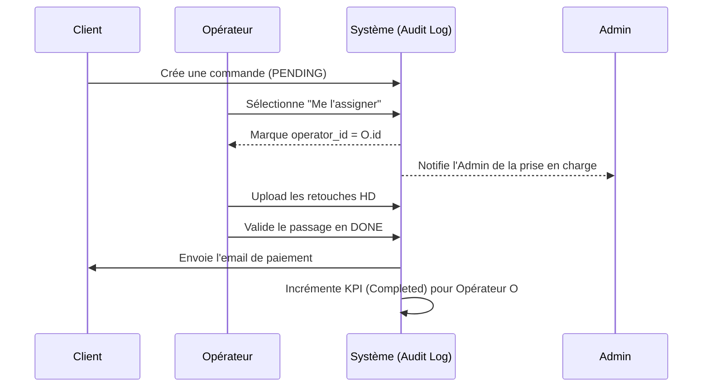
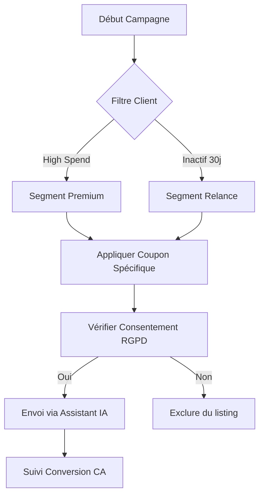

# [MASTER PLAN] Écosystème Collaboratif & Performance OmnyRestore v2.0

Ce document détaille la stratégie complète pour transformer OmnyRestore en une plateforme multi-opérateurs sécurisée, pilotée par la performance et assistée par l'intelligence artificielle.

---

## 🎯 Objectifs Stratégiques
1. **Passage à l'Échelle** : Permettre à une équipe de 10 personnes de gérer les flux (Commandes/Support).
2. **Gouvernance Transparente** : Rendre le RBAC (Role-Based Access Control) visible et auditable.
3. **Qualité de Service** : Garantir une communication parfaite via l'IA.
4. **Monitoring Analytique** : Mesurer la rentabilité et l'efficacité de chaque collaborateur.
5. **Acquisition Passive** : Simplifier l'envoi des photos via des utilitaires mobiles gratuits.
6. **Sécurité & Délivrabilité** : Garantir que les emails de masse et de transaction arrivent en boîte de réception.

---

## 🛠️ Phase 0 : Hardening de l'Automatisation IA (Priorité Critique)
Avant d'intégrer des collaborateurs, nous devons stabiliser le moteur de traitement qui est actuellement défaillant.

*   **Diagnostic Intégral** : Identifier pourquoi la reprise des images par l'IA ne fonctionne pas (problème de payload, timeout API OpenAI ou mauvaise gestion des médias Spatie).
*   **Refonte du `PhotoDamageAnalyzer`** : 
    *   Optimisation des prompts pour une classification 100% cohérente.
    *   Implémentation d'un mécanisme de "Retry" intelligent en cas d'échec de l'IA.
    *   Logging granulaire pour isoler les erreurs de traitement par photo.

---

## 🏗️ Phase 1 : Architecture RBAC & Gestion des Sièges (10 Max)
L'administration doit avoir une visibilité totale sur qui peut faire quoi.

### Structure des Rôles
*   **Super-Admin** : Propriétaire. Accès total (Configuration, Pilotage stratégique, Crise, Logs).
*   **Collaborateur (Opérateur)** : Focus sur le traitement des photos et le support client.
*   **Marketing** : Focus sur l'acquisition, les coupons et les avis clients.
*   **Transparence Légale (Loi Européenne)** : *Tous les rôles ci-dessus* ont accès en lecture à un **Dashboard de Transparence Salariale** centralisant les revenus et performances de tous les collègues, par honnêteté et conformité légale.

### Diagramme d'État : Cycle de Vie d'un Compte Staff

### Implémentation Technique
*   **Migration `users`** : Ajout d'une colonne `role` (enum) et `last_active_at`.
*   **Interface RBAC** : Une nouvelle page `/admin/team/roles` affichant une matrice de permissions interactive.
*   **Garde-fou "10 Sièges"** : 
    *   Logique de validation bloquant l'ajout d'un nouvel utilisateur si le quota de 10 (hors clients) est atteint.
    *   Widget visuel "Licence" indiquant l'occupation des sièges.

---

## 📈 Phase 2 : Workflow Collaboratif & Tracking KPIs
Chaque action doit être tracée pour permettre un reporting précis.

### Diagramme de Séquence : Prise en charge d'une Commande

### Gestion des Affectations
*   **Prise en charge** : Bouton "Prendre en charge" sur les commandes `PENDING`.
*   **Assignation Auto** : Option pour distribuer les tickets de support équitablement entre les collaborateurs disponibles.

### Indicateurs de Performance (KPIs)
*   **Volume** : Nombre de commandes traitées (passage en `DONE`).
*   **Financier** : CA TTC généré par l'opérateur (basé sur les commandes assignées et payées).
*   **Réactivité** : Temps moyen de réponse sur les tickets (Delta entre création et réponse).
*   **Feedback** : Note moyenne des avis clients liés aux commandes traitées par l'opérateur.

---

## 📢 Phase 3 : Module Marketing & Fidélisation
Une section dédiée pour booster le chiffre d'affaires et la réputation.

### Flowchart : Processus de Campagne Promo (Mass Mail)

### Fonctionnalités Clés

*   **Centre de Coupons** : Interface pour créer des campagnes (ex: `FLASH20` pour -20% sur 24h).
*   **Gestion des Avis** : Modération avancée avec analyse de sentiment IA.
*   **Mass Mailer (GDPR Ready)** : Envoi de newsletters aux clients ayant consenti, avec filtres (ex: "Tous les clients ayant dépensé plus de 50€").
*   **Analyses de Conversion** : Suivi de l'utilisation des coupons vs CA généré.
*   **Exemple (Facebook)** : "Ne laissez pas vos souvenirs s'effacer ! Nos experts (et nos IA) redonnent vie à vos photos de famille. 📸 Profitez de -10% avec le code SOUVENIR10 !"

### 📱 Stratégie "CamScanner" (Acquisition Mobile)
Développement d'utilitaires mobiles ultra-légers pour simplifier l'acquisition pour les clients sans scanner (ex: seniors).
*   **Double Développement (Ciblé)** :
    *   **iOS (Swift)** : Pour une performance maximale et une intégration native.
    *   **Android/Multi (React Native)** : Pour une couverture universelle rapide.
*   **Fonctionnalité Critique** : **Suppression intégrale des métadonnées EXIF** dès la capture (Anonymisation technique immédiate pour éviter tout problème de confidentialité/tracking).
*   **Business Model** : 100% gratuit, sans publicité.
*   **Call-To-Action** : Bouton unique "Envoyer à OmnyRestore" redirigeant vers la plateforme avec les photos prêtes. Pour cela le compte une fois connecté serait un identifiant unique permettant à l'utilisateur de lié son compte avec la plateforme. c'est valable pour android et ios. C'est un outil de captation de clients.
*   Le theme doit être similaire à celui de la plateforme pour garder une certaine cohérence visuelle.
*   

---

## 🤖 Phase 4 : Assistant de Communication IA "OmnyScribe"
Garantir que chaque message envoyé par l'équipe est irréprochable.

### L'Assistant "OmnyScribe"
*   **Correction Instantanée** : Bouton intégré aux formulaires de réponse.
*   **Optimisation de Ton** :
    *   **Standard** : Clair et concis.
    *   **Empathique** : Pour les clients mécontents ou les problèmes techniques.
    *   **Directif** : Pour les demandes de pièces manquantes.
*   **Sécurité** : Détection automatique des données sensibles (mots de passe, CB) avant l'envoi.

---

## 📄 Phase 5 : Reporting Automatisé & Génération PDF
Transformer les données en rapports professionnels exploitables.

### Rapports Collaborateurs (Individuels)
*   **Fiche de Performance Mensuelle** : Un PDF généré automatiquement le 1er du mois pour chaque collaborateur résumant son activité (Graphiques, CA, retours clients).

### Rapport Global (Admin)
*   **Audit d'Équipe** : PDF récapitulant la rentabilité de la flotte et comparatifs de performance (anonymisables).

### 📊 Simulateur de Croissance (Option SASU)
*   **Nouvel Onglet "Projection SASU"** :
    *   Simulation du passage de l'Auto-Entreprise vers la SASU.
    *   Calcul des nouveaux frais (IS, Cotisations sociales dirigeant, Expert-comptable).
    *   Visualisation du CA minimum requis pour maintenir le même revenu net.

---

## 🛡️ Phase 6 : Sécurité & Audit Trail
*   **Logs Granulaires** : Chaque modification de prix ou de statut est enregistrée avec l'ID de l'opérateur.
*   **Middlewares de protection** :
    *   `EnsureIsStaff` : Accès global au panel (Commandes, Tickets) ET au **Dashboard de Transparence Salariale**.
    *   `EnsureIsAdmin` : Accès exclusif aux sections de gestion d'entreprise (Configuration Stripe, Pilotage SASU, RBAC).
*   **Délivrabilité (DMARC)** : Implémentation de politiques SPF/DKIM/DMARC strictes pour éviter le blacklistage lors des envois de masse (Newsletters, Relances).
*   **Anonymisation RGPD** : Lors de la suppression d'un collaborateur, ses actions historiques sont conservées mais son nom est remplacé par "Ex-Opérateur X".

---

## 🚀 Prochaines Étapes Suggérées (Roadmap)
1. ✅ **Phase 1 (Base Collaborative)** : Migrations DB `operator_id`, Middlewares `EnsureIsStaff`/`EnsureIsAdmin`, Dashboard de Transparence Salariale et Assignation terminés.
2. ⏳ **Phase de Diagnostic (IA)** : Reprendre la résolution du bug d'automatisation de l'IA (Phase 0).
3. ⏳ **Gestion de l'Équipe** : Créer l'interface `/admin/team/roles` pour inviter des collaborateurs et gérer les 10 sièges.
4. ⏳ **Prototype IA** : Intégrer le premier bouton de correction "OmnyScribe" sur les tickets de support.
