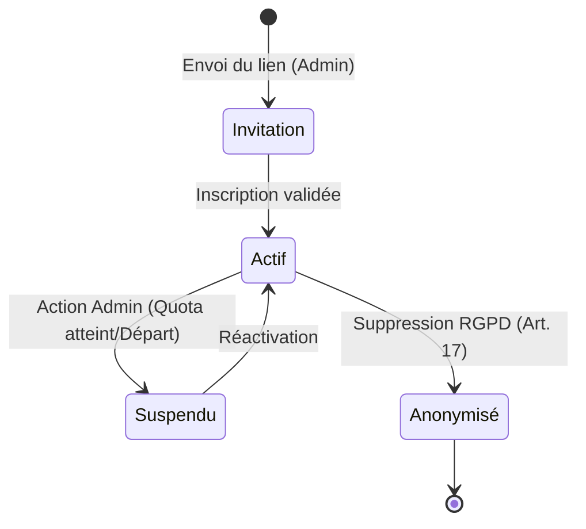
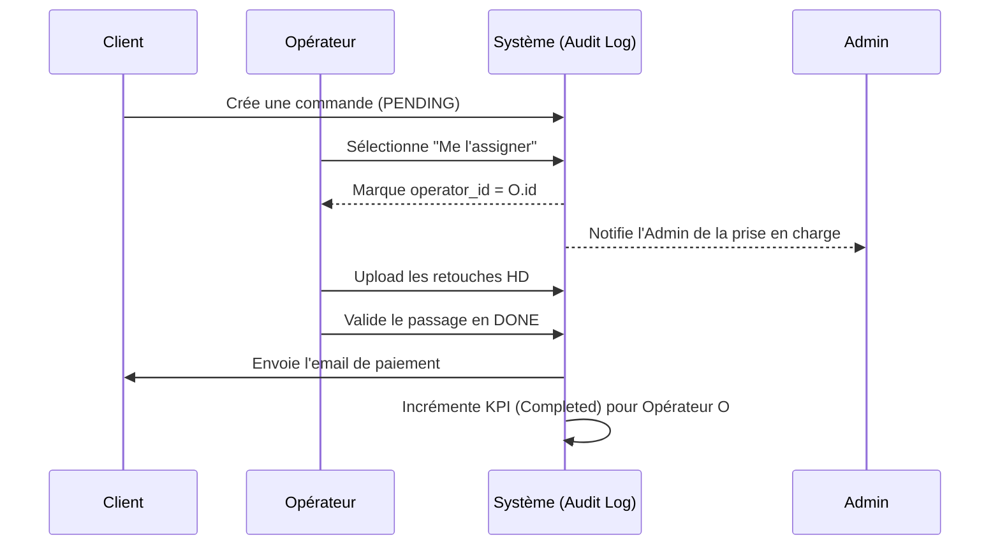
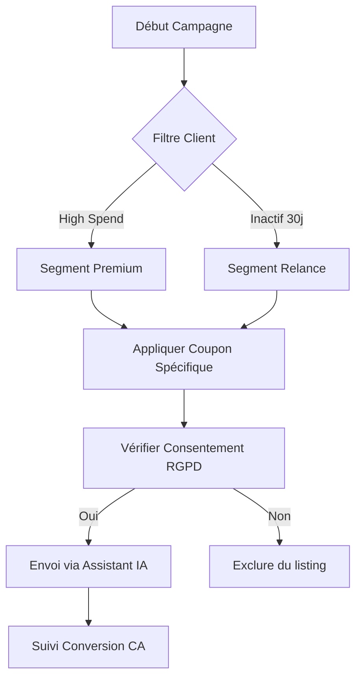

# [MASTER PLAN] Écosystème Collaboratif & Performance OmnyRestore v2.0

Ce document définit la stratégie complète pour transformer OmnyRestore en une plateforme multi-opérateurs sécurisée, pilotée par la performance et assistée par l'intelligence artificielle.

---

## 🎯 Objectifs Stratégiques
1. **Passage à l'Échelle** : Permettre à une équipe de 10 personnes de gérer les flux (Commandes/Support).
2. **Gouvernance Transparente** : Rendre le RBAC (Role-Based Access Control) visible et auditable.
3. **Qualité de Service** : Garantir une communication parfaite via l'IA.
4. **Monitoring Analytique** : Mesurer la rentabilité et l'efficacité de chaque collaborateur.

---

## 🏗️ Architecture des Pouvoirs (RBAC)

L'administration doit avoir une visibilité totale sur qui peut faire quoi.

### Structure des Rôles
*   **Super-Admin** : Propriétaire. Accès total (Finances, RBAC, Crise, Logs).
*   **Collaborateur (Opérateur)** : Focus sur le traitement des photos et le support client.
*   **Marketing** : Focus sur l'acquisition, les coupons et les avis clients.

### Diagramme d'État : Cycle de Vie d'un Compte Staff

### Limite des 10 Sièges
*   **Garde-fou "10 Sièges"** : Logique de validation bloquant l'ajout d'un nouvel utilisateur si le quota de 10 (hors clients) est atteint.
*   **Interface RBAC** : Une nouvelle page `/admin/team/roles` affichant une matrice de permissions interactive.

---

## 🛠️ Phase 0 : Hardening de l'Automatisation IA (Priorité Critique)

Avant d'intégrer des collaborateurs, nous devons stabiliser le moteur de traitement qui est actuellement défaillant.

*   **Diagnostic Intégral** : Identifier pourquoi la reprise des images par l'IA ne fonctionne pas (problème de payload, timeout API OpenAI ou mauvaise gestion des médias Spatie).
*   **Refonte du `PhotoDamageAnalyzer`** : 
    *   Optimisation des prompts pour une classification 100% cohérente.
    *   Implémentation d'un mécanisme de "Retry" intelligent en cas d'échec de l'IA.
    *   Logging granulaire pour isoler les erreurs de traitement par photo.

---

## 📈 Workflow Collaboratif & Tracking KPIs

Chaque action doit être tracée pour permettre un reporting précis et éviter les conflits d'assignation.

### Diagramme de Séquence : Prise en charge d'une Commande

### Indicateurs de Performance (KPIs)
*   **Volume** : Nombre de commandes traitées (passage en `DONE`).
*   **Financier** : CA TTC généré par l'opérateur (basé sur les commandes assignées et payées).
*   **Réactivité** : Temps moyen de réponse sur les tickets (Delta entre création et réponse).
*   **Feedback** : Note moyenne des avis clients liés aux commandes traitées par l'opérateur.

---

## 📢 Module Marketing & Fidélisation

Ce module permet de transformer les données de la base en leviers de croissance.

### Flowchart : Processus de Campagne Promo (Mass Mail)

### Centre de Coupons (Calendrier Promotionnel)
Modèles de codes pour les temps forts de l'année :
*   **Noël & Jour de l'An** (ex: `NOEL2026`)
*   **Saint-Valentin** (ex: `VALENTIN24`)
*   **Fête des Mères** (ex: `MAMAN15`)
*   **Fête des Pères** (ex: `PAPA15`)
*   **Black Friday** (ex: `BLACKOMNY`)

### Social Media Toolkit
Modèles de messages prêts à l'emploi :
*   **LinkedIn** : "Besoin de restaurer vos archives d'entreprise ? OmnyRestore garantit désormais une confidentialité totale et un traitement HD en 24h. 🛡️ #CyberSecurity #Archives"
*   **Facebook** : "Ne laissez pas vos souvenirs s'effacer ! Nos experts (et nos IA) redonnent vie à vos photos de famille. 📸 Profitez de -10% avec le code SOUVENIR10 !"

---

## 🤖 Assistant de Communication IA "OmnyScribe"

Garantir que chaque message envoyé par l'équipe est irréprochable.

### Fonctionnalités détaillées :
*   **Correction Instantanée** : Bouton intégré aux formulaires de réponse (orthographe/grammaire).
*   **Optimisation de Ton** :
    *   *Standard* : Clair et concis.
    *   *Empathique* : Pour les clients mécontents ou les litiges.
    *   *Technique* : Pour les explications sur la restauration.
*   **Sécurité** : Détection automatique des données sensibles (mots de passe, CB) avant l'envoi.

---

## 📄 Reporting & Performance (PDF)

Transformer les données en rapports professionnels exploitables générés par DomPDF.

*   **Fiche de Performance Mensuelle** : Un PDF généré automatiquement le 1er du mois pour chaque collaborateur résumant son activité.
*   **Audit d'Équipe (Admin)** : PDF récapitulant la rentabilité globale de la flotte des 10 collaborateurs.

---

## 🚀 Prochaines Étapes Suggérées (Roadmap)

1.  **Phase de Diagnostic** : Résoudre le bug d'automatisation de l'IA (Phase 0).
2.  **Migration DB** : Ajouter les rôles et les champs de tracking dans les tables `users` et `orders`.
3.  **Maquette RBAC** : Créer l'interface de visualisation des droits.
4.  **Prototype IA** : Intégrer le premier bouton de correction sur les tickets de support.
