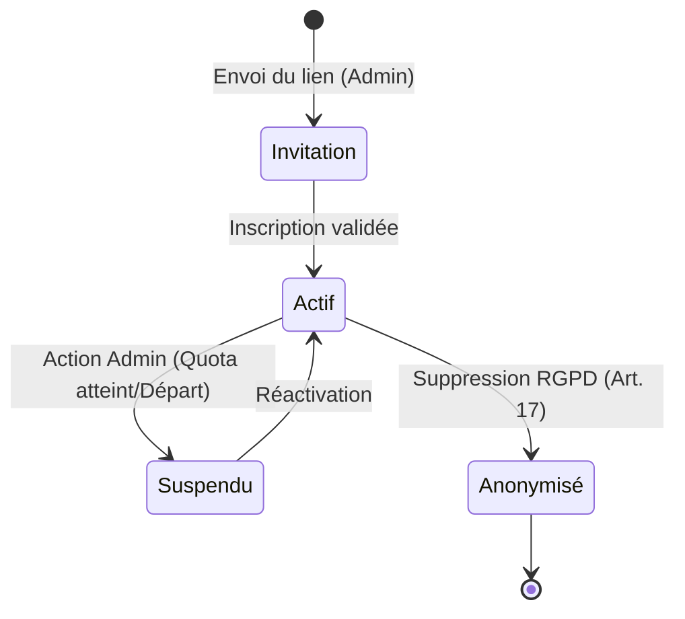
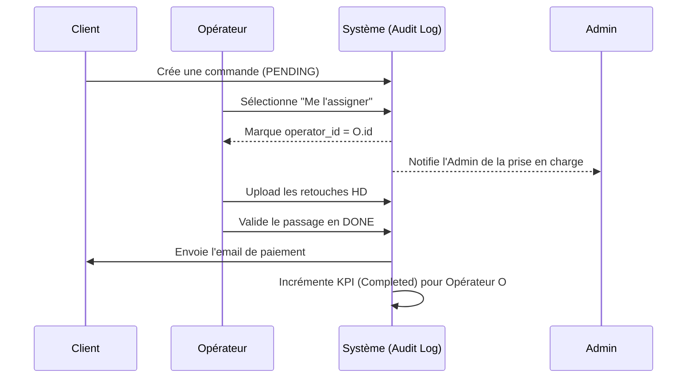
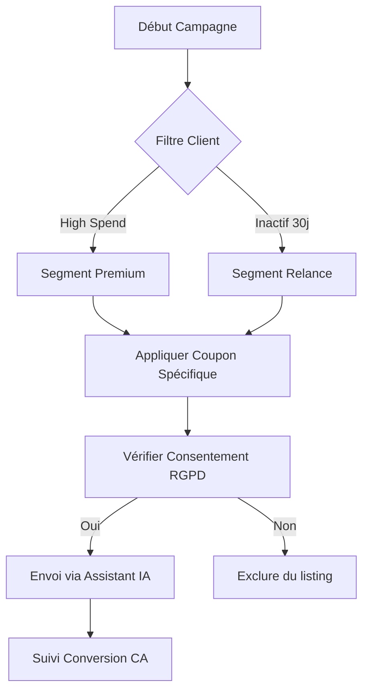

# [MASTER PLAN] Écosystème Collaboratif & Performance OmnyRestore v2.0

Ce document détaille la stratégie complète pour transformer OmnyRestore en une plateforme multi-opérateurs sécurisée, pilotée par la performance et assistée par l'intelligence artificielle.

---

## 🎯 Objectifs Stratégiques
1. **Passage à l'Échelle** : Permettre à une équipe de 10 personnes de gérer les flux (Commandes/Support).
2. **Gouvernance Transparente** : Rendre le RBAC (Role-Based Access Control) visible et auditable.
3. **Qualité de Service** : Garantir une communication parfaite via l'IA.
4. **Monitoring Analytique** : Mesurer la rentabilité et l'efficacité de chaque collaborateur.
5. **Acquisition Passive** : Simplifier l'envoi des photos via des utilitaires mobiles gratuits.
6. **Sécurité & Délivrabilité** : Garantir que les emails de masse et de transaction arrivent en boîte de réception.

---

## 🏗️ Phase 1 : Architecture RBAC & Gestion des Sièges (10 Max)
L'administration doit avoir une visibilité totale sur qui peut faire quoi.

### Structure des Rôles
*   **Super-Admin** : Propriétaire. Accès total (Configuration, Pilotage stratégique, Crise, Logs).
*   **RH (Ressources Humaines)** : Focus sur le recrutement, le simulateur de trésorerie (Runway), l'édition des contrats et la préparation des éléments variables de paie (EVP).
*   **Collaborateur (Opérateur)** : Focus sur le traitement des photos et le support client.
*   **Marketing** : Focus sur l'acquisition, les coupons et les avis clients. A également accès en **Lecture Seule (Read-Only)** à la liste et aux fiches détaillées des commandes (sans aucune possibilité de modification opérationnelle ou financière) afin de pouvoir authentifier ou justifier les avis positifs/négatifs des clients.
*   **Transparence Légale (Loi Européenne)** : *Tous les rôles ci-dessus* ont accès en lecture à un **Dashboard de Transparence Salariale** centralisant les revenus et performances de tous les collègues, par honnêteté et conformité légale.

### Diagramme d'État : Cycle de Vie d'un Compte Staff

### Implémentation Technique
*   **Migration `users`** : Ajout d'une colonne `role` (enum), `last_active_at`, `suspended_at`, et d'une colonne `contact_email` (nullable string) pour séparer l'identifiant de connexion de l'e-mail de notification réel.
*   **Séparation des E-mails de Connexion & Contact (Sécurité)** :
    *   L'adresse `email` principale sert uniquement de clé d'authentification (peut être une adresse fictive ou interne, ex: `collab1@omny.internal`).
    *   L'adresse `contact_email` optionnelle reçoit toutes les notifications applicatives réelles (réinitialisations de mot de passe, invitations, alertes de sécurité) en surchargeant `routeNotificationForMail()` dans le modèle `User`.
*   **Interface RBAC & HR** : Une nouvelle page `/admin/team/roles` affichant une matrice de permissions interactive, permettant l'ajout et l'édition rapide des infos de contact, du Salaire Net, du Type de contrat et de la Date d'entrée.
*   **Garde-fou "10 Licences"** : 
    *   Logique de validation bloquant l'ajout d'un nouvel utilisateur si le quota de 10 (incluant le propriétaire) est atteint.
    *   Widget visuel "Licences Actives" indiquant l'occupation des sièges.
*   **Simulateur RH & Trésorerie (Runway)** : Interface de calcul de viabilité.
    *   Calcul du nombre de mois restants (`Trésorerie / (Masse Salariale + Frais Fixes)`).
    *   *Vision Future* : Génération des contrats de travail et intégration d'une API externe (ex: PayFit) pour l'automatisation des fiches de paie françaises.

---

## 📈 Phase 2 : Workflow Collaboratif & Tracking KPIs
Chaque action doit être tracée pour permettre un reporting précis.

### Diagramme de Séquence : Prise en charge d'une Commande

### Gestion des Affectations
*   **Prise en charge** : Bouton "Prendre en charge" sur les commandes `PENDING`.
*   **Assignation Auto** : Option pour distribuer les tickets de support équitablement entre les collaborateurs disponibles.

### Indicateurs de Performance (KPIs)
*   **Volume** : Nombre de commandes traitées (passage en `DONE`).
*   **Financier** : CA TTC généré par l'opérateur (basé sur les commandes assignées et payées).
*   **Réactivité** : Temps moyen de réponse sur les tickets (Delta entre création et réponse).
*   **Feedback** : Note moyenne des avis clients liés aux commandes traitées par l'opérateur.

---

## 📢 Phase 3 : Module Marketing & Fidélisation
Une section dédiée pour booster le chiffre d'affaires et la réputation.

### Flowchart : Processus de Campagne Promo (Mass Mail)

### Fonctionnalités Clés

*   **Centre de Coupons** : Interface pour créer des campagnes (ex: `FLASH20` pour -20% sur 24h).
*   **Gestion des Avis** : Modération avancée avec analyse de sentiment IA.
*   **Visualisation des Commandes (Lecture Seule)** : Possibilité de consulter l'ensemble des commandes et leurs détails pour valider et justifier la pertinence d'un avis client, sans aucune possibilité d'action ou modification.
*   **Mass Mailer (GDPR Ready)** : Envoi de newsletters aux clients ayant consenti, avec filtres (ex: "Tous les clients ayant dépensé plus de 50€").
*   **Analyses de Conversion** : Suivi de l'utilisation des coupons vs CA généré.
*   **Exemple (Facebook)** : "Ne laissez pas vos souvenirs s'effacer ! Nos experts (et nos IA) redonnent vie à vos photos de famille. 📸 Profitez de -10% avec le code SOUVENIR10 !"

### 📱 Stratégie "CamScanner" (Acquisition Mobile)
Développement d'utilitaires mobiles ultra-légers pour simplifier l'acquisition pour les clients sans scanner (ex: seniors).
*   **Double Développement (Ciblé)** :
    *   **iOS (Swift)** : Pour une performance maximale et une intégration native.
    *   **Android/Multi (React Native)** : Pour une couverture universelle rapide.
*   **Fonctionnalité Critique** : **Suppression intégrale des métadonnées EXIF** dès la capture (Anonymisation technique immédiate pour éviter tout problème de confidentialité/tracking).
*   **Business Model** : 100% gratuit, sans publicité.
*   **Call-To-Action** : Bouton unique "Envoyer à OmnyRestore" redirigeant vers la plateforme avec les photos prêtes. Pour cela le compte une fois connecté serait un identifiant unique permettant à l'utilisateur de lié son compte avec la plateforme. c'est valable pour android et ios. C'est un outil de captation de clients.
*   Le theme doit être similaire à celui de la plateforme pour garder une certaine cohérence visuelle.

---

## 🤖 Phase 4 : Assistant de Communication IA "OmnyScribe"
Garantir que chaque message envoyé par l'équipe est irréprochable.

### L'Assistant "OmnyScribe"
*   **Correction Instantanée** : Bouton intégré aux formulaires de réponse.
*   **Optimisation de Ton** :
    *   **Standard** : Clair et concis.
    *   **Empathique** : Pour les clients mécontents ou les problèmes techniques.
    *   **Directif** : Pour les demandes de pièces manquantes.
*   **Sécurité** : Détection automatique des données sensibles (mots de passe, CB) avant l'envoi.

---

## 📄 Phase 5 : Reporting Automatisé & Génération PDF
Transformer les données en rapports professionnels exploitables.

### Rapports Collaborateurs (Individuels)
*   **Fiche de Performance Mensuelle** : Un PDF généré automatiquement le 1er du mois pour chaque collaborateur résumant son activité (Graphiques, CA, retours clients).

### Rapport Global (Admin)
*   **Audit d'Équipe** : PDF récapitulant la rentabilité de la flotte et comparatifs de performance (anonymisables).

### 📊 Simulateur de Croissance (Option SASU)
*   **Nouvel Onglet "Projection SASU"** :
    *   Simulation du passage de l'Auto-Entreprise vers la SASU.
    *   Calcul des nouveaux frais (IS, Cotisations sociales dirigeant, Expert-comptable).
    *   Visualisation du CA minimum requis pour maintenir le même revenu net.

---

## 🛡️ Phase 6 : Sécurité & Audit Trail
*   **Logs Granulaires** : Chaque modification de prix ou de statut est enregistrée avec l'ID de l'opérateur.
*   **Middlewares de protection** :
    *   `EnsureIsStaff` : Accès global au panel (Commandes, Tickets) ET au **Dashboard de Transparence Salariale**.
    *   `EnsureIsAdmin` : Accès exclusif aux sections de gestion d'entreprise (Configuration Stripe, Pilotage SASU, RBAC).
*   **Délivrabilité (DMARC)** : Implémentation de politiques SPF/DKIM/DMARC strictes pour éviter le blacklistage lors des envois de masse (Newsletters, Relances).
*   **Anonymisation RGPD** : Lors de la suppression d'un collaborateur, ses actions historiques sont conservées mais son nom est remplacé par "Ex-Opérateur X".

---

## 🛠️ Phase 7 : Diagnostic & Hardening de l'Automatisation IA
Dernière étape technique pour parfaire l'écosystème : stabiliser définitivement le moteur de traitement.

*   **Diagnostic Intégral** : Identifier pourquoi la reprise des images par l'IA ne fonctionne pas parfois (problème de payload, timeout API OpenAI ou mauvaise gestion des médias Spatie).
*   **Refonte du `PhotoDamageAnalyzer`** : 
    *   Optimisation des prompts pour une classification 100% cohérente.
    *   Implémentation d'un mécanisme de "Retry" intelligent en cas d'échec de l'IA.
    *   Logging granulaire pour isoler les erreurs de traitement par photo.

---

## 🚀 Prochaines Étapes Suggérées (Roadmap)

1. ✅ **Phase 1, 1.5 & 1.6 (Base Collaborative, Gestion d'Équipe & E-mail Sécurisé)** : Migrations DB, Middlewares de sécurité (EnsureIsStaff/EnsureIsAdmin), Dashboard de Transparence Salariale, interface premium d'administration de l'équipe (`/admin/team/roles`) avec quota de 10 sièges, anonymisation RGPD, et routage de sécurité avec e-mail de contact réel (`contact_email`) 100% opérationnels.

2. ✅ **Phase 1.7 (Tabs & Diagrammes de Cycle de Vie Super-Admin)** : Organisation par onglets (`Membres`, `Matrice RBAC`, `Cycle de vie & Diagrammes`) et intégration visuelle interactive du cycle de vie des collaborateurs et workflow opérationnel au sein de la page `/admin/team/roles` 100% opérationnels.

3. ✅ **Phase 1.8 (Espace RH & Transparence Intégrée)** : Création d'un espace personnel pour chaque membre du staff (`/admin/hr-profile`), intégration de la validation SMIC 2026, du graphique KPI salarial CSS, et inclusion de l'encart de Transparence Salariale au sein de l'espace. Refonte complète des actions d'équipe via une fenêtre modale 100% opérationnels.

4. ✅ **Phase 1.9 (Gouvernance RH Confidentielle)** : Création d'un espace sécurisé "Notes & Avis RH", persistance des onglets, fiabilisation de l'UI des diagrammes de cycle de vie et consolidation du stockage des notes RH avec badge de tracking.

5. ✅ **Phase 2 (Accès Lecture Seule Marketing)** : Consultation globale des commandes (`/admin/orders`) et détails en lecture seule pour le rôle `marketing` avec masquage UI, désactivation des notes, bouton "Commandes" dans la navbar et blocage strict 403 en écriture 100% opérationnels.

6. ✅ **Phase 4 (Prototype IA OmnyScribe)** : Intégration du premier bouton de correction "OmnyScribe" sur les tickets de support, avec filtrage de sécurité et optimisation du ton de réponse 100% opérationnels.

7. ⏳ **Hardening IA (Phase 7)** : Reprendre la résolution du bug d'automatisation de l'IA.
