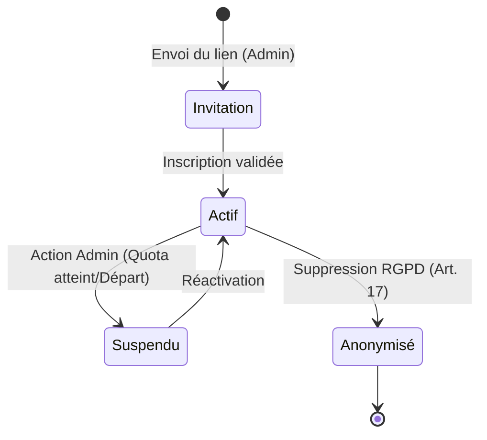
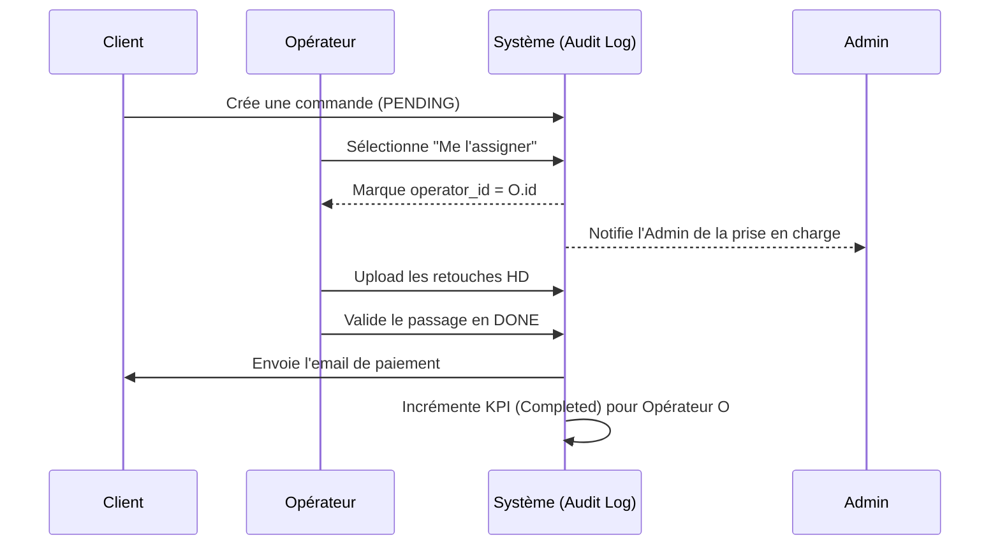
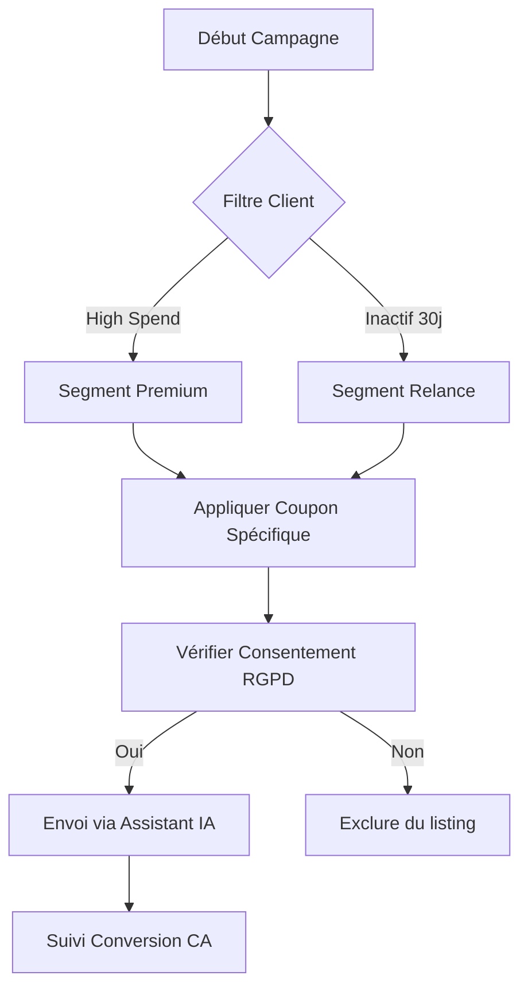

# [STRATÉGIE] Écosystème Collaboratif OmnyRestore v2.0

Ce document définit l'architecture technique et fonctionnelle pour le passage d'OmnyRestore en mode multi-opérateurs (collaborateurs).

---

## 🏗️ Architecture des Pouvoirs (RBAC)

La sécurité repose sur une séparation stricte des rôles pour garantir l'intégrité des données financières et de la configuration système.

### Diagramme d'État : Cycle de Vie d'un Compte Staff

---

## 📈 Workflow de Traitement Collaboratif

L'objectif est d'éviter les conflits entre opérateurs tout en maximisant la vitesse de traitement.

### Diagramme de Séquence : Prise en charge d'une Commande

---

## 📢 Module Marketing & Fidélisation

Ce module permet de transformer les données de la base en leviers de croissance.

### Flowchart : Processus de Campagne Promo (Mass Mail)

---

## 🤖 Assistant de Communication "OmnyScribe"

Un outil transverse pour garantir l'image de marque.

### Fonctionnalités détaillées :
1. **Correction Orthotypographique** : Suppression des fautes de frappe et de grammaire.
2. **Harmonisation du Ton** :
   - *Tone 1 (Conciliant)* : Idéal pour les réclamations clients.
   - *Tone 2 (Expert)* : Pour les explications techniques sur la restauration.
3. **Sécurisation des données** : Masquage automatique des URLs ou identifiants sensibles avant l'envoi.

---

## 📄 Reporting & Performance (PDF)

Génération automatique de documents confidentiels pour le pilotage :
*   **KPI Hebdo** : Rapport automatique envoyé à l'Admin résumant l'activité de la flotte.
*   **Certificat de Performance** : Pour les collaborateurs (valorisation du travail accompli).

---

## 🚀 Plan de Déploiement (Roadmap)

1. **Step 1** : Migration de la table `users` et implémentation du middleware RBAC.
2. **Step 2** : Création du Dashboard de monitoring des opérateurs (Vue Admin).
3. **Step 3** : Activation du module Marketing et déplacement des coupons/avis.
4. **Step 4** : Intégration de l'Assistant IA dans les tickets de support.
5. **Step 5** : Finalisation du moteur de génération de rapports PDF.
