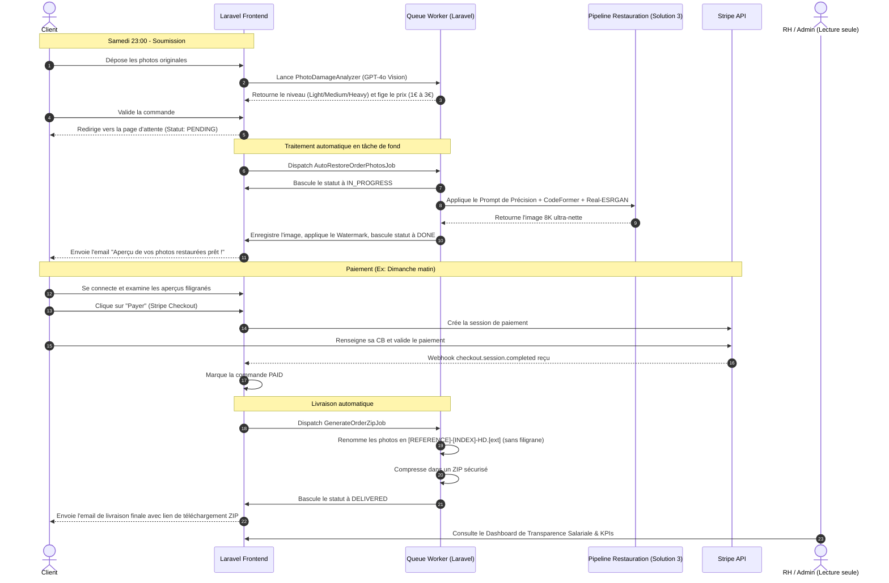
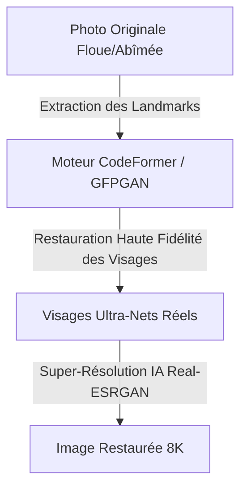

# [MASTER PLAN] Écosystème Collaboratif & Performance OmnyRestore v3.0

Ce document détaille la stratégie complète et actualisée pour stabiliser le traitement d'images haute fidélité (résolution du problème des visages) et finaliser l'écosystème multi-opérateurs sécurisé et souverain d'OmnyRestore.

---

## 🎯 Objectifs Stratégiques v3.0
1. **Chirurgie Visuelle (Fidélité 100%)** : Bannir les hallucinations de DALL-E 3 pour les visages. Intégrer des modèles de restauration dédiés (**CodeFormer / GFPGAN**).
2. **Souveraineté des Données & RGPD** : Garantir la conformité et documenter les options de transition vers l'auto-hébergement local.
3. **Tracking & Performance Opérationnelle** : Achever le monitoring des KPIs de chaque collaborateur (CA généré, vitesse de traitement, notes).
4. **Fidélisation & Marketing** : Déployer le mass mailer confidentiel et sécurisé avec conformité RGPD.
5. **Acquisition Mobile Passive** : Développer l'utilitaire d'acquisition sans métadonnées.

---

## 🏗️ 1. Diagramme d'Architecture Technique Global

Voici l'architecture de traitement et de distribution d'OmnyRestore v3.0 intégrant la Solution 3 :

```mermaid
flowchart TB
    subgraph ClientSpace ["Espace Client (Frontend / Livewire)"]
        Upload[Dépose des photos] -->|1. Analyse instantanée| Analyzer[PhotoDamageAnalyzer GPT-4o Vision]
        Analyzer -->|2. Prix estimé 1€ à 3€ TTC| Display[Affiche Tarif & Résumé]
        Display -->|3. Soumission Commande| CreateOrder[Commande créée PENDING]
    end

    subgraph LaravelQueue ["Queue Laravel (Traitement Asynchrone 24/7)"]
        CreateOrder -->|4. Déclenchement automatique| AutoRestoreJob[AutoRestoreOrderPhotosJob]
        AutoRestoreJob -->|5. Bascule statut IN_PROGRESS| Process[Traitement IA Solution 3]
        
        subgraph Solution3 ["Pipeline Restauration IA (Solution 3)"]
            Process -->|A. Prompt de Précision| SDXL[SDXL Image-to-Image + ControlNet]
            SDXL -->|B. Correction Visages| CodeFormer[CodeFormer / GFPGAN]
            CodeFormer -->|C. Super-Résolution 8K| RealESRGAN[Real-ESRGAN]
        end
        
        RealESRGAN -->|6. Enregistrement collection 'retouched'| Watermark[Filigrane de prévisualisation]
        Watermark -->|7. Passage statut DONE| DoneState[Commande prête pour client]
    end

    subgraph PaymentFlow ["Tunnel de Paiement Stripe"]
        DoneState -->|8. Notification Email| ClientView[Client examine la preview filigranée]
        ClientView -->|9. Paiement Stripe| Checkout[Session Stripe Checkout]
        Checkout -->|10. Webhook Stripe checkout.completed| PaidState[Commande marquée PAID]
    end

    subgraph ZipDelivery ["Job de Conditionnement final"]
        PaidState -->|11. Déclenchement| ZipJob[GenerateOrderZipJob]
        ZipJob -->|A. Anonymisation stricte| Rename[Fichiers renommés en REFERENCE-INDEX-HD.ext]
        Rename -->|B. Archive ZIP créée| Store[Storage local sécurisé]
        Store -->|12. Passage statut DELIVERED| Delivered[Email automatique contenant le lien de téléchargement]
    end
```



---

## 🔄 2. Diagramme de Séquence Temporel & États (Week-end 24/7)

Ce diagramme décrit la chronologie exacte des événements depuis l'upload du client le samedi soir jusqu'à la livraison automatique :



---

## 🗺️ État d'Avancement des Phases

| Phase | Description | Statut | Détails |
| :--- | :--- | :--- | :--- |
| **Phase 1** | Base RBAC, quota 10 sièges, mails sécurisés | **100% ACCOMPLI** | Middlewares `EnsureIsStaff`/`Admin` OK. Séparation `email`/`contact_email` opérationnelle. |
| **Phase 1.5** | Tabs, Diagrammes de vie Super-Admin | **100% ACCOMPLI** | Intégration visuelle dans `/admin/team/roles` (Membres, Matrice, Cycle de vie). |
| **Phase 1.8** | Espace RH & Transparence | **100% ACCOMPLI** | Graphiques salariaux CSS, validation SMIC 2026, modales d'actions rapides `/admin/hr-profile`. |
| **Phase 1.9** | Gouvernance RH Confidentielle | **100% ACCOMPLI** | Notes RH persistées avec badges de sécurité et tracking. |
| **Phase 2 (Mkt)**| Lecture Seule Marketing | **100% ACCOMPLI** | Rôle `marketing` restreint aux vues de commandes sans actions d'écriture (403 strict). |
| **Phase 4** | Assistant IA OmnyScribe | **100% ACCOMPLI** | Premier prototype de correction de ton intégré sur le support client. |
| **Phase 7** | **Chirurgie IA (Fidélité Visages)** | 🔴 **À FAIRE (URGENT)** | Intégrer la Solution 3 (SDXL + CodeFormer) dans `PhotoRestorationService.php`. |
| **Phase 2 (KPIs)**| Tracking KPIs Opérateurs complet | 🟡 **À FAIRE** | Persister le CA par opérateur, le volume et le feedback en DB. |
| **Phase 3** | Marketing, Coupons, Mobile App | 🟡 **À FAIRE** | Mass Mailer, coupons actifs et utilitaires mobiles iOS/Android. |
| **Phase 5** | Reporting PDF & Projection SASU | 🟡 **À FAIRE** | Génération de fiches mensuelles collaborateurs PDF et onglet projection SASU. |
| **Phase 6** | Sécurité (DMARC & RGPD Logs) | 🟡 **À FAIRE** | Politiques SPF/DKIM/DMARC strictes et anonymisation automatique. |

---

## 🧠 Phase A : Réhabilitation IA (Fidélité 100% & Chirurgie des Visages)
*Priorité absolue suite à l'audit d'échec de ressemblance de DALL-E 3.*

### Le Problème v2.0
Le pipeline actuel utilise GPT-4o Vision + DALL-E 3. DALL-E 3 réinvente entièrement l'identité faciale des ancêtres de nos clients en générant une nouvelle image uniquement basée sur une description textuelle.

### La Solution v3.0 (Option C de l'Audit)
Remplacer ou encapsuler DALL-E par un pipeline de **Restauration Dédiée** exploitant les réseaux de prédiction faciale (**CodeFormer** ou **GFPGAN**).



*   **Zéro Hallucination** : Les traits d'origine (yeux, nez, bouche, rides) sont conservés à 100% car le réseau utilise des vecteurs géométriques de la photo d'origine comme guides de reconstruction.
*   **Intégration Laravel** :
    *   **Cloud** : API Replicate (`sczhou/codeformer`) pour un coût dérisoire de 0.005 $ par photo.
    *   **Local (Souverain)** : Déploiement d'un conteneur Docker CodeFormer sur serveur GPU NVIDIA local.

---

## 📊 Phase B : Workflow Collaboratif & Tracking KPIs (Phase 2 Restante)
*Mesurer l'efficacité opérationnelle et la rentabilité en temps réel.*

1. **Affectation Dynamique** :
   * Une commande `PENDING` affiche un bouton "Prendre en charge".
   * Le clic associe `operator_id` à l'utilisateur connecté et fait passer la commande à `IN_PROGRESS`.
2. **Persistence des Performance KPIs** :
   * Ajout de compteurs en base de données sur la table `users` (ou table de jointure `staff_performances`) :
     * `completed_orders_count` : Nombre total de commandes livrées.
     * `total_revenue_generated` : Somme cumulée du CA TTC des commandes assignées et payées.
     * `average_response_time_seconds` : Temps de réaction moyen sur les tickets de support assignés.

---

## 📢 Phase C : Module Marketing & Fidélisation (Phase 3 Restante)
*Booster le panier moyen et faciliter l'acquisition.*

1. **Mass Mailer RGPD** :
   * Interface d'envoi de newsletters aux clients ayant coché la case de consentement.
   * Segmentation dynamique : "Gros dépensiers (>50€)", "Inactifs depuis 30j".
2. **Coupons Promotionnels** :
   * Création et modération des codes promos (`FLASH20`, `BIENVENUE`).
3. **L'Utilitaire Mobile "CamScanner Lite" (iOS/Android)** :
   * Outil mobile gratuit, sans pub, permettant aux clients de photographier proprement leurs vieilles photos physiques.
   * **Anonymisation Technique** : Script mobile de suppression automatique des métadonnées EXIF (localisation, date, type de smartphone) avant envoi pour protéger la vie privée des utilisateurs.
   * Liaison par code unique de couplage.

---

## 📄 Phase D : Reporting Automatisé & Projection SASU (Phase 5 Restante)
*Aider le Super-Admin dans son pilotage stratégique.*

1. **Génération PDF** :
   * Génération automatique de rapports mensuels d'activité pour l'équipe (Fiche de paie / variable performance) via la librairie `dompdf` ou `snappy`.
2. **Simulateur de Transition SASU** :
   * Onglet financier simulant les impacts fiscaux (Passage d'Auto-Entrepreneur à SASU, calcul de l'IS à 15%/25%, cotisations sociales URSSAF sur le salaire président).

---

## 🛡️ Phase E : Durcissement Sécurité & Délivrabilité (Phase 6 Restante)
*Garantir la sécurité de l'infrastructure et la réception des e-mails.*

1. **Délivrabilité E-mail (DMARC)** :
   * Configuration de politiques SPF, DKIM et DMARC strictes au niveau des serveurs DNS pour éviter que les relances clients et campagnes marketing finissent dans les spams.
2. **Anonymisation RGPD automatique** :
   * Lors du bannissement/suppression d'un collaborateur, sa fiche RH et ses données personnelles sont effacées, et ses actions de traitement historiques sont rattachées au label générique "Ex-Opérateur X" afin de préserver l'intégrité des statistiques financières de l'entreprise.
3. **Mise à jour des Mentions Légales & RGPD (OpenAI API Compliance)** :
   * Afin de respecter la transparence RGPD tout en rassurant vos clients, voici le paragraphe juridique précis à ajouter à vos **Mentions Légales / Politique de Confidentialité** :
     > **Traitement des images par Intelligence Artificielle (API OpenAI) :**
     > Dans le cadre de l'évaluation technique et tarifaire de vos clichés, notre plateforme utilise l'API sécurisée d'OpenAI. Conformément aux politiques strictes d'OpenAI pour les développeurs (API Policy), vos photos ne sont **JAMAIS** utilisées pour l'entraînement ou l'amélioration des modèles d'intelligence artificielle. Elles sont stockées de manière strictement temporaire et anonyme sur des serveurs sécurisés pour une durée maximale de 30 jours uniquement à des fins de contrôle de modération technique et de sécurité, avant d'être définitivement et automatiquement effacées.
4. **Transition Souveraine "Vision Locale" (Remplacement de l'API OpenAI pour l'estimation de prix)** :
   * Pour atteindre un niveau de sécurité et de souveraineté absolu (zéro transit vers l'étranger), vous pouvez migrer `PhotoDamageAnalyzer.php` sur un modèle de vision local open-source ultra-léger (**Moondream2** ou **LLaVA**) hébergé sur votre propre machine via **Ollama**.
   
   #### A. Lancement du modèle en local (Serveur d'analyse) :
   ```bash
   # Installer Ollama sur la machine locale
   # Télécharger le modèle de vision ultra-performant et économe (1.8B params)
   ollama run moondream
   ```
   
   #### B. Implémentation du service local `PhotoDamageAnalyzerLocal.php` :
   ```php
   <?php

   namespace App\Services;

   use Illuminate\Support\Facades\Http;
   use Illuminate\Support\Facades\Log;
   use RuntimeException;

   class PhotoDamageAnalyzerLocal
   {
       /**
        * Analyse les dommages d'une photo en local avec Ollama (Moondream).
        * 100% Souverain, Zéro données cloud.
        */
       public function analyze(string $filePath): string
       {
           Log::info("[Souveraineté Vision] Analyse locale de la photo : {$filePath}");

           if (!file_exists($filePath)) {
               throw new RuntimeException("Fichier image introuvable pour l'analyse locale.");
           }

           // Étape 1 : Encodage de l'image en base64
           $base64Image = base64_encode(file_get_contents($filePath));

           // Étape 2 : Requête à l'API locale d'Ollama
           $response = Http::timeout(30)->post('http://localhost:11434/api/generate', [
               'model' => 'moondream',
               'prompt' => "Analyze this old damaged photograph. Focus on tears, scratches, dust, fading, or missing parts. Classify the overall damage strictly as one of these three words: 'light', 'medium', or 'heavy'. Respond with only one word, lowercased, nothing else.",
               'images' => [$base64Image],
               'stream' => false,
           ]);

           if ($response->failed()) {
               Log::error("[Souveraineté Vision] Échec d'Ollama local : " . $response->body());
               return 'medium'; // Valeur de repli sécurisée
           }

           $result = trim(strtolower($response->json()['response'] ?? ''));

           // Étape 3 : Nettoyage et validation stricte du verdict
           if (str_contains($result, 'light')) return 'light';
           if (str_contains($result, 'heavy')) return 'heavy';
           return 'medium';
       }
   }
   ```

---

## 🚀 Plan d'Exécution Immédiat

1. 📂 **Création du Guide de Restauration Dédiée (Solution 3)** : Générer un document technique exhaustif détaillant le fonctionnement, le déploiement local (Docker/Python) et l'intégration API Laravel de CodeFormer/GFPGAN.
2. 🛠️ **Mise en Œuvre Technique de la Solution 3** : Remplacer l'architecture DALL-E 3 instable par le pipeline ultra-fidèle de restauration de visages.
