# Cycle complet d'une commande — OmnyRestore

> Flowchart du parcours d'une commande, de la soumission des photos jusqu'à la livraison du ZIP au client.

## Diagramme

```mermaid
flowchart TB
    classDef client   fill:#1a3a5c,stroke:#4a9eda,color:#e8f4ff
    classDef admin    fill:#3a2a00,stroke:#c9a84c,color:#fff8e1
    classDef stripe   fill:#1a1a3e,stroke:#7c7cff,color:#e8e8ff
    classDef job      fill:#1a3a1a,stroke:#4aaa4a,color:#e8ffe8
    classDef observer fill:#3a1a1a,stroke:#dd5555,color:#ffe8e8
    classDef status   fill:#0d0d0d,stroke:#555,color:#ccc
    classDef email    fill:#2a1a3a,stroke:#aa55dd,color:#f0e8ff

    START(["Client soumet ses photos\net cree une commande"]):::client
    S1["Order creee\nstatus = PENDING\nreference = ORD-YYYY-XXXX"]:::status
    START --> S1

    S1 --> A1["Admin voit la commande\ndans le panel admin"]:::admin
    A1 --> A2["Admin clique 'Prendre en charge'\nstartProcessing()"]:::admin
    A2 --> S2["status = IN_PROGRESS"]:::status
    S2 --> A3["Admin restaure les photos\net uploade les retouches"]:::admin
    A3 --> A4["Admin clique 'Marquer terminee'\nmarkAsDone()"]:::admin
    A4 --> S3["status = DONE\ndelivered_at = now()"]:::status

    S3 --> OBS1["OrderObserver\nstatus DONE detecte"]:::observer
    OBS1 --> MAIL1["Email OrderReadyForPayment\n'Vos photos sont pretes'\nlien signe 7 jours"]:::email

    MAIL1 --> C1["Client recoit l'email"]:::client
    C1 --> C2["Clic lien signe\nUnlockPreviewController\npreview_unlocked_at = now()"]:::client
    C2 --> C3["Client voit les apercus\nfiligranes et selectionne\nses photos"]:::client
    C3 --> C4{"Satisfait ?"}

    C4 -- "Non" --> C3
    C4 -- "Oui" --> C5["Client clique\n'Payer X,XX euro TTC'"]:::client

    C5 --> STR1["StripeCheckoutController\ncree session Checkout\nmode payment, currency EUR"]:::stripe
    STR1 --> STR2["Redirection Stripe\nHosted Checkout Page"]:::stripe
    STR2 --> STR3{"Paiement\nStripe"}

    STR3 -- "Abandon" --> STR4["Redirect /payment/cancel\nstatus reste DONE"]:::stripe
    STR3 -- "Paiement valide" --> STR5["Stripe confirme"]:::stripe

    STR5 --> SPLIT{{"Double filet\nde securite"}}

    SPLIT --> WH["WEBHOOK Stripe\nPOST /webhook/stripe\ncheckout.session.completed\nSource de verite principale"]:::stripe
    SPLIT --> PSC["REDIRECT navigateur\nGET /payment/success\nPaymentSuccessController\nFallback si webhook echoue"]:::stripe

    WH --> WH2["Verification HMAC\nStripe-Signature"]:::stripe
    WH2 --> WH3["markAsPaid\nstatus = PAID\npayment_status = paid\npaid_at = now()"]:::stripe

    PSC --> PSC2{"Deja PAID ?"}
    PSC2 -- "Oui" --> PSCR["Redirect payment-success"]:::stripe
    PSC2 -- "Non" --> PSC3["markAsPaid\ntry/catch si deja traite"]:::stripe
    PSC3 --> PSCR

    WH3 --> S4["status = PAID\npayment_status = paid"]:::status
    PSCR --> PAGE1["Page 'Paiement confirme !'\n/client/orders/id/payment-success\nPolling 5s attend DELIVERED"]:::client

    S4 --> OBS2["OrderObserver\nstatus PAID detecte"]:::observer
    OBS2 --> MAIL2["Email OrderPaidConfirmation\n'Paiement recu,\nZIP en preparation'"]:::email

    S4 --> JOB["GenerateOrderZipJob\ndispatch via queue\nidempotent - webhook + fallback"]:::job

    JOB --> JOB2["Cree archive ZIP\nPhotos HD sans filigrane\nREADME.txt"]:::job
    JOB2 --> JOB3["Sauvegarde ZIP\nstorage/app/orders/zips/"]:::job
    JOB3 --> JOB4["forceFill DELIVERED\nzip_path renseigne\nzip_expires_at +90 jours"]:::job
    JOB4 --> S5["status = DELIVERED"]:::status

    S5 --> OBS3["OrderObserver\nstatus DELIVERED detecte"]:::observer
    OBS3 --> MAIL3["Email OrderDeliveryReady\n'Vos photos sont pretes !'\nBouton ZIP + Facture PDF"]:::email

    S5 --> PAGE1_UPDATE["Polling page confirmation\ndetecte DELIVERED\nAffiche bouton telechargement"]:::client

    MAIL3 --> C6["Client recoit email livraison"]:::client
    C6 --> C7["Telechargement ZIP\nOrderDownloadController\nVerif payment_status = paid"]:::client
    C7 --> END(["Livraison terminee"])

    S5 --> ADM2["Panel Admin\nbouton 'Envoyer ZIP + Facture'\ndevient actif gold apres PAID"]:::admin
    ADM2 --> ADM3["Admin peut renvoyer\nl'email manuellement\n1 envoi / 5 min"]:::admin
    ADM3 --> END
    PAGE1_UPDATE --> END
```



## Transitions de statut

```
PENDING → IN_PROGRESS → DONE → PAID → DELIVERED
            │               │
            └→ CANCELLED    └→ CANCELLED
```

| Transition | Méthode | Guard |
|---|---|---|
| `PENDING → IN_PROGRESS` | `startProcessing()` | Depuis `PENDING` uniquement |
| `IN_PROGRESS → DONE` | `markAsDone()` | Depuis `IN_PROGRESS` uniquement |
| `DONE → PAID` | `markAsPaid($intentId)` | Depuis `DONE` uniquement |
| `PAID → DELIVERED` | `forceFill(['status'])` dans `GenerateOrderZipJob` | Après ZIP généré |
| `→ CANCELLED` | `cancel($reason)` | Depuis `PENDING` ou `IN_PROGRESS` |

## Emails automatiques (OrderObserver)

| Email | Déclencheur | Contenu |
|---|---|---|
| `OrderReadyForPayment` | `status → DONE` | Lien aperçu signé + bouton payer |
| `OrderPaidConfirmation` | `status → PAID` | Confirmation + "ZIP en préparation" |
| `OrderDeliveryReady` | `status → DELIVERED` | Lien ZIP + lien facture PDF |

> **Note** : Tous les emails passent par la queue (`QUEUE_CONNECTION=database`).
> Worker requis : `php artisan queue:work`

## Tarification

| Niveau | HT | TTC |
|---|---|---|
| `light` — Standard | 0,83 € | **1,00 €** |
| `medium` — Avancée | 1,67 € | **2,00 €** |
| `heavy` — Complète | 2,50 € | **3,00 €** |

Le TTC est calculé en **sommant les prix TTC individuels** par photo (pas TVA sur total HT cumulé) pour éviter toute perte de centime par arrondi.
